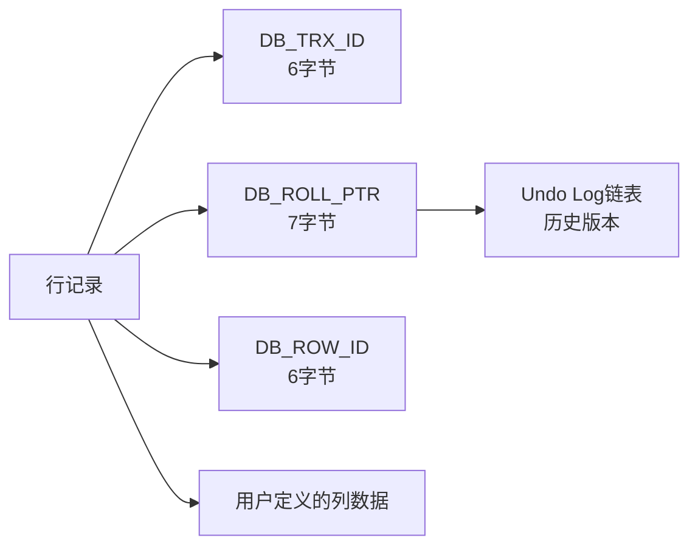
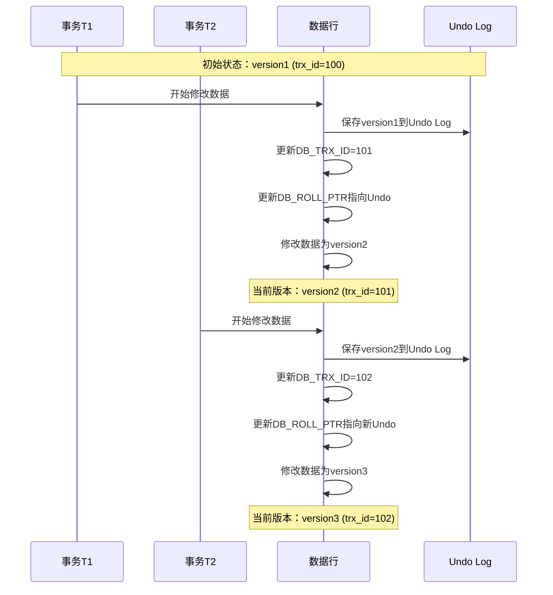
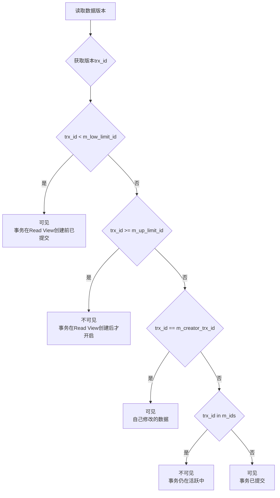
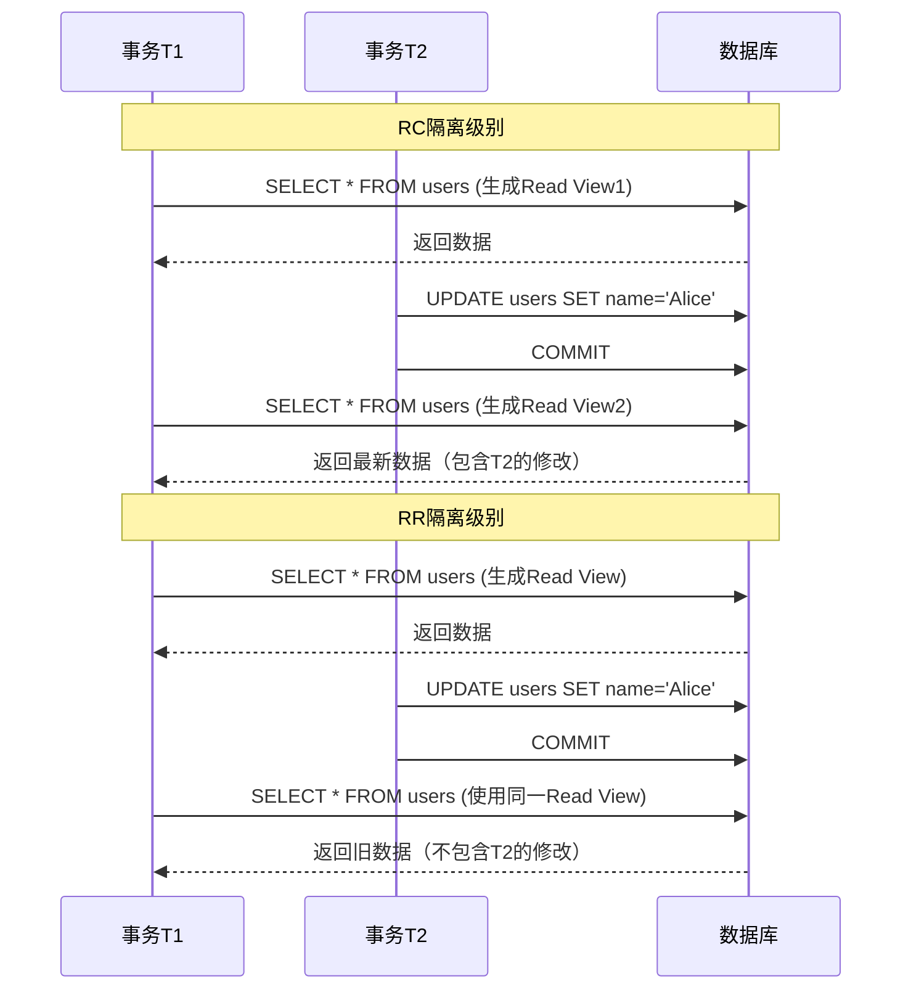
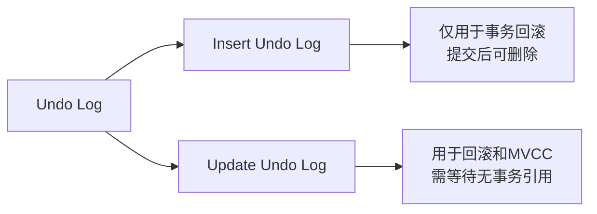
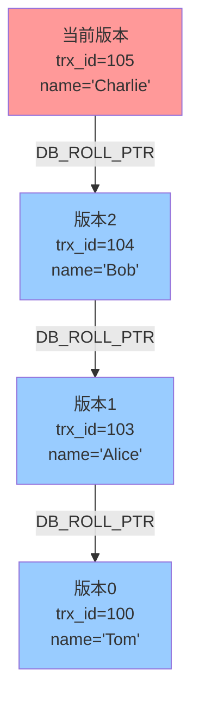
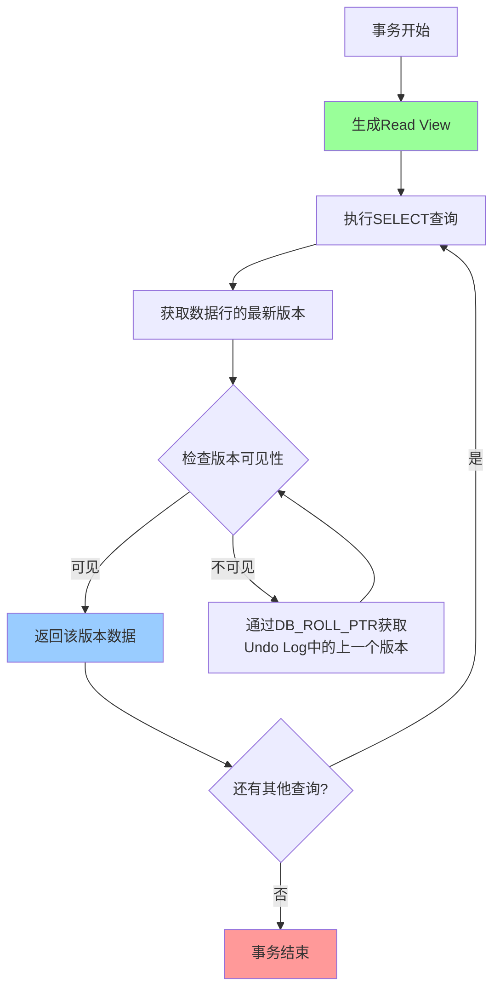
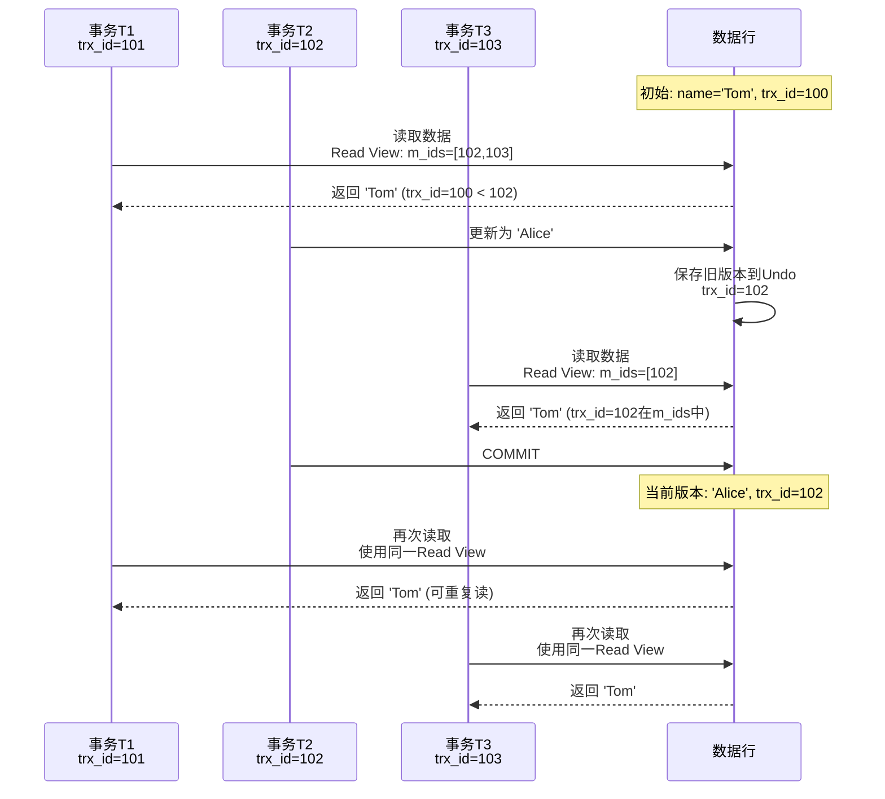
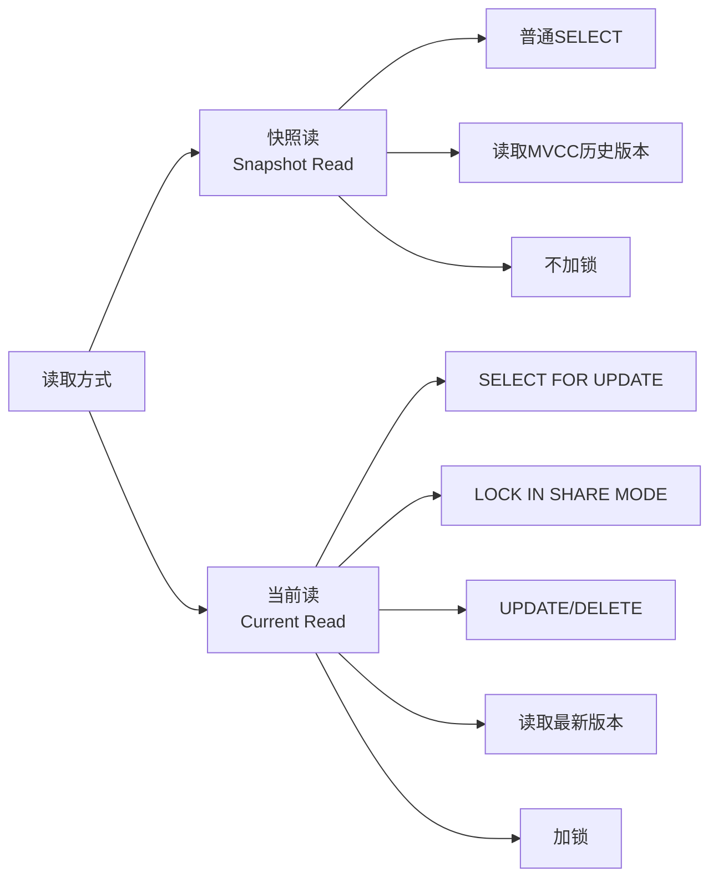
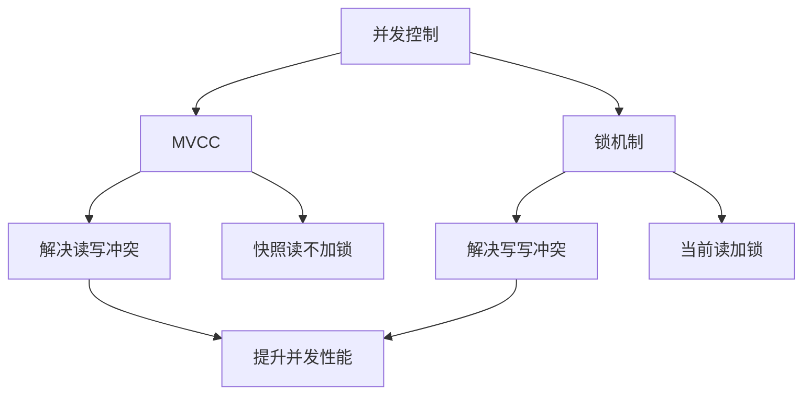

## 简介

MVCC（Multi-Version Concurrency Control，多版本并发控制）是MySQL InnoDB存储引擎实现高并发事务的核心技术。它通过维护数据的历史版本，使得读写操作可以互不阻塞，从而显著提升了数据库的并发性能。

在传统的数据库并发控制中，通常使用锁机制来实现事务隔离，但这会导致读写冲突，降低并发性能。MVCC通过为每行记录维护多个版本，使得读操作可以读取到符合事务隔离级别的历史版本数据，而不需要加锁，从而实现了"读写不冲突"。

MVCC是MySQL实现事务隔离级别（特别是RC和RR级别）的基础，理解MVCC对于深入掌握MySQL事务机制、优化数据库性能、排查并发问题都具有重要意义。

## 架构原理

### MVCC核心概念

MVCC的核心思想是通过保存数据的历史版本，使得事务可以看到数据在某个时间点的快照。在InnoDB中，MVCC的实现依赖于以下几个关键组件：

1. **隐藏字段**：每行记录包含三个隐藏字段
2. **Undo Log（回滚日志）**：存储数据的历史版本
3. **Read View（读视图）**：判断数据版本可见性的机制
4. **事务ID**：标识事务的执行顺序

### 隐藏字段详解

InnoDB为每行记录自动添加以下隐藏字段：

| 字段名 | 大小 | 描述 |
| -------- | ------ | ------ |
| `DB_TRX_ID` | 6字节 | 最近一次修改该行记录的事务ID |
| `DB_ROLL_PTR` | 7字节 | 回滚指针，指向该行记录的上一个版本（存储在Undo Log中） |
| `DB_ROW_ID` | 6字节 | 隐藏主键，如果表没有主键，InnoDB会自动生成 |



### MVCC工作原理

当事务修改数据时，InnoDB会：

1. 将旧版本数据复制到Undo Log中
2. 更新当前行记录的`DB_TRX_ID`为当前事务ID
3. 更新`DB_ROLL_PTR`指向Undo Log中的旧版本
4. 修改行数据为新的值

这样，通过`DB_ROLL_PTR`可以形成一个版本链，链表中的每个节点都是一个历史版本。



## 源码分析

### Read View结构

Read View是MVCC中判断数据版本可见性的核心机制。在MySQL源码中，Read View的结构定义如下（简化版）：

```c
class ReadView {
private:
    trx_id_t m_low_limit_id;      // 最小活跃事务ID（m_ids中最小值）
    trx_id_t m_up_limit_id;       // 最大活跃事务ID（m_ids中最大值+1）
    trx_id_t m_creator_trx_id;    // 创建该Read View的事务ID
    ids_t m_ids;                  // 活跃事务ID列表
    bool m_closed;                // Read View是否关闭

public:
    bool changes_visible(trx_id_t id, const table_name_t& name) const;
};
```

### 可见性判断算法

当事务读取数据时，会根据Read View判断数据版本的可见性：



### RC和RR级别的Read View生成时机

MySQL在不同隔离级别下，Read View的生成时机不同：

| 隔离级别 | Read View生成时机 | 说明 |
|----------|------------------|------|
| READ COMMITTED（RC） | 每次SELECT语句执行时生成 | 每次查询都能看到其他已提交事务的最新修改 |
| REPEATABLE READ（RR） | 事务第一次SELECT语句执行时生成 | 整个事务期间使用同一个Read View，保证可重复读 |



### Undo Log结构

Undo Log不仅用于事务回滚，也是MVCC实现的关键。Undo Log分为两类：

1. **Insert Undo Log**：记录INSERT操作，事务提交后可立即删除
2. **Update Undo Log**：记录UPDATE和DELETE操作，可能被MVCC使用，不能立即删除



## 可视化图表

### MVCC版本链示意图



### MVCC完整工作流程



### 事务并发场景示例



## 使用场景及代码示例

### 场景1：避免脏读

```sql
-- 事务A
START TRANSACTION;
SELECT balance FROM accounts WHERE id = 1;  -- 读取到1000元

-- 事务B（在事务A提交前执行）
START TRANSACTION;
UPDATE accounts SET balance = balance - 100 WHERE id = 1;  -- 余额变为900
-- 注意：此时事务B未提交，事务A再次读取仍然看到1000元
SELECT balance FROM accounts WHERE id = 1;  -- 仍然读到1000元（避免脏读）

-- 事务B提交
COMMIT;

-- 事务A（RC级别下）
SELECT balance FROM accounts WHERE id = 1;  -- 读到900元（其他事务的已提交修改）

-- 事务A（RR级别下）
SELECT balance FROM accounts WHERE id = 1;  -- 仍然读到1000元（可重复读）
COMMIT;
```

### 场景2：实现可重复读

```sql
-- 创建测试表
CREATE TABLE products (
    id INT PRIMARY KEY,
    name VARCHAR(50),
    price DECIMAL(10,2),
    version INT DEFAULT 0
);

-- 插入测试数据
INSERT INTO products VALUES (1, 'Laptop', 5000.00, 0);

-- 事务A（RR隔离级别）
SET TRANSACTION ISOLATION LEVEL REPEATABLE READ;
START TRANSACTION;

-- 第一次查询
SELECT * FROM products WHERE id = 1;  -- price=5000.00

-- 事务B（并发执行）
START TRANSACTION;
UPDATE products SET price = 4500.00 WHERE id = 1;
COMMIT;

-- 事务A再次查询（仍然看到旧值）
SELECT * FROM products WHERE id = 1;  -- price=5000.00（可重复读）

-- 事务A提交
COMMIT;
```

### 场景3：快照读与当前读

MySQL中存在两种读取方式：

```sql
-- 快照读（Snapshot Read）：读取MVCC快照版本
SELECT * FROM products WHERE id = 1;  -- 普通SELECT是快照读

-- 当前读（Current Read）：读取最新版本并加锁
SELECT * FROM products WHERE id = 1 FOR UPDATE;  -- 加锁读
SELECT * FROM products WHERE id = 1 LOCK IN SHARE MODE;  -- 共享锁读
UPDATE products SET price = 4000.00 WHERE id = 1;  -- UPDATE是当前读
DELETE FROM products WHERE id = 1;  -- DELETE是当前读
```



### 场景4：MVCC在Spring事务中的应用

```java
@Service
@Transactional(isolation = Isolation.REPEATABLE_READ)
public class OrderService {
    
    @Autowired
    private OrderMapper orderMapper;
    
    public Order getOrderById(Long orderId) {
        // 使用MVCC快照读，保证在事务内多次查询结果一致
        Order order = orderMapper.selectById(orderId);
        
        // 模拟业务处理
        processOrder(order);
        
        // 再次查询，仍然得到相同的快照（可重复读）
        Order order2 = orderMapper.selectById(orderId);
        
        return order;
    }
    
    @Transactional(isolation = Isolation.READ_COMMITTED)
    public List<Order> getRecentOrders() {
        // RC级别下，每次SELECT都会生成新的Read View
        List<Order> orders = orderMapper.selectRecent();
        
        // 如果此时有其他事务提交了新订单
        // 下一次查询可能看到新数据
        
        return orders;
    }
}
```

## 注意事项

### 1. MVCC的局限性

MVCC虽然提升了并发性能，但也存在一些限制：

- **只能解决读写冲突**：MVCC无法解决写写冲突，写写操作仍然需要加锁
- **历史版本占用空间**：Undo Log会占用额外的存储空间，需要定期清理
- **长事务问题**：长事务会导致Undo Log无法及时清理，占用大量空间
- **当前读需要加锁**：UPDATE、DELETE、SELECT FOR UPDATE等操作仍然需要加锁

### 2. 长事务的危害

```sql
-- 长事务示例（不推荐）
START TRANSACTION;
SELECT * FROM large_table;  -- 执行耗时查询
-- ... 执行其他操作 ...
-- 持续数小时未提交
COMMIT;
```

长事务会导致：

1. Undo Log无法清理，占用大量磁盘空间
2. 可能导致purge线程阻塞
3. 影响数据库性能
4. 可能导致主从复制延迟

**建议**：

- 监控长事务：`SELECT * FROM information_schema.innodb_trx;`
- 设置事务超时：`SET GLOBAL max_execution_time = 10000;`
- 及时提交或回滚事务

### 3. MVCC与锁的配合

MVCC和锁机制是配合使用的：



### 4. 不同存储引擎的差异

| 特性 | InnoDB | MyISAM |
| ------ | -------- | -------- |
| 支持MVCC | 是 | 否 |
| 支持事务 | 是 | 否 |
| 行级锁 | 是 | 表级锁 |
| 支持外键 | 是 | 否 |

### 5. MVCC性能优化建议

1. **合理选择隔离级别**：根据业务需求选择RC或RR
   - RC：读一致性要求不高，希望读到最新数据
   - RR：需要严格的可重复读保证

2. **避免长事务**：及时提交或回滚事务

3. **优化查询语句**：减少全表扫描，利用索引

4. **监控Undo Log使用情况**：

```sql
-- 查看Undo Log相关信息
SHOW ENGINE INNODB STATUS;
-- 查看历史版本长度
SELECT * FROM information_schema.innodb_metrics 
WHERE name LIKE '%undo%';
```

1. **合理配置purge线程**：

```sql
-- 配置purge线程数量
SET GLOBAL innodb_purge_threads = 4;
-- 配置purge批处理大小
SET GLOBAL innodb_purge_batch_size = 300;
```

## 常见问题及解决方案

### 问题1：为什么RR级别下仍然会出现幻读？

**现象**：

```sql
-- 事务A
START TRANSACTION;
SELECT * FROM users WHERE age > 18;  -- 返回10条记录

-- 事务B
START TRANSACTION;
INSERT INTO users VALUES (11, 'NewUser', 20);
COMMIT;

-- 事务A
SELECT * FROM users WHERE age > 18;  -- 仍然返回10条记录（MVCC避免幻读）

-- 但是
UPDATE users SET name = 'Updated' WHERE age > 18;  -- 更新了11条记录！
SELECT * FROM users WHERE age > 18;  -- 返回11条记录（幻读出现）
```

**原因**：

- MVCC的快照读可以避免幻读
- 但当前读（UPDATE）会读取最新版本，可能导致幻读
- InnoDB通过Next-Key Lock（临键锁）解决当前读的幻读问题

**解决方案**：

- 理解快照读和当前读的区别
- 对于需要严格避免幻读的场景，使用SELECT FOR UPDATE

### 问题2：Undo Log占用空间过大

**现象**：

```sql
-- 查看Undo Log使用情况
SELECT 
    SUM(DATA_LENGTH + INDEX_LENGTH) / 1024 / 1024 AS size_mb
FROM information_schema.TABLES 
WHERE TABLE_SCHEMA = 'your_database'
AND TABLE_NAME LIKE '%undo%';
```

**原因**：

- 存在长事务，Undo Log无法清理
- 大量并发事务，Undo Log增长过快
- purge线程配置不当

**解决方案**：

```sql
-- 1. 查找并终止长事务
SELECT * FROM information_schema.innodb_trx;

-- 2. 优化purge配置
SET GLOBAL innodb_purge_threads = 4;
SET GLOBAL innodb_purge_batch_size = 300;

-- 3. 重启MySQL（谨慎操作，会清空Undo Log）
-- 4. 升级到MySQL 8.0+，使用Undo Log自动截断功能
```

### 问题3：主从复制延迟

**现象**：主库数据已更新，但从库查询仍然是旧数据

**原因**：

- 从库在应用binlog时，可能需要等待Undo Log清理
- 长事务导致从库复制延迟

**解决方案**：

```sql
-- 1. 减少长事务
-- 2. 优化从库复制参数
SET GLOBAL slave_parallel_workers = 4;
SET GLOBAL slave_parallel_type = 'LOGICAL_CLOCK';

-- 3. 使用MySQL 8.0的并行复制
-- 4. 监控复制延迟
SHOW SLAVE STATUS\G
```

### 问题4：死锁问题

**现象**：

```
ERROR 1213 (40001): Deadlock found when trying to get lock;
```

**原因**：

- MVCC无法解决写写冲突
- 不同事务以不同顺序访问资源

**解决方案**：

```sql
-- 1. 查看死锁日志
SHOW ENGINE INNODB STATUS;

-- 2. 分析死锁原因，调整事务访问顺序
-- 3. 减少事务持有锁的时间
-- 4. 使用乐观锁（版本号机制）
UPDATE products 
SET price = 4000, version = version + 1 
WHERE id = 1 AND version = 0;
```

### 问题5：MVCC在分布式事务中的问题

**现象**：分布式环境下，MVCC无法保证全局一致性

**原因**：

- MVCC只保证单个数据库实例内的一致性
- 分布式事务需要额外的协调机制

**解决方案**：

- 使用XA两阶段提交
- 使用TCC（Try-Confirm-Cancel）模式
- 使用Saga模式
- 使用分布式事务中间件（如Seata）

## 总结

MVCC是MySQL InnoDB存储引擎实现高并发事务的核心技术，通过维护数据的历史版本，实现了读写操作的互不阻塞，显著提升了数据库的并发性能。

### 核心要点

1. **MVCC的核心组件**：隐藏字段（DB_TRX_ID、DB_ROLL_PTR、DB_ROW_ID）、Undo Log、Read View
2. **可见性判断**：通过Read View中的事务ID列表判断数据版本的可见性
3. **隔离级别差异**：RC级别每次SELECT生成新Read View，RR级别事务内使用同一Read View
4. **快照读与当前读**：普通SELECT是快照读（不加锁），UPDATE/DELETE/SELECT FOR UPDATE是当前读（加锁）
5. **Next-Key Lock**：配合MVCC解决当前读的幻读问题

### 最佳实践

1. 根据业务需求合理选择隔离级别（RC或RR）
2. 避免长事务，及时提交或回滚
3. 理解快照读和当前读的区别，合理使用
4. 监控Undo Log使用情况，及时清理
5. 对于分布式场景，使用专门的分布式事务解决方案

### 性能优化

- 优化查询语句，减少全表扫描
- 合理配置purge线程参数
- 监控长事务并及时处理
- 使用索引提升查询性能
- 考虑使用读写分离架构

MVCC是MySQL事务机制的基石，深入理解MVCC对于数据库开发、性能优化和问题排查都具有重要意义。在实际应用中，需要根据业务场景合理选择隔离级别，避免长事务，并配合索引优化和监控手段，才能充分发挥MVCC的优势。
