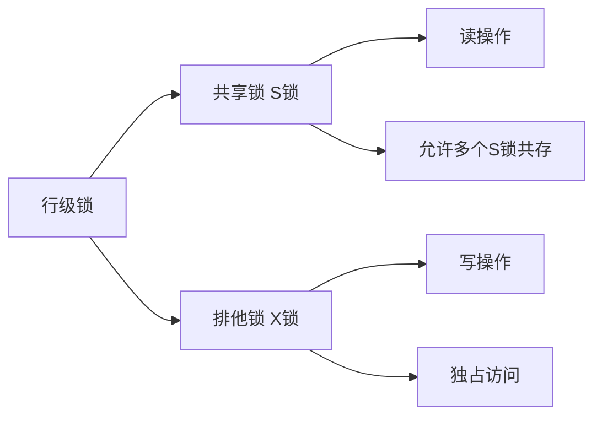
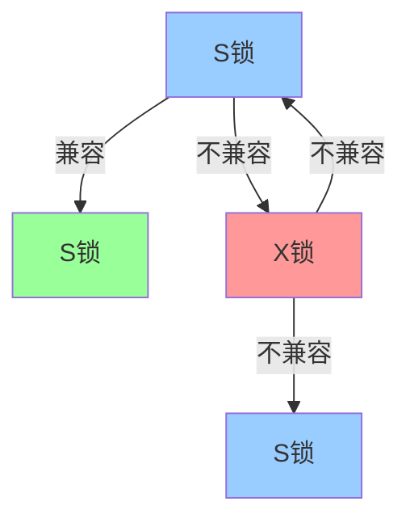
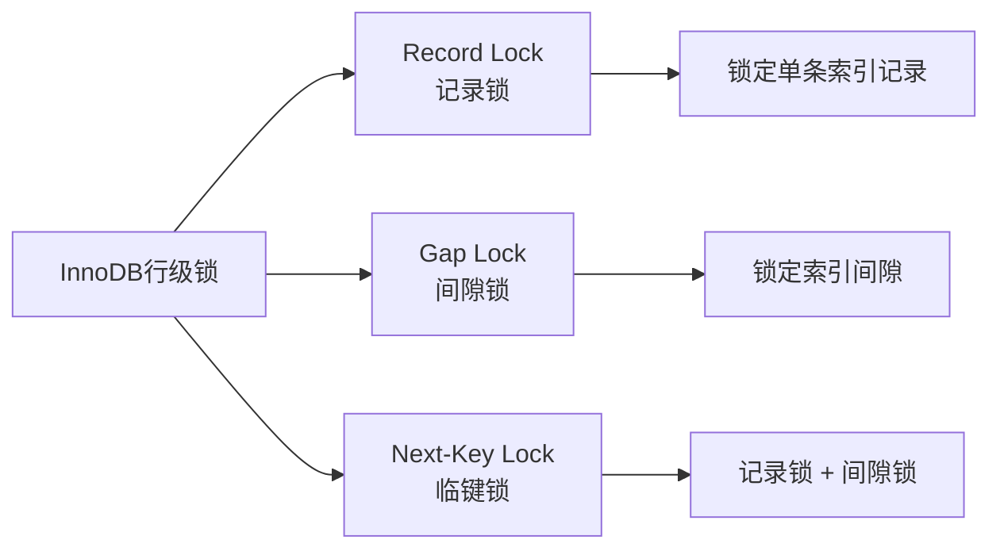
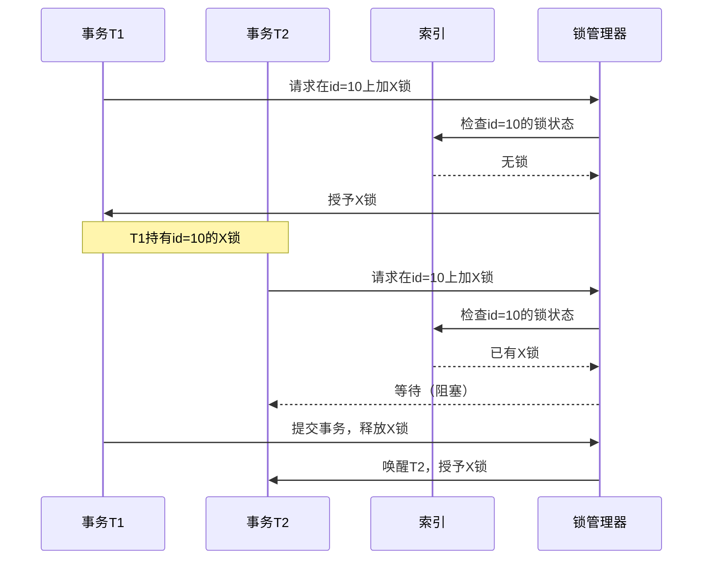
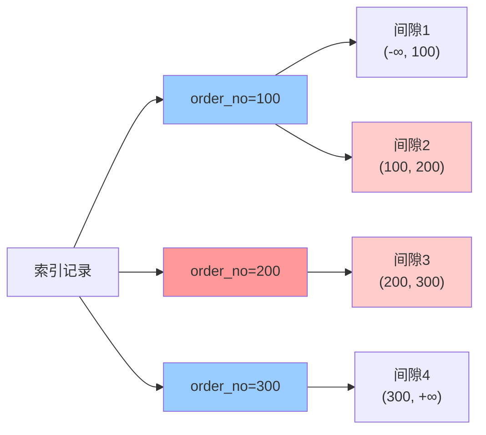
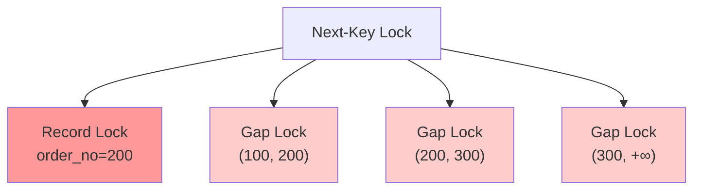
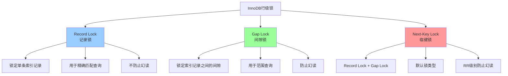
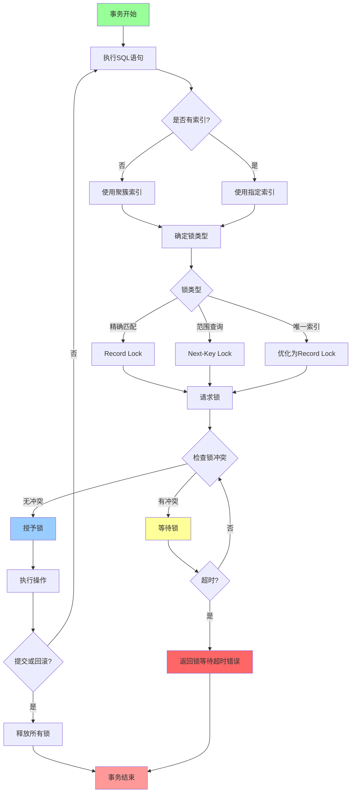
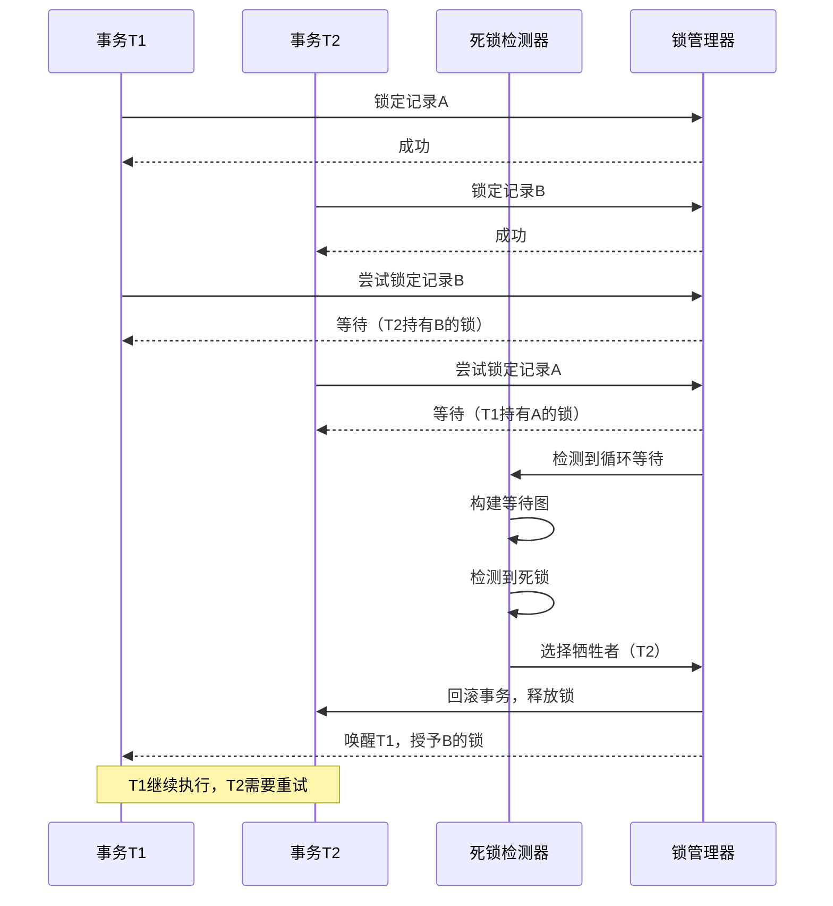
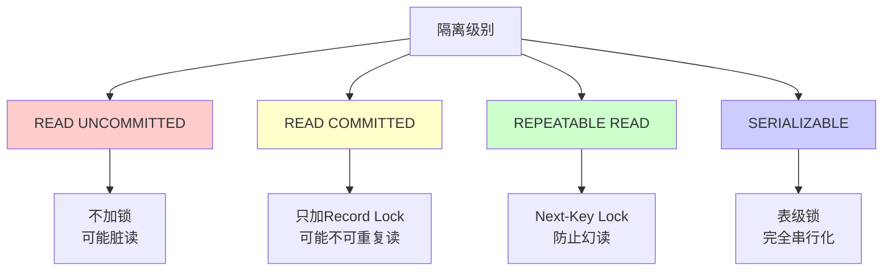

## 简介

行级锁是MySQL InnoDB存储引擎实现高并发事务的关键机制，它允许不同事务同时操作同一表中的不同行，从而显著提升了数据库的并发性能。与表级锁相比，行级锁的粒度更细，锁冲突的概率更低，能够支持更高的并发度。

在InnoDB中，行级锁是基于索引实现的，这意味着锁是加在索引记录上的，而不是物理行上。理解行级锁的工作原理、锁的类型、兼容性规则以及死锁机制，对于开发高性能的数据库应用、解决并发问题、优化系统性能都至关重要。

本文将从行级锁的基础概念出发，深入分析各种锁类型的实现原理，通过实际案例演示锁的行为，并提供死锁预防和性能优化的实用建议。

## 架构原理

### 行级锁基础概念

InnoDB的行级锁分为两大类：

1. **共享锁（Shared Lock，S锁）**：允许事务读取一行数据，阻止其他事务对该行进行排他锁定
2. **排他锁（Exclusive Lock，X锁）**：允许事务更新或删除一行数据，阻止其他事务对该行进行任何锁定



### 锁的兼容性矩阵

不同类型的锁之间存在兼容性关系：

| 锁类型 | S锁 | X锁 |
|--------|-----|-----|
| S锁 | 兼容 | 不兼容 |
| X锁 | 不兼容 | 不兼容 |



### InnoDB行级锁的三种类型

InnoDB实现了三种不同粒度的行级锁：

| 锁类型 | 英文名称 | 锁定范围 | 作用 |
|--------|----------|----------|------|
| 记录锁 | Record Lock | 单条索引记录 | 锁定索引记录本身 |
| 间隙锁 | Gap Lock | 索引记录之间的间隙 | 锁定索引记录之间的空隙，防止幻读 |
| 临键锁 | Next-Key Lock | 记录锁 + 间隙锁 | 锁定记录及其前面的间隙 |



## 源码分析

### Record Lock实现原理

Record Lock是行级锁最基本的类型，它锁定的是索引记录本身，而不是物理行。这意味着：

- 如果查询使用主键索引，锁加在主键索引记录上
- 如果查询使用辅助索引，锁加在辅助索引记录上
- 如果没有索引，MySQL会使用隐藏的聚簇索引（主键）

```sql
-- 示例表结构
CREATE TABLE users (
    id INT PRIMARY KEY,
    name VARCHAR(50),
    age INT,
    KEY idx_age (age)
);

-- Record Lock示例
START TRANSACTION;
SELECT * FROM users WHERE id = 10 FOR UPDATE;  -- 在id=10的记录上加X锁
-- 此时其他事务无法修改或锁定id=10的记录
```



### Gap Lock实现原理

Gap Lock锁定的是索引记录之间的间隙，用于防止幻读。它不锁定记录本身，而是锁定记录之间的空隙。

```sql
-- Gap Lock示例
CREATE TABLE orders (
    id INT PRIMARY KEY,
    order_no INT,
    amount DECIMAL(10,2),
    KEY idx_order_no (order_no)
);

-- 插入测试数据
INSERT INTO orders VALUES (1, 100, 1000.00);
INSERT INTO orders VALUES (2, 200, 2000.00);
INSERT INTO orders VALUES (3, 300, 3000.00);

START TRANSACTION;
SELECT * FROM orders WHERE order_no = 200 FOR UPDATE;
-- 此时锁定的范围：(100, 200) 和 (200, 300)
-- 其他事务无法插入order_no在(100, 300)之间的记录
```



### Next-Key Lock实现原理

Next-Key Lock是Record Lock和Gap Lock的组合，锁定记录及其前面的间隙。它是InnoDB默认的锁类型，用于在RR隔离级别下防止幻读。

```sql
-- Next-Key Lock示例
START TRANSACTION;
SELECT * FROM orders WHERE order_no >= 200 FOR UPDATE;
-- 锁定范围：
-- - Next-Key Lock: [100, 200)
-- - Record Lock: order_no=200
-- - Gap Lock: (200, 300)
-- - Gap Lock: (300, +∞)
```



### 锁算法的优化

InnoDB在实现锁时有一些优化策略：

1. **索引优化**：如果查询使用唯一索引，Next-Key Lock会退化为Record Lock
2. **范围优化**：对于等值查询，Gap Lock可能被优化掉
3. **覆盖索引优化**：如果查询只使用索引，不需要回表，可能减少锁的范围

```sql
-- 唯一索引优化
CREATE TABLE unique_test (
    id INT PRIMARY KEY,
    unique_col INT UNIQUE
);

START TRANSACTION;
SELECT * FROM unique_test WHERE unique_col = 10 FOR UPDATE;
-- 使用唯一索引，Next-Key Lock退化为Record Lock
-- 只锁定unique_col=10的记录，不锁定间隙
```

## 可视化图表

### 行级锁类型对比



### 锁的获取与释放流程



### 死锁检测流程



### 不同隔离级别的锁行为



## 使用场景及代码示例

### 场景1：Record Lock的使用

```sql
-- 创建测试表
CREATE TABLE products (
    id INT PRIMARY KEY,
    name VARCHAR(50),
    stock INT,
    price DECIMAL(10,2)
);

INSERT INTO products VALUES (1, 'Laptop', 10, 5000.00);
INSERT INTO products VALUES (2, 'Phone', 20, 3000.00);

-- 事务A：使用Record Lock
START TRANSACTION;
SELECT * FROM products WHERE id = 1 FOR UPDATE;
-- 此时在id=1的记录上加X锁
-- 其他事务无法修改或锁定id=1的记录

-- 事务B：尝试锁定同一记录
START TRANSACTION;
SELECT * FROM products WHERE id = 1 FOR UPDATE;
-- 阻塞，等待事务A释放锁

-- 事务C：可以锁定其他记录
START TRANSACTION;
SELECT * FROM products WHERE id = 2 FOR UPDATE;
-- 成功，可以锁定id=2的记录

-- 事务A提交
COMMIT;
-- 事务B被唤醒，获得锁
```

### 场景2：Gap Lock防止幻读

```sql
-- 创建测试表
CREATE TABLE orders (
    id INT PRIMARY KEY,
    order_no INT,
    status VARCHAR(20),
    KEY idx_order_no (order_no)
);

INSERT INTO orders VALUES (1, 100, 'pending');
INSERT INTO orders VALUES (2, 200, 'pending');
INSERT INTO orders VALUES (3, 300, 'pending');

-- 事务A：使用Gap Lock
START TRANSACTION;
SELECT * FROM orders WHERE order_no = 200 FOR UPDATE;
-- 锁定范围：(100, 200) 和 (200, 300)

-- 事务B：尝试插入新记录
START TRANSACTION;
INSERT INTO orders VALUES (4, 150, 'pending');
-- 阻塞，因为150在(100, 200)间隙中

-- 事务C：可以插入其他范围的记录
START TRANSACTION;
INSERT INTO orders VALUES (5, 50, 'pending');
-- 成功，50在(-∞, 100)间隙中

-- 事务A提交
COMMIT;
-- 事务B被唤醒，插入成功
```

### 场景3：Next-Key Lock在范围查询中的应用

```sql
-- 事务A：范围查询
START TRANSACTION;
SELECT * FROM orders WHERE order_no >= 200 FOR UPDATE;
-- 锁定范围：
-- - Next-Key Lock: [100, 200)
-- - Record Lock: order_no=200
-- - Gap Lock: (200, 300)
-- - Gap Lock: (300, +∞)

-- 事务B：尝试插入
START TRANSACTION;
INSERT INTO orders VALUES (6, 150, 'pending');
-- 阻塞，150在[100, 200)范围内

INSERT INTO orders VALUES (7, 250, 'pending');
-- 阻塞，250在(200, 300)间隙中

INSERT INTO orders VALUES (8, 350, 'pending');
-- 阻塞，350在(300, +∞)间隙中

-- 事务A提交
COMMIT;
-- 事务B的所有插入操作被唤醒
```

### 场景4：死锁场景及解决

```sql
-- 经典的死锁场景
-- 事务A
START TRANSACTION;
UPDATE products SET stock = stock - 1 WHERE id = 1;
-- 锁定id=1

-- 事务B
START TRANSACTION;
UPDATE products SET stock = stock - 1 WHERE id = 2;
-- 锁定id=2

-- 事务A
UPDATE products SET stock = stock - 1 WHERE id = 2;
-- 等待id=2的锁

-- 事务B
UPDATE products SET stock = stock - 1 WHERE id = 1;
-- 等待id=1的锁
-- 形成死锁，MySQL会选择一个事务回滚

-- 解决方案：按固定顺序加锁
-- 事务A和事务B都按id从小到大的顺序加锁
START TRANSACTION;
UPDATE products SET stock = stock - 1 WHERE id = 1;
UPDATE products SET stock = stock - 1 WHERE id = 2;
COMMIT;
```

### 场景5：在Spring中使用行级锁

```java
@Service
public class OrderService {
    
    @Autowired
    private OrderMapper orderMapper;
    
    @Autowired
    private ProductMapper productMapper;
    
    @Transactional
    public void createOrder(Long productId, int quantity) {
        // 使用SELECT FOR UPDATE加锁
        Product product = productMapper.selectForUpdate(productId);
        
        if (product.getStock() < quantity) {
            throw new RuntimeException("库存不足");
        }
        
        // 扣减库存
        product.setStock(product.getStock() - quantity);
        productMapper.updateById(product);
        
        // 创建订单
        Order order = new Order();
        order.setProductId(productId);
        order.setQuantity(quantity);
        order.setAmount(product.getPrice().multiply(BigDecimal.valueOf(quantity)));
        orderMapper.insert(order);
    }
}

// Mapper接口
@Mapper
public interface ProductMapper {
    
    @Select("SELECT * FROM products WHERE id = #{id} FOR UPDATE")
    Product selectForUpdate(Long id);
    
    @Update("UPDATE products SET stock = #{stock} WHERE id = #{id}")
    int updateById(Product product);
}
```

### 场景6：乐观锁与悲观锁的选择

```java
// 悲观锁：使用SELECT FOR UPDATE
@Transactional
public void updateWithPessimisticLock(Long productId) {
    Product product = productMapper.selectForUpdate(productId);
    product.setStock(product.getStock() - 1);
    productMapper.updateById(product);
}

// 乐观锁：使用版本号
@Entity
@Table(name = "products")
public class Product {
    @Id
    private Long id;
    private String name;
    private Integer stock;
    private BigDecimal price;
    
    @Version
    private Integer version;  // 乐观锁版本号
}

@Transactional
public void updateWithOptimisticLock(Long productId) {
    Product product = productMapper.selectById(productId);
    product.setStock(product.getStock() - 1);
    
    int affected = productMapper.updateWithVersion(product);
    if (affected == 0) {
        throw new RuntimeException("数据已被修改，请重试");
    }
}

// Mapper接口
@Update("UPDATE products SET stock = #{stock}, version = version + 1 " +
        "WHERE id = #{id} AND version = #{version}")
int updateWithVersion(Product product);
```

## 注意事项

### 1. 锁的粒度与性能

行级锁虽然并发性能好，但也有开销：

- **锁管理开销**：每个锁都需要内存和CPU资源管理
- **锁竞争**：高并发下，锁竞争可能导致等待
- **死锁检测**：死锁检测需要额外的CPU资源

**建议**：

- 合理选择隔离级别
- 避免长事务
- 减少锁的持有时间

### 2. 索引对锁的影响

索引的选择直接影响锁的范围：

```sql
-- 使用主键索引
SELECT * FROM products WHERE id = 1 FOR UPDATE;
-- 只锁定id=1的记录

-- 使用辅助索引
SELECT * FROM products WHERE name = 'Laptop' FOR UPDATE;
-- 锁定name='Laptop'的记录和对应的主键记录

-- 没有索引
SELECT * FROM products WHERE stock = 10 FOR UPDATE;
-- 锁定所有记录（表级锁）
```

**建议**：

- 为查询条件创建合适的索引
- 避免全表扫描
- 使用覆盖索引减少锁的范围

### 3. 不同隔离级别的锁行为

| 隔离级别 | Record Lock | Gap Lock | Next-Key Lock |
|----------|-------------|----------|---------------|
| RU | 不使用 | 不使用 | 不使用 |
| RC | 使用 | 不使用 | 不使用 |
| RR | 使用 | 使用 | 使用 |
| Serializable | 使用 | 使用 | 使用 |

**建议**：

- RC级别：读多写少，允许不可重复读
- RR级别：需要严格的一致性保证
- 避免使用RU和Serializable级别

### 4. 死锁的预防

死锁产生的四个必要条件：

1. **互斥条件**：资源不能共享
2. **请求与保持**：持有锁的同时请求其他锁
3. **不可剥夺**：锁不能被强制释放
4. **循环等待**：形成等待环路

**预防策略**：

```java
// 1. 按固定顺序加锁
@Transactional
public void transfer(Long fromId, Long toId, BigDecimal amount) {
    // 确保fromId < toId，避免循环等待
    if (fromId > toId) {
        Long temp = fromId;
        fromId = toId;
        toId = temp;
    }
    
    Account from = accountMapper.selectForUpdate(fromId);
    Account to = accountMapper.selectForUpdate(toId);
    
    from.setBalance(from.getBalance().subtract(amount));
    to.setBalance(to.getBalance().add(amount));
    
    accountMapper.updateById(from);
    accountMapper.updateById(to);
}

// 2. 一次性获取所有锁
@Transactional
public void batchUpdate(List<Long> ids) {
    List<Product> products = productMapper.selectForUpdateByIds(ids);
    products.forEach(p -> p.setStock(p.getStock() - 1));
    productMapper.batchUpdate(products);
}

// 3. 设置锁等待超时
// 在application.yml中配置
spring:
  datasource:
    hikari:
      connection-timeout: 30000
      lock-timeout: 5000
```

### 5. 锁等待超时设置

```sql
-- 查看当前锁等待超时时间
SHOW VARIABLES LIKE 'innodb_lock_wait_timeout';

-- 设置锁等待超时时间（单位：秒）
SET GLOBAL innodb_lock_wait_timeout = 50;
SET SESSION innodb_lock_wait_timeout = 50;

-- 在Java中处理锁等待超时
try {
    orderService.createOrder(productId, quantity);
} catch (CannotAcquireLockException e) {
    // 处理锁等待超时
    throw new BusinessException("系统繁忙，请稍后重试");
}
```

### 6. 监控行级锁

```sql
-- 查看当前锁等待情况
SELECT * FROM information_schema.INNODB_LOCKS;
SELECT * FROM information_schema.INNODB_LOCK_WAITS;
SELECT * FROM information_schema.INNODB_TRX;

-- 查看锁相关的性能指标
SHOW ENGINE INNODB STATUS;

-- 查看死锁信息
SHOW VARIABLES LIKE 'innodb_print_all_deadlocks';
SET GLOBAL innodb_print_all_deadlocks = ON;
```

## 常见问题及解决方案

### 问题1：为什么SELECT FOR UPDATE没有加锁？

**现象**：

```sql
START TRANSACTION;
SELECT * FROM products WHERE name = 'Laptop' FOR UPDATE;
-- 在另一个会话中仍然可以修改这条记录
```

**原因**：

- 查询没有使用索引，导致全表扫描
- 在某些情况下，MySQL可能优化掉锁

**解决方案**：

```sql
-- 确保查询使用索引
-- 1. 创建索引
CREATE INDEX idx_name ON products(name);

-- 2. 使用FORCE INDEX强制使用索引
SELECT * FROM products FORCE INDEX(idx_name) 
WHERE name = 'Laptop' FOR UPDATE;

-- 3. 检查执行计划
EXPLAIN SELECT * FROM products WHERE name = 'Laptop' FOR UPDATE;
```

### 问题2：Gap Lock导致插入阻塞

**现象**：

```sql
-- 事务A
START TRANSACTION;
SELECT * FROM orders WHERE order_no = 200 FOR UPDATE;

-- 事务B
START TRANSACTION;
INSERT INTO orders VALUES (4, 150, 'pending');
-- 阻塞，无法插入
```

**原因**：

- RR隔离级别下，Gap Lock防止幻读
- 150在(100, 200)间隙中，被Gap Lock锁定

**解决方案**：

```sql
-- 方案1：使用RC隔离级别
SET SESSION TRANSACTION ISOLATION LEVEL READ COMMITTED;
START TRANSACTION;
SELECT * FROM orders WHERE order_no = 200 FOR UPDATE;
-- 此时只有Record Lock，没有Gap Lock

-- 方案2：使用唯一索引
CREATE UNIQUE INDEX idx_order_no_unique ON orders(order_no);
-- 唯一索引的等值查询不会加Gap Lock

-- 方案3：使用乐观锁
-- 不使用SELECT FOR UPDATE，通过版本号控制并发
```

### 问题3：死锁频繁发生

**现象**：

```sql
ERROR 1213 (40001): Deadlock found when trying to get lock;
```

**原因**：

- 事务以不同顺序访问资源
- 长事务持有锁时间过长
- 索引设计不合理

**解决方案**：

```sql
-- 1. 查看死锁日志
SHOW ENGINE INNODB STATUS;

-- 2. 开启死锁日志记录
SET GLOBAL innodb_print_all_deadlocks = ON;

-- 3. 分析死锁原因
-- 查看死锁日志中的LATEST DETECTED DEADLOCK部分

-- 4. 优化代码逻辑
-- 按固定顺序加锁
@Transactional
public void safeUpdate(List<Long> ids) {
    // 排序，确保加锁顺序一致
    ids.sort(Long::compareTo);
    ids.forEach(id -> {
        Product product = productMapper.selectForUpdate(id);
        product.setStock(product.getStock() - 1);
        productMapper.updateById(product);
    });
}

-- 5. 减少事务范围
// 错误示例：事务包含耗时操作
@Transactional
public void badExample() {
    Product product = productMapper.selectForUpdate(id);
    // 耗时的外部调用
    callExternalService();
    product.setStock(product.getStock() - 1);
    productMapper.updateById(product);
}

// 正确示例：缩小事务范围
public void goodExample() {
    Product product = productMapper.selectById(id);
    // 耗时操作在事务外
    ExternalData data = callExternalService();
    
    // 事务只包含必要的数据库操作
    updateProductStock(id, data);
}

@Transactional
public void updateProductStock(Long id, ExternalData data) {
    Product product = productMapper.selectForUpdate(id);
    product.setStock(product.getStock() - data.getQuantity());
    productMapper.updateById(product);
}
```

### 问题4：锁等待超时

**现象**：

```java
org.springframework.dao.CannotAcquireLockException: 
### Error updating database.  Cause: java.sql.SQLException: Lock wait timeout exceeded
```

**原因**：

- 锁等待时间超过配置的超时时间
- 长事务持有锁不释放
- 死锁导致锁等待

**解决方案**：

```java
// 1. 增加锁等待超时时间
// application.yml
spring:
  datasource:
    hikari:
      connection-timeout: 30000  # 30秒
      maximum-pool-size: 20

// 或在MySQL中设置
SET GLOBAL innodb_lock_wait_timeout = 120;  # 120秒

// 2. 使用重试机制
@Retryable(value = {CannotAcquireLockException.class}, 
           maxAttempts = 3, 
           backoff = @Backoff(delay = 100))
@Transactional
public void createOrderWithRetry(Long productId, int quantity) {
    Product product = productMapper.selectForUpdate(productId);
    product.setStock(product.getStock() - quantity);
    productMapper.updateById(product);
}

// 3. 使用乐观锁避免锁等待
@Transactional
public void createOrderWithOptimisticLock(Long productId, int quantity) {
    int maxRetries = 3;
    for (int i = 0; i < maxRetries; i++) {
        Product product = productMapper.selectById(productId);
        
        if (product.getStock() < quantity) {
            throw new RuntimeException("库存不足");
        }
        
        product.setStock(product.getStock() - quantity);
        int affected = productMapper.updateWithVersion(product);
        
        if (affected > 0) {
            return;  // 更新成功
        }
        
        // 版本号不匹配，重试
        if (i == maxRetries - 1) {
            throw new RuntimeException("系统繁忙，请稍后重试");
        }
        
        try {
            Thread.sleep(100);  // 短暂等待后重试
        } catch (InterruptedException e) {
            Thread.currentThread().interrupt();
            throw new RuntimeException("操作被中断");
        }
    }
}
```

### 问题5：锁升级导致性能下降

**现象**：

```sql
-- 简单的查询导致整个表被锁定
SELECT * FROM products WHERE stock > 0 FOR UPDATE;
-- 其他所有操作都被阻塞
```

**原因**：

- 查询没有使用索引
- MySQL将行级锁升级为表级锁
- 锁的范围过大

**解决方案**：

```sql
-- 1. 创建合适的索引
CREATE INDEX idx_stock ON products(stock);

-- 2. 优化查询条件
-- 限制查询范围
SELECT * FROM products 
WHERE stock > 0 AND id BETWEEN 1 AND 100 
FOR UPDATE;

-- 3. 使用覆盖索引
CREATE INDEX idx_stock_id ON products(stock, id, name);

-- 4. 分批处理
-- 错误示例：一次性锁定大量记录
@Transactional
public void badBatchUpdate() {
    List<Product> products = productMapper.selectAllForUpdate();
    products.forEach(p -> p.setStock(p.getStock() - 1));
    productMapper.batchUpdate(products);
}

// 正确示例：分批处理
public void goodBatchUpdate() {
    int batchSize = 100;
    int offset = 0;
    
    while (true) {
        List<Product> products = productMapper.selectBatchForUpdate(offset, batchSize);
        if (products.isEmpty()) {
            break;
        }
        
        updateBatch(products);
        offset += batchSize;
    }
}

@Transactional
public void updateBatch(List<Product> products) {
    products.forEach(p -> p.setStock(p.getStock() - 1));
    productMapper.batchUpdate(products);
}
```

### 问题6：主从复制中的锁问题

**现象**：

- 主库更新成功，但从库查询不到最新数据
- 主从延迟导致数据不一致

**原因**：

- 从库应用binlog时可能遇到锁冲突
- 长事务导致复制延迟

**解决方案**：

```sql
-- 1. 监控主从复制延迟
SHOW SLAVE STATUS\G
-- 查看Seconds_Behind_Master字段

-- 2. 优化从库复制参数
SET GLOBAL slave_parallel_workers = 4;
SET GLOBAL slave_parallel_type = 'LOGICAL_CLOCK';

-- 3. 避免在从库上执行写操作
-- 从库设置为只读
SET GLOBAL read_only = ON;

-- 4. 使用读写分离
// 在Spring中配置主从数据源
@Configuration
public class DataSourceConfig {
    
    @Bean
    @Primary
    public DataSource masterDataSource() {
        HikariDataSource dataSource = new HikariDataSource();
        dataSource.setJdbcUrl("jdbc:mysql://master-host:3306/db");
        dataSource.setUsername("user");
        dataSource.setPassword("password");
        return dataSource;
    }
    
    @Bean
    public DataSource slaveDataSource() {
        HikariDataSource dataSource = new HikariDataSource();
        dataSource.setJdbcUrl("jdbc:mysql://slave-host:3306/db");
        dataSource.setUsername("user");
        dataSource.setPassword("password");
        dataSource.setReadOnly(true);
        return dataSource;
    }
}

// 使用@ReadOnly注解指定读操作
@Target(ElementType.METHOD)
@Retention(RetentionPolicy.RUNTIME)
public @interface ReadOnly {
}

@Aspect
@Component
public class DataSourceAspect {
    
    @Autowired
    private DataSource masterDataSource;
    
    @Autowired
    private DataSource slaveDataSource;
    
    @Around("@annotation(readOnly)")
    public Object around(ProceedingJoinPoint point, ReadOnly readOnly) throws Throwable {
        // 切换到从库数据源
        // 执行查询
        // 切换回主库数据源
        return point.proceed();
    }
}
```

## 总结

MySQL行级锁是InnoDB存储引擎实现高并发事务的核心机制，通过精细的锁粒度控制，实现了高并发度和数据一致性的平衡。

### 核心要点

1. **三种锁类型**：Record Lock（记录锁）、Gap Lock（间隙锁）、Next-Key Lock（临键锁）
2. **锁的兼容性**：S锁与S锁兼容，X锁与任何锁都不兼容
3. **索引的作用**：锁是加在索引上的，索引的选择直接影响锁的范围
4. **隔离级别差异**：RC级别只使用Record Lock，RR级别使用Next-Key Lock防止幻读
5. **死锁处理**：MySQL自动检测死锁并回滚一个事务，开发中需要预防死锁

### 最佳实践

1. **合理选择隔离级别**：
   - RC：读多写少，允许不可重复读
   - RR：需要严格的一致性保证

2. **优化索引设计**：
   - 为查询条件创建合适的索引
   - 避免全表扫描导致锁升级
   - 使用覆盖索引减少锁的范围

3. **预防死锁**：
   - 按固定顺序加锁
   - 减少锁的持有时间
   - 设置合理的锁等待超时

4. **选择合适的锁策略**：
   - 悲观锁：写多读少，冲突频繁
   - 乐观锁：读多写少，冲突较少

5. **监控和优化**：
   - 定期检查锁等待情况
   - 分析死锁日志
   - 优化慢查询和长事务

### 性能优化建议

1. **减少锁的持有时间**：将耗时操作放在事务外
2. **缩小锁的范围**：使用索引，避免全表扫描
3. **使用批量操作**：减少锁的获取和释放次数
4. **合理设置超时**：避免长时间等待
5. **读写分离**：将读操作分散到从库

行级锁是MySQL并发控制的基础，深入理解行级锁的工作原理和使用技巧，对于开发高性能、高可用的数据库应用至关重要。在实际开发中，需要根据业务场景选择合适的锁策略，并通过监控和优化不断提升系统性能。
