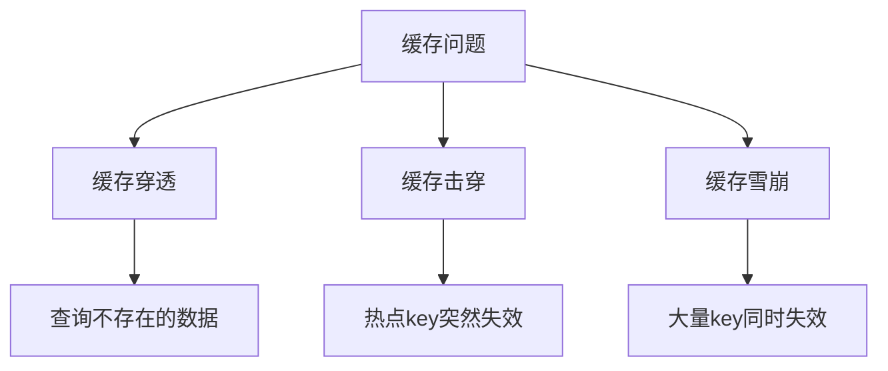
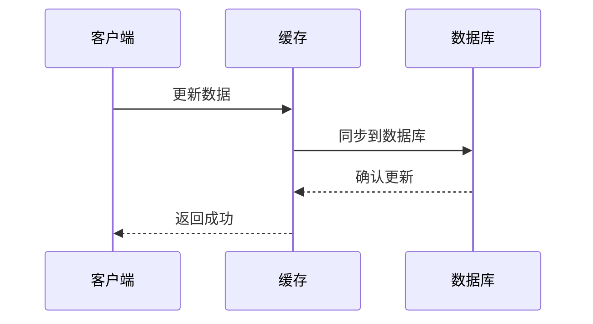

# 缓存同步方案深度解析与架构设计

## 概述

在现代分布式系统中，缓存已成为提升系统性能的关键组件。然而，缓存与数据库之间的数据同步问题一直是系统架构设计的难点。本文将深入解析缓存同步的各种方案，包括缓存穿透、缓存击穿、缓存雪崩的解决方案，以及数据一致性保证机制。

## 缓存同步的核心挑战

### 1. 数据一致性挑战

在分布式系统中，缓存与数据库之间的数据同步面临以下挑战：

- **数据不一致**：缓存与数据库数据不同步
- **并发更新**：多个节点同时更新同一数据
- **网络延迟**：分布式环境下网络延迟导致同步延迟
- **故障恢复**：节点故障后的数据恢复

### 2. 缓存经典问题



## 缓存同步方案分类

### 1. 按同步时机分类

#### 1.1 实时同步方案

**方案特点**：数据变更后立即同步缓存

```java
@Service
public class RealTimeCacheSyncService {
    
    @Autowired
    private RedisTemplate<String, Object> redisTemplate;
    
    @Transactional
    public void updateUser(User user) {
        // 1. 更新数据库
        userMapper.updateById(user);
        
        // 2. 实时更新缓存
        String cacheKey = "user:" + user.getId();
        redisTemplate.opsForValue().set(cacheKey, user, Duration.ofHours(1));
        
        // 3. 发布变更事件
        redisTemplate.convertAndSend("user.update", user.getId());
    }
}
```

#### 1.2 延迟同步方案

**方案特点**：数据变更后延迟一段时间同步缓存

```java
@Service
public class DelayedCacheSyncService {
    
    @Autowired
    private DelayQueue<CacheSyncTask> delayQueue;
    
    public void updateUser(User user) {
        // 1. 更新数据库
        userMapper.updateById(user);
        
        // 2. 加入延迟队列，5秒后同步缓存
        CacheSyncTask task = new CacheSyncTask("user:" + user.getId(), user, 5000);
        delayQueue.offer(task);
    }
    
    @EventListener
    public void handleCacheSync(CacheSyncEvent event) {
        // 延迟同步处理逻辑
        String cacheKey = event.getKey();
        Object value = event.getValue();
        redisTemplate.opsForValue().set(cacheKey, value, Duration.ofHours(1));
    }
}
```

#### 1.3 定时同步方案

**方案特点**：按照固定时间间隔同步缓存

```java
@Component
public class ScheduledCacheSyncService {
    
    @Scheduled(fixedRate = 60000) // 每分钟执行一次
    public void syncHotData() {
        // 同步热点数据到缓存
        List<User> hotUsers = userMapper.selectHotUsers();
        for (User user : hotUsers) {
            String cacheKey = "user:" + user.getId();
            redisTemplate.opsForValue().set(cacheKey, user, Duration.ofHours(1));
        }
    }
}
```

### 2. 按同步方向分类

#### 2.1 写时更新（Write-Through）

**方案特点**：先更新缓存，再更新数据库



```java
@Service
public class WriteThroughCacheService {
    
    public void updateUser(User user) {
        String cacheKey = "user:" + user.getId();
        
        // 1. 先更新缓存
        redisTemplate.opsForValue().set(cacheKey, user, Duration.ofHours(1));
        
        // 2. 再更新数据库
        userMapper.updateById(user);
        
        // 3. 如果数据库更新失败，回滚缓存
        try {
            // 数据库操作
        } catch (Exception e) {
            // 回滚缓存
            redisTemplate.delete(cacheKey);
            throw e;
        }
    }
}
```

#### 2.2 写后更新（Write-Behind）

**方案特点**：先更新缓存，异步更新数据库

```java
@Service
public class WriteBehindCacheService {
    
    @Autowired
    private ExecutorService asyncExecutor;
    
    public void updateUser(User user) {
        String cacheKey = "user:" + user.getId();
        
        // 1. 立即更新缓存
        redisTemplate.opsForValue().set(cacheKey, user, Duration.ofHours(1));
        
        // 2. 异步更新数据库
        asyncExecutor.submit(() -> {
            try {
                userMapper.updateById(user);
            } catch (Exception e) {
                // 记录日志，重试机制
                log.error("异步更新数据库失败: {}", user.getId(), e);
            }
        });
    }
}
```

#### 2.3 读时更新（Read-Through）

**方案特点**：缓存未命中时从数据库加载

```java
@Service
public class ReadThroughCacheService {
    
    public User getUserById(Long id) {
        String cacheKey = "user:" + id;
        
        // 1. 尝试从缓存获取
        User user = (User) redisTemplate.opsForValue().get(cacheKey);
        
        if (user == null) {
            // 2. 缓存未命中，从数据库加载
            user = userMapper.selectById(id);
            
            if (user != null) {
                // 3. 写入缓存
                redisTemplate.opsForValue().set(cacheKey, user, Duration.ofHours(1));
            }
        }
        
        return user;
    }
}
```

## 分布式缓存同步架构

### 1. 基于消息队列的同步方案

#### 1.1 Redis Pub/Sub 方案

```java
@Component
public class RedisPubSubCacheSync {
    
    @Autowired
    private RedisTemplate<String, Object> redisTemplate;
    
    /**
     * 发布缓存更新消息
     */
    public void publishCacheUpdate(String channel, Object message) {
        redisTemplate.convertAndSend(channel, message);
    }
    
    /**
     * 订阅缓存更新消息
     */
    @EventListener
    public void handleCacheUpdate(Message message, byte[] pattern) {
        String channel = new String(pattern);
        String data = new String(message.getBody());
        
        // 解析消息并更新本地缓存
        CacheUpdateEvent event = JSON.parseObject(data, CacheUpdateEvent.class);
        updateLocalCache(event);
    }
    
    private void updateLocalCache(CacheUpdateEvent event) {
        // 根据事件类型更新缓存
        switch (event.getType()) {
            case "UPDATE":
                redisTemplate.opsForValue().set(event.getKey(), event.getValue());
                break;
            case "DELETE":
                redisTemplate.delete(event.getKey());
                break;
            case "EXPIRE":
                redisTemplate.expire(event.getKey(), Duration.ofSeconds(event.getTtl()));
                break;
        }
    }
}
```

#### 1.2 RabbitMQ 方案

```java
@Component
public class RabbitMqCacheSync {
    
    @Autowired
    private RabbitTemplate rabbitTemplate;
    
    /**
     * 发送缓存同步消息
     */
    public void sendCacheSyncMessage(CacheSyncMessage message) {
        rabbitTemplate.convertAndSend(
            "cache.sync.exchange",
            "cache.sync.routingKey",
            message
        );
    }
    
    /**
     * 接收缓存同步消息
     */
    @RabbitListener(queues = "cache.sync.queue")
    public void handleCacheSyncMessage(CacheSyncMessage message) {
        // 根据消息类型处理缓存同步
        switch (message.getOperation()) {
            case UPDATE:
                updateCache(message.getKey(), message.getValue());
                break;
            case DELETE:
                deleteCache(message.getKey());
                break;
            case INVALIDATE:
                invalidateCache(message.getPattern());
                break;
        }
    }
}
```

### 2. 基于数据库日志的同步方案

#### 2.1 MySQL Binlog 方案

```java
@Component
public class BinlogCacheSync {
    
    @Autowired
    private RedisTemplate<String, Object> redisTemplate;
    
    /**
     * 监听MySQL Binlog变化
     */
    @EventListener
    public void handleBinlogEvent(BinlogEvent event) {
        // 解析Binlog事件
        TableChange change = parseBinlogEvent(event);
        
        // 根据表名和操作类型更新缓存
        if ("user".equals(change.getTableName())) {
            handleUserTableChange(change);
        } else if ("order".equals(change.getTableName())) {
            handleOrderTableChange(change);
        }
    }
    
    private void handleUserTableChange(TableChange change) {
        String cacheKey = "user:" + change.getPrimaryKey();
        
        switch (change.getOperation()) {
            case INSERT:
            case UPDATE:
                // 从数据库查询最新数据
                User user = userMapper.selectById(change.getPrimaryKey());
                redisTemplate.opsForValue().set(cacheKey, user);
                break;
            case DELETE:
                redisTemplate.delete(cacheKey);
                break;
        }
    }
}
```

#### 2.2 Canal 中间件方案

```java
@Component
public class CanalCacheSync {
    
    @Autowired
    private CanalConnector canalConnector;
    
    /**
     * 启动Canal监听
     */
    @PostConstruct
    public void startCanalListener() {
        new Thread(() -> {
            while (true) {
                try {
                    Message message = canalConnector.getWithoutAck(1000);
                    List<CanalEntry.Entry> entries = message.getEntries();
                    
                    for (CanalEntry.Entry entry : entries) {
                        if (entry.getEntryType() == CanalEntry.EntryType.ROWDATA) {
                            // 处理行数据变更
                            handleRowChange(entry);
                        }
                    }
                    
                    canalConnector.ack(message.getId());
                } catch (Exception e) {
                    log.error("Canal监听异常", e);
                }
            }
        }).start();
    }
    
    private void handleRowChange(CanalEntry.Entry entry) {
        // 解析行数据变更并更新缓存
        CanalEntry.RowChange rowChange = CanalEntry.RowChange.parseFrom(entry.getStoreValue());
        
        for (CanalEntry.RowData rowData : rowChange.getRowDatasList()) {
            // 根据变更类型更新缓存
            updateCacheByRowChange(rowChange.getEventType(), rowData);
        }
    }
}
```

## 缓存一致性保证机制

### 1. 分布式锁方案

#### 1.1 Redis 分布式锁

```java
@Service
public class RedisDistributedLock {
    
    private static final String LOCK_PREFIX = "lock:";
    private static final long DEFAULT_EXPIRE_TIME = 30000; // 30秒
    
    /**
     * 获取分布式锁
     */
    public boolean tryLock(String key, long expireTime) {
        String lockKey = LOCK_PREFIX + key;
        String value = UUID.randomUUID().toString();
        
        return Boolean.TRUE.equals(redisTemplate.opsForValue()
            .setIfAbsent(lockKey, value, Duration.ofMillis(expireTime)));
    }
    
    /**
     * 释放分布式锁
     */
    public void unlock(String key) {
        String lockKey = LOCK_PREFIX + key;
        redisTemplate.delete(lockKey);
    }
    
    /**
     * 带重试的锁获取
     */
    public boolean tryLockWithRetry(String key, long expireTime, int retryTimes, long sleepTime) {
        for (int i = 0; i < retryTimes; i++) {
            if (tryLock(key, expireTime)) {
                return true;
            }
            
            try {
                Thread.sleep(sleepTime);
            } catch (InterruptedException e) {
                Thread.currentThread().interrupt();
                return false;
            }
        }
        
        return false;
    }
}
```

#### 1.2 缓存更新的一致性保证

```java
@Service
public class ConsistentCacheUpdate {
    
    @Autowired
    private RedisDistributedLock distributedLock;
    
    public void updateUserWithLock(User user) {
        String lockKey = "user_update:" + user.getId();
        
        try {
            // 获取分布式锁
            if (distributedLock.tryLock(lockKey, 5000)) {
                // 1. 更新数据库
                userMapper.updateById(user);
                
                // 2. 更新缓存
                String cacheKey = "user:" + user.getId();
                redisTemplate.opsForValue().set(cacheKey, user, Duration.ofHours(1));
                
                // 3. 发布变更通知
                publishCacheUpdateEvent(user.getId());
            } else {
                throw new RuntimeException("获取锁失败，请重试");
            }
        } finally {
            // 释放锁
            distributedLock.unlock(lockKey);
        }
    }
}
```

### 2. 版本控制方案

#### 2.1 基于版本号的乐观锁

```java
@Data
public class CacheData {
    private Object data;
    private Long version;
    private Long timestamp;
}

@Service
public class VersionBasedCache {
    
    public boolean updateCacheWithVersion(String key, Object newValue, Long expectedVersion) {
        // 1. 获取当前缓存数据
        CacheData currentData = (CacheData) redisTemplate.opsForValue().get(key);
        
        if (currentData == null) {
            // 缓存不存在，直接设置
            CacheData newData = new CacheData(newValue, 1L, System.currentTimeMillis());
            redisTemplate.opsForValue().set(key, newData);
            return true;
        }
        
        // 2. 检查版本号
        if (!expectedVersion.equals(currentData.getVersion())) {
            // 版本冲突，更新失败
            return false;
        }
        
        // 3. 更新缓存
        CacheData newData = new CacheData(newValue, expectedVersion + 1, System.currentTimeMillis());
        redisTemplate.opsForValue().set(key, newData);
        return true;
    }
}
```

## 缓存问题解决方案

### 1. 缓存穿透解决方案

#### 1.1 布隆过滤器

```java
@Component
public class BloomFilterCache {
    
    private BloomFilter<String> bloomFilter;
    
    @PostConstruct
    public void init() {
        // 初始化布隆过滤器
        bloomFilter = BloomFilter.create(
            Funnels.stringFunnel(Charset.defaultCharset()),
            1000000, // 预期元素数量
            0.01     // 误判率
        );
        
        // 预热数据
        List<String> existingKeys = loadExistingKeys();
        for (String key : existingKeys) {
            bloomFilter.put(key);
        }
    }
    
    public Object getWithBloomFilter(String key) {
        // 1. 先检查布隆过滤器
        if (!bloomFilter.mightContain(key)) {
            // key肯定不存在，直接返回空
            return null;
        }
        
        // 2. 从缓存获取
        Object value = redisTemplate.opsForValue().get(key);
        
        if (value == null) {
            // 3. 缓存未命中，从数据库获取
            value = loadFromDatabase(key);
            
            if (value != null) {
                // 4. 写入缓存
                redisTemplate.opsForValue().set(key, value, Duration.ofHours(1));
            } else {
                // 5. 数据库也不存在，设置空值缓存
                redisTemplate.opsForValue().set(key, "", Duration.ofMinutes(5));
            }
        }
        
        return value;
    }
}
```

#### 1.2 空值缓存

```java
@Service
public class NullValueCache {
    
    public Object getWithNullCache(String key) {
        // 1. 从缓存获取
        Object value = redisTemplate.opsForValue().get(key);
        
        if (value != null) {
            if ("".equals(value)) {
                // 空值缓存，直接返回null
                return null;
            }
            return value;
        }
        
        // 2. 从数据库获取
        value = loadFromDatabase(key);
        
        if (value != null) {
            // 3. 写入缓存
            redisTemplate.opsForValue().set(key, value, Duration.ofHours(1));
        } else {
            // 4. 设置空值缓存，防止缓存穿透
            redisTemplate.opsForValue().set(key, "", Duration.ofMinutes(5));
        }
        
        return value;
    }
}
```

### 2. 缓存击穿解决方案

#### 2.1 互斥锁方案

```java
@Service
public class MutexLockCache {
    
    @Autowired
    private RedisDistributedLock distributedLock;
    
    public Object getWithMutexLock(String key) {
        // 1. 从缓存获取
        Object value = redisTemplate.opsForValue().get(key);
        
        if (value != null) {
            return value;
        }
        
        // 2. 获取分布式锁
        String lockKey = "cache_rebuild:" + key;
        
        try {
            if (distributedLock.tryLock(lockKey, 5000)) {
                // 3. 再次检查缓存（双重检查）
                value = redisTemplate.opsForValue().get(key);
                if (value != null) {
                    return value;
                }
                
                // 4. 从数据库加载
                value = loadFromDatabase(key);
                
                if (value != null) {
                    // 5. 写入缓存
                    redisTemplate.opsForValue().set(key, value, Duration.ofHours(1));
                }
                
                return value;
            } else {
                // 获取锁失败，等待并重试
                Thread.sleep(100);
                return redisTemplate.opsForValue().get(key);
            }
        } catch (InterruptedException e) {
            Thread.currentThread().interrupt();
            return null;
        } finally {
            distributedLock.unlock(lockKey);
        }
    }
}
```

#### 2.2 逻辑过期方案

```java
@Data
public class LogicExpireData {
    private Object data;
    private Long expireTime;
}

@Service
public class LogicExpireCache {
    
    public Object getWithLogicExpire(String key) {
        // 1. 从缓存获取
        LogicExpireData cacheData = (LogicExpireData) redisTemplate.opsForValue().get(key);
        
        if (cacheData == null) {
            // 缓存不存在，从数据库加载
            return loadAndSetCache(key);
        }
        
        // 2. 检查逻辑过期时间
        if (System.currentTimeMillis() > cacheData.getExpireTime()) {
            // 异步重建缓存
            rebuildCacheAsync(key);
        }
        
        return cacheData.getData();
    }
    
    private void rebuildCacheAsync(String key) {
        CompletableFuture.runAsync(() -> {
            try {
                Object newData = loadFromDatabase(key);
                if (newData != null) {
                    LogicExpireData newCacheData = new LogicExpireData();
                    newCacheData.setData(newData);
                    newCacheData.setExpireTime(System.currentTimeMillis() + 3600000); // 1小时后过期
                    redisTemplate.opsForValue().set(key, newCacheData);
                }
            } catch (Exception e) {
                log.error("异步重建缓存失败: {}", key, e);
            }
        });
    }
}
```

### 3. 缓存雪崩解决方案

#### 3.1 随机过期时间

```java
@Service
public class RandomExpireCache {
    
    private final Random random = new Random();
    
    public void setWithRandomExpire(String key, Object value, long baseExpire, long randomRange) {
        // 计算随机过期时间
        long expireTime = baseExpire + random.nextInt((int) randomRange);
        redisTemplate.opsForValue().set(key, value, Duration.ofMillis(expireTime));
    }
    
    public void setBatchWithRandomExpire(Map<String, Object> data, long baseExpire, long randomRange) {
        for (Map.Entry<String, Object> entry : data.entrySet()) {
            setWithRandomExpire(entry.getKey(), entry.getValue(), baseExpire, randomRange);
        }
    }
}
```

#### 3.2 缓存预热

```java
@Component
public class CacheWarmUp {
    
    @PostConstruct
    public void warmUpCache() {
        // 系统启动时预热热点数据
        List<String> hotKeys = Arrays.asList("hot_user_1", "hot_user_2", "hot_product_1");
        
        for (String key : hotKeys) {
            Object data = loadFromDatabase(key);
            if (data != null) {
                redisTemplate.opsForValue().set(key, data, Duration.ofHours(2));
            }
        }
    }
    
    @Scheduled(cron = "0 0 2 * * ?") // 每天凌晨2点执行
    public void scheduledWarmUp() {
        // 定时预热缓存
        warmUpHotData();
    }
}
```

## 监控与运维

### 1. 缓存监控指标

```java
@Component
public class CacheMonitor {
    
    @Autowired
    private MeterRegistry meterRegistry;
    
    private final Counter cacheHitCounter;
    private final Counter cacheMissCounter;
    private final Timer cacheResponseTimer;
    
    public CacheMonitor() {
        this.cacheHitCounter = Counter.builder("cache.hits")
            .description("缓存命中次数")
            .register(meterRegistry);
            
        this.cacheMissCounter = Counter.builder("cache.misses")
            .description("缓存未命中次数")
            .register(meterRegistry);
            
        this.cacheResponseTimer = Timer.builder("cache.response.time")
            .description("缓存响应时间")
            .register(meterRegistry);
    }
    
    public Object monitorCacheGet(String key, Supplier<Object> supplier) {
        return cacheResponseTimer.record(() -> {
            Object value = redisTemplate.opsForValue().get(key);
            
            if (value != null) {
                cacheHitCounter.increment();
                return value;
            } else {
                cacheMissCounter.increment();
                return supplier.get();
            }
        });
    }
}
```

### 2. 缓存健康检查

```java
@Component
public class CacheHealthCheck {
    
    @Autowired
    private RedisTemplate<String, Object> redisTemplate;
    
    public HealthCheckResult healthCheck() {
        HealthCheckResult result = new HealthCheckResult();
        
        try {
            // 检查Redis连接
            redisTemplate.opsForValue().get("health_check");
            result.setStatus("UP");
            result.setMessage("Redis连接正常");
        } catch (Exception e) {
            result.setStatus("DOWN");
            result.setMessage("Redis连接异常: " + e.getMessage());
        }
        
        return result;
    }
    
    @Scheduled(fixedRate = 60000) // 每分钟检查一次
    public void scheduledHealthCheck() {
        HealthCheckResult result = healthCheck();
        if ("DOWN".equals(result.getStatus())) {
            log.warn("缓存健康检查异常: {}", result.getMessage());
            // 发送告警通知
            sendAlert(result);
        }
    }
}
```

## 总结

缓存同步是分布式系统架构设计中的重要环节，本文详细介绍了各种缓存同步方案：

1. **同步时机分类**：实时同步、延迟同步、定时同步
2. **同步方向分类**：写时更新、写后更新、读时更新
3. **分布式架构**：基于消息队列、基于数据库日志
4. **一致性保证**：分布式锁、版本控制
5. **问题解决方案**：缓存穿透、缓存击穿、缓存雪崩

在实际应用中，应根据业务场景选择合适的同步方案，并结合监控告警机制，确保缓存系统的稳定性和数据一致性。通过合理的缓存同步设计，可以显著提升系统性能和用户体验。