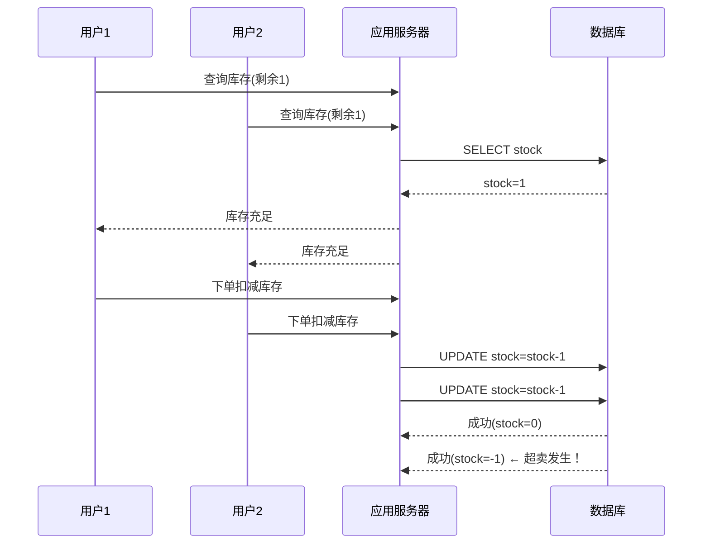
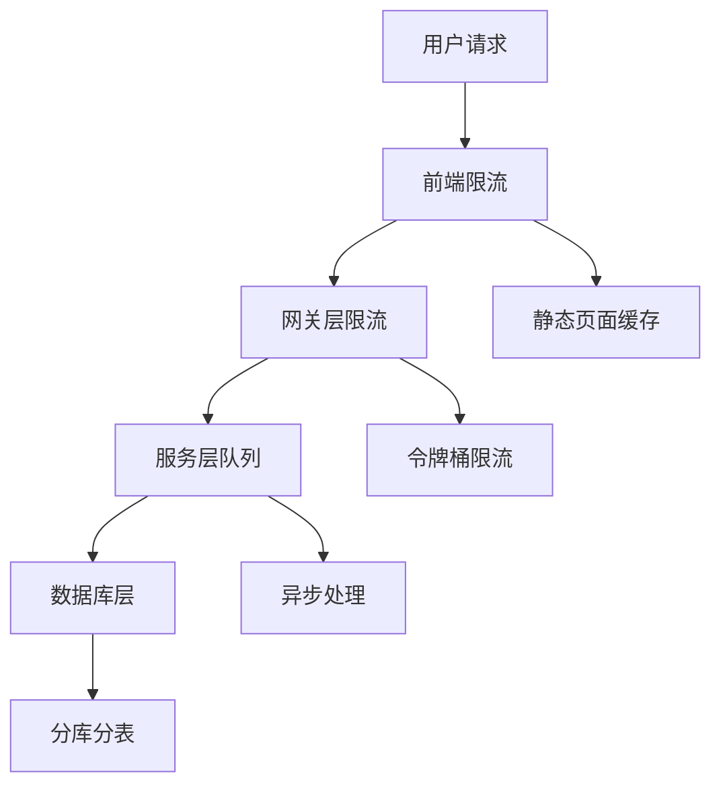
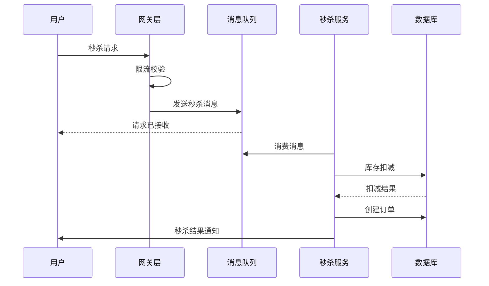

# 秒杀超卖问题深度解析与架构设计

## 概述

秒杀业务是电商系统中典型的高并发场景，其核心挑战在于如何在极端并发压力下保证库存数据的准确性和一致性，避免超卖问题。本文将深入解析秒杀超卖问题的根源，并提供完整的解决方案架构设计。

## 秒杀超卖问题根源分析

### 1. 超卖问题的本质

超卖问题本质上是并发环境下数据一致性问题，主要发生在以下场景：



### 2. 超卖产生的技术原因

#### 2.1 数据库层面
- **非原子操作**：查询和更新不是原子操作
- **隔离级别问题**：读已提交隔离级别下存在幻读
- **行锁竞争**：高并发下行锁竞争导致性能瓶颈

#### 2.2 应用层面
- **无锁设计**：未使用分布式锁或乐观锁
- **缓存不一致**：缓存与数据库数据不一致
- **事务边界**：事务范围设置不当

#### 2.3 架构层面
- **单点瓶颈**：库存扣减集中在单个数据库
- **无削峰措施**：未对请求进行流量控制
- **无熔断机制**：系统过载时无保护措施

## 秒杀系统架构设计原则

### 1. 分层削峰原则



### 2. 数据一致性原则
- **最终一致性**：允许短暂的数据不一致，但最终要达到一致
- **读写分离**：读操作走缓存，写操作走数据库
- **幂等性设计**：重复请求不会产生副作用

## 超卖解决方案架构设计

### 1. 数据库层面解决方案

#### 1.1 基于数据库行锁的方案

```sql
-- 方案1: 使用行锁 + 条件更新
UPDATE product_stock 
SET stock = stock - 1 
WHERE product_id = ? AND stock > 0;

-- 方案2: 使用乐观锁
UPDATE product_stock 
SET stock = stock - 1, version = version + 1 
WHERE product_id = ? AND version = ? AND stock > 0;

-- 方案3: 使用悲观锁（SELECT FOR UPDATE）
BEGIN;
SELECT stock FROM product_stock WHERE product_id = ? FOR UPDATE;
UPDATE product_stock SET stock = stock - 1 WHERE product_id = ?;
COMMIT;
```

#### 1.2 库存扣减服务实现

```java
@Service
public class StockDeductionService {
    
    @Autowired
    private ProductStockMapper stockMapper;
    
    /**
     * 基于数据库行锁的库存扣减
     */
    @Transactional
    public boolean deductStockWithRowLock(Long productId, Integer quantity) {
        int affectedRows = stockMapper.deductStock(productId, quantity);
        return affectedRows > 0;
    }
    
    /**
     * 基于乐观锁的库存扣减
     */
    @Transactional
    public boolean deductStockWithOptimisticLock(Long productId, Integer quantity, Long version) {
        int affectedRows = stockMapper.deductStockWithVersion(productId, quantity, version);
        
        if (affectedRows == 0) {
            // 版本冲突，重试机制
            return retryDeductStock(productId, quantity);
        }
        
        return true;
    }
    
    /**
     * 重试机制
     */
    private boolean retryDeductStock(Long productId, Integer quantity) {
        for (int i = 0; i < 3; i++) {
            try {
                ProductStock stock = stockMapper.selectById(productId);
                if (stock != null && stock.getStock() >= quantity) {
                    int affectedRows = stockMapper.deductStockWithVersion(
                        productId, quantity, stock.getVersion());
                    if (affectedRows > 0) {
                        return true;
                    }
                }
                Thread.sleep(100); // 短暂休眠后重试
            } catch (InterruptedException e) {
                Thread.currentThread().interrupt();
                return false;
            }
        }
        return false;
    }
}
```

### 2. 分布式锁解决方案

#### 2.1 Redis分布式锁实现

```java
@Component
public class RedisDistributedLock {
    
    @Autowired
    private RedisTemplate<String, String> redisTemplate;
    
    private static final String LOCK_PREFIX = "seckill_lock:";
    private static final long DEFAULT_EXPIRE_TIME = 3000; // 3秒
    
    /**
     * 尝试获取分布式锁
     */
    public boolean tryLock(String key, String value, long expireTime) {
        String lockKey = LOCK_PREFIX + key;
        
        return Boolean.TRUE.equals(redisTemplate.opsForValue()
            .setIfAbsent(lockKey, value, Duration.ofMillis(expireTime)));
    }
    
    /**
     * 释放分布式锁
     */
    public boolean unlock(String key, String value) {
        String lockKey = LOCK_PREFIX + key;
        
        // 使用Lua脚本保证原子性
        String script = "if redis.call('get', KEYS[1]) == ARGV[1] then " +
                       "return redis.call('del', KEYS[1]) " +
                       "else " +
                       "return 0 " +
                       "end";
        
        Long result = redisTemplate.execute(
            new DefaultRedisScript<>(script, Long.class),
            Collections.singletonList(lockKey),
            value
        );
        
        return result != null && result > 0;
    }
    
    /**
     * 带重试的锁获取
     */
    public boolean tryLockWithRetry(String key, String value, long expireTime, 
                                   int retryTimes, long sleepTime) {
        for (int i = 0; i < retryTimes; i++) {
            if (tryLock(key, value, expireTime)) {
                return true;
            }
            
            try {
                Thread.sleep(sleepTime);
            } catch (InterruptedException e) {
                Thread.currentThread().interrupt();
                return false;
            }
        }
        return false;
    }
}
```

#### 2.2 基于分布式锁的秒杀服务

```java
@Service
public class SeckillServiceWithLock {
    
    @Autowired
    private RedisDistributedLock distributedLock;
    
    @Autowired
    private StockDeductionService stockDeductionService;
    
    /**
     * 基于分布式锁的秒杀处理
     */
    public SeckillResult seckillWithLock(Long productId, Long userId) {
        String lockKey = "seckill:" + productId;
        String lockValue = UUID.randomUUID().toString();
        
        try {
            // 1. 获取分布式锁
            if (!distributedLock.tryLock(lockKey, lockValue, 3000)) {
                return SeckillResult.fail("系统繁忙，请重试");
            }
            
            // 2. 检查库存
            ProductStock stock = getStockFromCache(productId);
            if (stock == null || stock.getStock() <= 0) {
                return SeckillResult.fail("商品已售罄");
            }
            
            // 3. 扣减库存
            if (!stockDeductionService.deductStockWithRowLock(productId, 1)) {
                return SeckillResult.fail("库存不足");
            }
            
            // 4. 创建订单
            Order order = createOrder(productId, userId);
            
            // 5. 更新缓存
            updateStockCache(productId, stock.getStock() - 1);
            
            return SeckillResult.success(order);
            
        } finally {
            // 释放锁
            distributedLock.unlock(lockKey, lockValue);
        }
    }
    
    /**
     * 从缓存获取库存
     */
    private ProductStock getStockFromCache(Long productId) {
        String cacheKey = "stock:" + productId;
        return (ProductStock) redisTemplate.opsForValue().get(cacheKey);
    }
    
    /**
     * 更新库存缓存
     */
    private void updateStockCache(Long productId, Integer newStock) {
        String cacheKey = "stock:" + productId;
        redisTemplate.opsForValue().set(cacheKey, newStock, Duration.ofMinutes(10));
    }
}
```

### 3. 缓存原子操作解决方案

#### 3.1 Redis Lua脚本实现原子扣减

```lua
-- 库存扣减Lua脚本
local stockKey = KEYS[1]
local quantity = tonumber(ARGV[1])
local currentStock = tonumber(redis.call('get', stockKey))

if currentStock == nil then
    return -1  -- 库存不存在
end

if currentStock < quantity then
    return 0   -- 库存不足
end

-- 原子扣减库存
redis.call('decrby', stockKey, quantity)
return 1       -- 扣减成功
```

#### 3.2 Java调用Lua脚本

```java
@Service
public class RedisAtomicStockService {
    
    @Autowired
    private RedisTemplate<String, Object> redisTemplate;
    
    private static final String STOCK_DEDUCTION_SCRIPT = 
        "local stockKey = KEYS[1]\n" +
        "local quantity = tonumber(ARGV[1])\n" +
        "local currentStock = tonumber(redis.call('get', stockKey))\n\n" +
        "if currentStock == nil then\n" +
        "    return -1\n" +
        "end\n\n" +
        "if currentStock < quantity then\n" +
        "    return 0\n" +
        "end\n\n" +
        "redis.call('decrby', stockKey, quantity)\n" +
        "return 1";
    
    /**
     * 基于Redis原子操作的库存扣减
     */
    public StockDeductionResult deductStockAtomic(Long productId, Integer quantity) {
        String stockKey = "stock:" + productId;
        
        DefaultRedisScript<Long> script = new DefaultRedisScript<>();
        script.setScriptText(STOCK_DEDUCTION_SCRIPT);
        script.setResultType(Long.class);
        
        Long result = redisTemplate.execute(
            script,
            Collections.singletonList(stockKey),
            quantity.toString()
        );
        
        if (result == null) {
            return StockDeductionResult.error("执行失败");
        }
        
        switch (result.intValue()) {
            case 1:
                return StockDeductionResult.success();
            case 0:
                return StockDeductionResult.fail("库存不足");
            case -1:
                return StockDeductionResult.error("库存不存在");
            default:
                return StockDeductionResult.error("未知错误");
        }
    }
    
    /**
     * 初始化库存到Redis
     */
    public void initStockToRedis(Long productId, Integer stock) {
        String stockKey = "stock:" + productId;
        redisTemplate.opsForValue().set(stockKey, stock);
    }
}
```

### 4. 消息队列异步处理方案

#### 4.1 基于消息队列的秒杀架构



#### 4.2 消息队列实现代码

```java
@Component
public class SeckillMessageProducer {
    
    @Autowired
    private RabbitTemplate rabbitTemplate;
    
    /**
     * 发送秒杀消息
     */
    public void sendSeckillMessage(SeckillMessage message) {
        rabbitTemplate.convertAndSend(
            "seckill.exchange",
            "seckill.routingKey",
            message,
            new MessagePostProcessor() {
                @Override
                public Message postProcessMessage(Message message) throws AmqpException {
                    // 设置消息过期时间
                    message.getMessageProperties().setExpiration("5000"); // 5秒过期
                    return message;
                }
            }
        );
    }
}

@Component
public class SeckillMessageConsumer {
    
    @Autowired
    private SeckillService seckillService;
    
    /**
     * 消费秒杀消息
     */
    @RabbitListener(queues = "seckill.queue")
    public void handleSeckillMessage(SeckillMessage message) {
        try {
            SeckillResult result = seckillService.processSeckill(
                message.getProductId(), 
                message.getUserId()
            );
            
            // 发送结果通知
            sendResultNotification(message.getUserId(), result);
            
        } catch (Exception e) {
            log.error("处理秒杀消息失败: {}", message, e);
            // 记录失败日志，可进行重试或补偿
        }
    }
    
    /**
     * 发送秒杀结果通知
     */
    private void sendResultNotification(Long userId, SeckillResult result) {
        // 通过WebSocket、消息推送等方式通知用户
        notificationService.sendSeckillResult(userId, result);
    }
}
```

## 多层次防护架构设计

### 1. 前端层面防护

#### 1.1 按钮防重复点击

```javascript
class SeckillButton {
    constructor(buttonId) {
        this.button = document.getElementById(buttonId);
        this.isClicking = false;
        this.init();
    }
    
    init() {
        this.button.addEventListener('click', (e) => {
            this.handleClick(e);
        });
    }
    
    handleClick(e) {
        if (this.isClicking) {
            e.preventDefault();
            return;
        }
        
        this.isClicking = true;
        this.button.disabled = true;
        this.button.textContent = '抢购中...';
        
        // 发送请求
        this.sendSeckillRequest().finally(() => {
            setTimeout(() => {
                this.isClicking = false;
                this.button.disabled = false;
                this.button.textContent = '立即抢购';
            }, 2000); // 2秒后恢复
        });
    }
    
    async sendSeckillRequest() {
        try {
            const response = await fetch('/api/seckill', {
                method: 'POST',
                headers: {'Content-Type': 'application/json'},
                body: JSON.stringify({productId: this.productId})
            });
            
            const result = await response.json();
            this.showResult(result);
        } catch (error) {
            console.error('抢购失败:', error);
            this.showError('网络异常，请重试');
        }
    }
}
```

#### 1.2 倒计时与验证码

```javascript
class SeckillCountdown {
    constructor(endTime) {
        this.endTime = new Date(endTime).getTime();
        this.timer = null;
        this.init();
    }
    
    init() {
        this.updateCountdown();
        this.timer = setInterval(() => {
            this.updateCountdown();
        }, 1000);
    }
    
    updateCountdown() {
        const now = Date.now();
        const diff = this.endTime - now;
        
        if (diff <= 0) {
            clearInterval(this.timer);
            this.onCountdownEnd();
            return;
        }
        
        const hours = Math.floor(diff / (1000 * 60 * 60));
        const minutes = Math.floor((diff % (1000 * 60 * 60)) / (1000 * 60));
        const seconds = Math.floor((diff % (1000 * 60)) / 1000);
        
        this.displayCountdown(hours, minutes, seconds);
    }
    
    onCountdownEnd() {
        // 显示抢购按钮
        document.getElementById('seckill-btn').style.display = 'block';
        // 显示验证码
        this.showCaptcha();
    }
    
    showCaptcha() {
        // 显示图形验证码或滑动验证
        captchaService.show();
    }
}
```

### 2. 网关层面防护

#### 2.1 限流配置

```yaml
# Spring Cloud Gateway 限流配置
spring:
  cloud:
    gateway:
      routes:
        - id: seckill_route
          uri: lb://seckill-service
          predicates:
            - Path=/api/seckill/**
          filters:
            - name: RequestRateLimiter
              args:
                redis-rate-limiter.replenishRate: 100    # 每秒处理数
                redis-rate-limiter.burstCapacity: 200    # 峰值容量
                key-resolver: "#{@userKeyResolver}"
            - name: Hystrix
              args:
                name: seckillFallback
                fallbackUri: forward:/fallback/seckill
```

#### 2.2 自定义限流器

```java
@Component
public class UserKeyResolver implements KeyResolver {
    
    @Override
    public Mono<String> resolve(ServerWebExchange exchange) {
        // 基于用户ID限流
        return Mono.just(exchange.getRequest().getQueryParams().getFirst("userId"));
    }
}

@Component
public class IPKeyResolver implements KeyResolver {
    
    @Override
    public Mono<String> resolve(ServerWebExchange exchange) {
        // 基于IP地址限流
        String ip = exchange.getRequest().getRemoteAddress().getAddress().getHostAddress();
        return Mono.just(ip);
    }
}
```

### 3. 服务层面防护

#### 3.1 信号量限流

```java
@Component
public class SeckillRateLimiter {
    
    private final Semaphore semaphore = new Semaphore(1000); // 最大并发数
    
    /**
     * 尝试获取执行许可
     */
    public boolean tryAcquire() {
        return semaphore.tryAcquire();
    }
    
    /**
     * 释放执行许可
     */
    public void release() {
        semaphore.release();
    }
    
    /**
     * 带超时的获取许可
     */
    public boolean tryAcquire(long timeout, TimeUnit unit) {
        try {
            return semaphore.tryAcquire(timeout, unit);
        } catch (InterruptedException e) {
            Thread.currentThread().interrupt();
            return false;
        }
    }
}

@Service
public class SeckillServiceWithRateLimit {
    
    @Autowired
    private SeckillRateLimiter rateLimiter;
    
    public SeckillResult seckillWithRateLimit(Long productId, Long userId) {
        if (!rateLimiter.tryAcquire()) {
            return SeckillResult.fail("系统繁忙，请稍后重试");
        }
        
        try {
            return doSeckill(productId, userId);
        } finally {
            rateLimiter.release();
        }
    }
}
```

#### 3.2 熔断降级

```java
@Service
public class SeckillServiceWithCircuitBreaker {
    
    @Autowired
    private CircuitBreakerFactory circuitBreakerFactory;
    
    public SeckillResult seckillWithCircuitBreaker(Long productId, Long userId) {
        CircuitBreaker circuitBreaker = circuitBreakerFactory.create("seckill");
        
        return circuitBreaker.run(() -> {
            // 正常的秒杀逻辑
            return doSeckill(productId, userId);
        }, throwable -> {
            // 降级逻辑
            log.warn("秒杀服务熔断，执行降级逻辑", throwable);
            return SeckillResult.fail("秒杀活动太火爆，请稍后重试");
        });
    }
}
```

## 数据一致性与补偿机制

### 1. 最终一致性保障

#### 1.1 库存数据同步

```java
@Component
public class StockSyncService {
    
    @Autowired
    private ProductStockMapper stockMapper;
    
    /**
     * 定时同步Redis库存与数据库
     */
    @Scheduled(fixedRate = 60000) // 每分钟同步一次
    public void syncStock() {
        List<ProductStock> stocks = stockMapper.selectAll();
        
        for (ProductStock stock : stocks) {
            String redisKey = "stock:" + stock.getProductId();
            Integer redisStock = (Integer) redisTemplate.opsForValue().get(redisKey);
            
            if (redisStock == null || !redisStock.equals(stock.getStock())) {
                // 数据不一致，以数据库为准
                redisTemplate.opsForValue().set(redisKey, stock.getStock());
                log.warn("库存数据不一致，已同步: productId={}, dbStock={}, redisStock={}", 
                    stock.getProductId(), stock.getStock(), redisStock);
            }
        }
    }
}
```

#### 1.2 消息可靠性保障

```java
@Component
public class SeckillMessageReliability {
    
    /**
     * 消息消费失败的重试机制
     */
    @RabbitListener(queues = "seckill.queue")
    public void handleSeckillMessage(Message message, Channel channel) {
        long deliveryTag = message.getMessageProperties().getDeliveryTag();
        
        try {
            // 处理消息
            processMessage(message);
            
            // 手动确认消息
            channel.basicAck(deliveryTag, false);
            
        } catch (Exception e) {
            log.error("处理秒杀消息失败", e);
            
            // 判断是否达到最大重试次数
            if (getRetryCount(message) >= 3) {
                // 达到最大重试次数，放入死信队列
                channel.basicNack(deliveryTag, false, false);
            } else {
                // 重试
                channel.basicNack(deliveryTag, false, true);
            }
        }
    }
    
    /**
     * 获取消息重试次数
     */
    private int getRetryCount(Message message) {
        Map<String, Object> headers = message.getMessageProperties().getHeaders();
        return (int) headers.getOrDefault("retry-count", 0);
    }
}
```

### 2. 补偿事务机制

#### 2.1 库存回滚补偿

```java
@Service
public class StockRollbackService {
    
    @Autowired
    private ProductStockMapper stockMapper;
    
    /**
     * 库存回滚补偿
     */
    @Transactional
    public void rollbackStock(Long productId, Integer quantity) {
        // 回滚数据库库存
        stockMapper.rollbackStock(productId, quantity);
        
        // 回滚Redis库存
        String redisKey = "stock:" + productId;
        redisTemplate.opsForValue().increment(redisKey, quantity);
        
        log.info("库存回滚完成: productId={}, quantity={}", productId, quantity);
    }
    
    /**
     * 定时扫描超时未支付订单
     */
    @Scheduled(fixedRate = 300000) // 5分钟执行一次
    public void scanTimeoutOrders() {
        List<Order> timeoutOrders = orderMapper.selectTimeoutOrders(15); // 15分钟未支付
        
        for (Order order : timeoutOrders) {
            try {
                // 回滚库存
                rollbackStock(order.getProductId(), order.getQuantity());
                
                // 更新订单状态为已取消
                orderMapper.updateOrderStatus(order.getId(), OrderStatus.CANCELLED);
                
                log.info("超时订单库存回滚: orderId={}", order.getId());
                
            } catch (Exception e) {
                log.error("回滚库存失败: orderId={}", order.getId(), e);
            }
        }
    }
}
```

## 监控与告警体系

### 1. 关键指标监控

```java
@Component
public class SeckillMonitor {
    
    @Autowired
    private MeterRegistry meterRegistry;
    
    private final Counter seckillRequestCounter;
    private final Counter seckillSuccessCounter;
    private final Counter seckillFailCounter;
    private final Timer seckillResponseTimer;
    
    public SeckillMonitor() {
        this.seckillRequestCounter = Counter.builder("seckill.requests")
            .description("秒杀请求总数")
            .register(meterRegistry);
            
        this.seckillSuccessCounter = Counter.builder("seckill.success")
            .description("秒杀成功数")
            .register(meterRegistry);
            
        this.seckillFailCounter = Counter.builder("seckill.fail")
            .description("秒杀失败数")
            .register(meterRegistry);
            
        this.seckillResponseTimer = Timer.builder("seckill.response.time")
            .description("秒杀响应时间")
            .register(meterRegistry);
    }
    
    /**
     * 记录秒杀指标
     */
    public void recordSeckillMetrics(boolean success, long responseTime) {
        seckillRequestCounter.increment();
        
        if (success) {
            seckillSuccessCounter.increment();
        } else {
            seckillFailCounter.increment();
        }
        
        seckillResponseTimer.record(responseTime, TimeUnit.MILLISECONDS);
    }
}
```

### 2. 业务监控大盘

```java
@Service
public class SeckillDashboardService {
    
    /**
     * 获取秒杀活动实时数据
     */
    public SeckillDashboard getRealtimeData(Long activityId) {
        SeckillDashboard dashboard = new SeckillDashboard();
        
        // 实时请求量
        dashboard.setRequestCount(getRequestCount(activityId));
        
        // 成功率
        dashboard.setSuccessRate(calculateSuccessRate(activityId));
        
        // 库存消耗情况
        dashboard.setStockConsumption(getStockConsumption(activityId));
        
        // 系统负载
        dashboard.setSystemLoad(getSystemLoad());
        
        return dashboard;
    }
    
    /**
     * 异常检测与告警
     */
    @Scheduled(fixedRate = 60000) // 每分钟检测一次
    public void checkAnomalies() {
        List<SeckillActivity> activities = getActiveActivities();
        
        for (SeckillActivity activity : activities) {
            // 检测异常指标
            if (detectAnomaly(activity)) {
                // 发送告警
                sendAlert(activity);
            }
        }
    }
}
```

## 总结

秒杀超卖问题的解决需要从多个层面进行综合设计：

1. **数据库层面**：使用行锁、乐观锁保证数据一致性
2. **分布式锁**：Redis分布式锁防止并发冲突
3. **缓存原子操作**：Lua脚本实现原子库存扣减
4. **消息队列**：异步处理削峰填谷
5. **多层次防护**：前端、网关、服务层限流熔断
6. **数据一致性**：最终一致性保障与补偿机制
7. **监控告警**：实时监控与异常检测

在实际应用中，应根据业务场景和系统规模选择合适的方案组合，并通过压测验证系统性能。一个健壮的秒杀系统需要在保证数据准确性的同时，具备高可用、高并发、可扩展的特性。