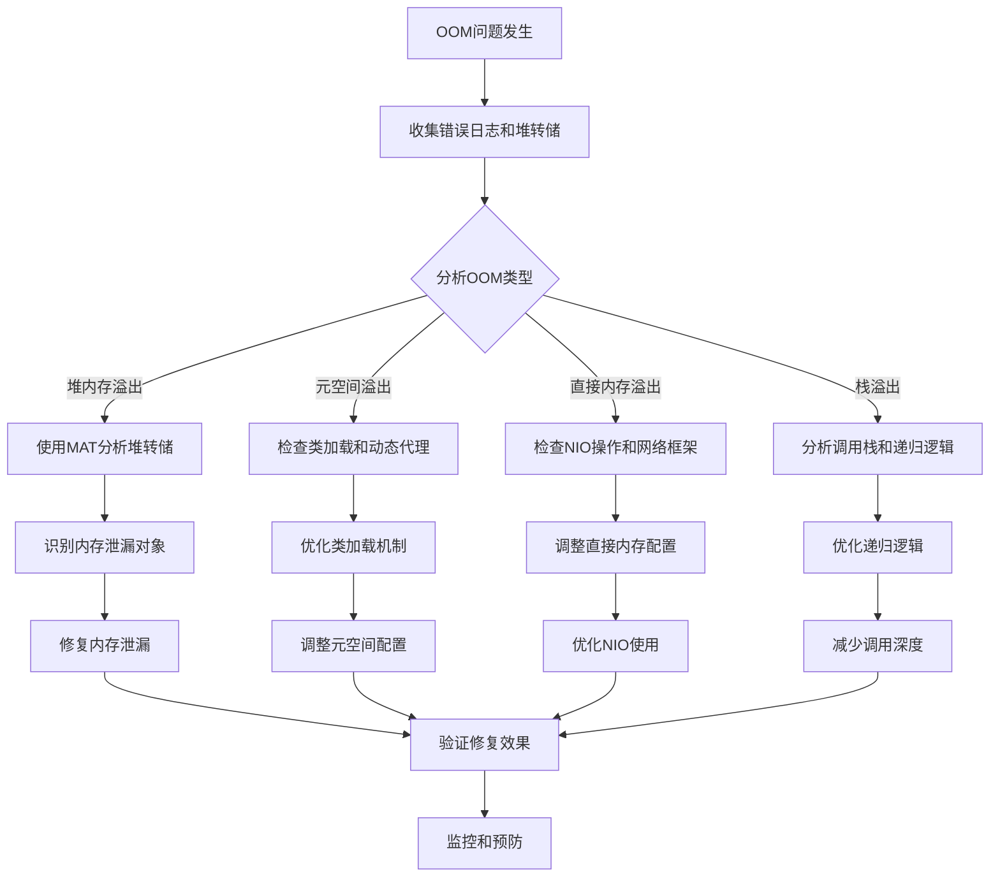

## 概述

OOM（Out Of Memory）是Java应用中常见且严重的问题，直接影响系统稳定性和可用性。本文将从OOM类型分析、排查工具使用、问题定位方法到架构优化方案，提供一套完整的OOM问题解决方案。

## OOM类型与特征分析

### 1. Java堆内存溢出（java.lang.OutOfMemoryError: Java heap space）

**特征表现：**
- 应用响应变慢，频繁Full GC
- 堆内存使用率持续高位运行
- 最终抛出`java.lang.OutOfMemoryError: Java heap space`

**常见原因：**
- 内存泄漏：对象被意外持有无法回收
- 数据量过大：一次性加载过多数据到内存
- 缓存配置不当：缓存无限制增长

### 2. 元空间溢出（java.lang.OutOfMemoryError: Metaspace）

**特征表现：**
- 类加载频繁，动态生成类过多
- 元空间使用率持续增长
- 抛出`java.lang.OutOfMemoryError: Metaspace`

**常见原因：**
- 动态代理类过多（如Spring AOP）
- 热部署频繁，类卸载不及时
- 反射、字节码增强框架使用不当

### 3. 直接内存溢出（java.lang.OutOfMemoryError: Direct buffer memory）

**特征表现：**
- NIO操作频繁，大量使用ByteBuffer
- 直接内存使用率异常升高
- 抛出`java.lang.OutOfMemoryError: Direct buffer memory`

**常见原因：**
- 大文件读写未及时释放
- Netty等网络框架配置不当
- 直接内存分配超过-XX:MaxDirectMemorySize限制

### 4. 栈溢出（java.lang.StackOverflowError）

**特征表现：**
- 递归调用层次过深
- 线程栈空间不足
- 抛出`java.lang.StackOverflowError`

**常见原因：**
- 无限递归调用
- 方法调用链过长
- 栈帧过大（大量局部变量）

## OOM问题排查工具与流程

### 1. 内存监控工具

#### JVM内置工具

```bash
# 查看JVM内存使用情况
jstat -gc <pid> 1000 10

# 查看堆内存详情
jmap -heap <pid>

# 生成堆转储文件
jmap -dump:format=b,file=heapdump.hprof <pid>

# 查看类加载情况
jstat -class <pid>
```

#### 可视化分析工具

- **JVisualVM**: JDK自带，实时监控内存使用
- **MAT (Memory Analyzer Tool)**: 强大的堆转储分析工具
- **JProfiler**: 商业级性能分析工具
- **Arthas**: 阿里开源的Java诊断工具

### 2. 排查流程设计



## 内存泄漏排查实战

### 1. 堆转储分析步骤

```java
// 示例：内存泄漏代码
@Service
public class MemoryLeakService {
    
    private static final List<byte[]> LEAK_LIST = new ArrayList<>();
    
    public void processLargeData() {
        // 每次处理都向静态列表添加数据，导致内存泄漏
        byte[] largeData = new byte[10 * 1024 * 1024]; // 10MB
        LEAK_LIST.add(largeData);
    }
}
```

**MAT分析步骤：**
1. 打开堆转储文件（heapdump.hprof）
2. 查看Histogram，按Retained Heap排序
3. 分析大对象引用链
4. 定位泄漏根源

### 2. 常见内存泄漏模式

#### 静态集合类泄漏

```java
// 错误示例：静态Map导致内存泄漏
public class CacheManager {
    private static final Map<String, Object> CACHE = new HashMap<>();
    
    public void put(String key, Object value) {
        CACHE.put(key, value); // 无清理机制，持续增长
    }
}

// 正确示例：使用WeakHashMap或定时清理
public class SafeCacheManager {
    private static final Map<String, Object> CACHE = new WeakHashMap<>();
    private static final ScheduledExecutorService CLEANER = 
        Executors.newScheduledThreadPool(1);
    
    public SafeCacheManager() {
        // 定时清理过期缓存
        CLEANER.scheduleAtFixedRate(this::cleanExpired, 1, 1, TimeUnit.HOURS);
    }
}
```

#### 线程局部变量泄漏

```java
// 错误示例：ThreadLocal使用不当
public class UserContext {
    private static final ThreadLocal<User> USER_CONTEXT = new ThreadLocal<>();
    
    public static void setUser(User user) {
        USER_CONTEXT.set(user);
    }
    
    // 缺少remove调用，线程池复用导致内存泄漏
}

// 正确示例：使用后及时清理
public class SafeUserContext {
    private static final ThreadLocal<User> USER_CONTEXT = new ThreadLocal<>();
    
    public static void setUser(User user) {
        USER_CONTEXT.set(user);
    }
    
    public static void clear() {
        USER_CONTEXT.remove(); // 关键：使用后清理
    }
}
```

## 架构优化方案

### 1. 内存使用规范

#### 对象池化设计

```java
@Component
public class ObjectPoolManager {
    
    private final GenericObjectPool<ExpensiveObject> objectPool;
    
    public ObjectPoolManager() {
        PooledObjectFactory<ExpensiveObject> factory = new BasePooledObjectFactory<>() {
            @Override
            public ExpensiveObject create() {
                return new ExpensiveObject();
            }
            
            @Override
            public PooledObject<ExpensiveObject> wrap(ExpensiveObject obj) {
                return new DefaultPooledObject<>(obj);
            }
        };
        
        // 配置对象池参数
        GenericObjectPoolConfig<ExpensiveObject> config = new GenericObjectPoolConfig<>();
        config.setMaxTotal(100);      // 最大对象数
        config.setMaxIdle(50);        // 最大空闲数
        config.setMinIdle(10);        // 最小空闲数
        config.setTestOnBorrow(true); // 借用时验证
        
        this.objectPool = new GenericObjectPool<>(factory, config);
    }
    
    public ExpensiveObject borrowObject() throws Exception {
        return objectPool.borrowObject();
    }
    
    public void returnObject(ExpensiveObject obj) {
        objectPool.returnObject(obj);
    }
}
```

#### 大文件处理优化

```java
@Service
public class LargeFileProcessor {
    
    public void processLargeFile(String filePath) {
        // 使用流式处理，避免一次性加载到内存
        try (Stream<String> lines = Files.lines(Paths.get(filePath))) {
            lines
                .map(this::parseLine)      // 逐行解析
                .filter(Objects::nonNull)  // 过滤无效数据
                .forEach(this::processItem); // 逐条处理
        } catch (IOException e) {
            throw new RuntimeException("文件处理失败", e);
        }
    }
    
    // 分批处理大数据集
    public <T> void processInBatches(List<T> data, int batchSize, Consumer<List<T>> processor) {
        List<List<T>> batches = Lists.partition(data, batchSize);
        batches.forEach(processor);
    }
}
```

### 2. 缓存架构优化

#### 多级缓存设计

```java
@Component
public class MultiLevelCache {
    
    @Autowired
    private RedisTemplate<String, Object> redisTemplate;
    
    // 本地缓存（Caffeine）
    private final Cache<String, Object> localCache = Caffeine.newBuilder()
        .maximumSize(1000)                    // 最大条目数
        .expireAfterWrite(10, TimeUnit.MINUTES) // 写入后过期时间
        .build();
    
    // 分布式缓存（Redis）配置
    private final Cache<String, Object> distributedCache = new Cache<String, Object>() {
        @Override
        public Object get(String key) {
            return redisTemplate.opsForValue().get(key);
        }
        
        @Override
        public void put(String key, Object value) {
            redisTemplate.opsForValue().set(key, value, Duration.ofHours(1));
        }
    };
    
    public Object get(String key) {
        // 先查本地缓存
        Object value = localCache.getIfPresent(key);
        if (value != null) {
            return value;
        }
        
        // 再查分布式缓存
        value = distributedCache.get(key);
        if (value != null) {
            // 回填本地缓存
            localCache.put(key, value);
        }
        
        return value;
    }
}
```

#### 缓存淘汰策略

```java
@Configuration
public class CacheConfig {
    
    @Bean
    public CacheManager cacheManager() {
        CaffeineCacheManager cacheManager = new CaffeineCacheManager();
        cacheManager.setCaffeine(Caffeine.newBuilder()
            .maximumSize(10000)                    // 最大缓存条目
            .expireAfterAccess(30, TimeUnit.MINUTES) // 访问后过期
            .expireAfterWrite(2, TimeUnit.HOURS)    // 写入后过期
            .recordStats()                         // 记录统计信息
        );
        return cacheManager;
    }
    
    // 监控缓存命中率
    @Bean
    public CacheMetrics cacheMetrics(CacheManager cacheManager) {
        return new CacheMetrics(cacheManager);
    }
}
```

### 3. JVM参数优化配置

#### 生产环境JVM配置示例

```bash
# 堆内存配置
-Xms4g -Xmx4g                    # 初始和最大堆内存一致，避免动态调整
-XX:NewRatio=2                   # 新生代与老年代比例 1:2
-XX:SurvivorRatio=8              # Eden与Survivor比例 8:1:1

# GC配置
-XX:+UseG1GC                     # 使用G1垃圾收集器
-XX:MaxGCPauseMillis=200         # 最大GC停顿时间目标
-XX:G1HeapRegionSize=16m         # G1区域大小

# 元空间配置
-XX:MetaspaceSize=256m           # 初始元空间大小
-XX:MaxMetaspaceSize=512m        # 最大元空间大小

# 直接内存配置
-XX:MaxDirectMemorySize=1g       # 最大直接内存大小

# 监控和诊断
-XX:+HeapDumpOnOutOfMemoryError  # OOM时生成堆转储
-XX:HeapDumpPath=./heapdumps/    # 堆转储文件路径
-XX:+PrintGCDetails              # 打印GC详情
-XX:+PrintGCTimeStamps           # 打印GC时间戳
```

#### 容器环境优化

```dockerfile
FROM openjdk:11-jre

# 设置容器内存限制感知
ENV JAVA_OPTS="-XX:+UseContainerSupport \
               -XX:MaxRAMPercentage=75.0 \
               -XX:InitialRAMPercentage=50.0"

# 启动应用
CMD java $JAVA_OPTS -jar app.jar
```

## 监控与预警体系

### 1. 内存监控指标

```java
@Component
public class MemoryMonitor {
    
    private final MeterRegistry meterRegistry;
    
    public MemoryMonitor(MeterRegistry meterRegistry) {
        this.meterRegistry = meterRegistry;
        startMemoryMonitoring();
    }
    
    private void startMemoryMonitoring() {
        // 监控堆内存使用率
        Gauge.builder("jvm.memory.used", this, 
                value -> getHeapMemoryUsage().getUsed())
            .description("JVM堆内存使用量")
            .register(meterRegistry);
            
        // 监控GC次数和耗时
        Gauge.builder("jvm.gc.count", this,
                value -> getGcCount())
            .description("GC次数")
            .register(meterRegistry);
    }
    
    private MemoryUsage getHeapMemoryUsage() {
        return ManagementFactory.getMemoryMXBean().getHeapMemoryUsage();
    }
    
    private long getGcCount() {
        return ManagementFactory.getGarbageCollectorMXBeans().stream()
            .mapToLong(GarbageCollectorMXBean::getCollectionCount)
            .sum();
    }
}
```

### 2. 预警规则配置

```yaml
# Prometheus告警规则
groups:
- name: memory_alerts
  rules:
  - alert: HighMemoryUsage
    expr: jvm_memory_used_bytes{area="heap"} / jvm_memory_max_bytes{area="heap"} > 0.8
    for: 5m
    labels:
      severity: warning
    annotations:
      summary: "堆内存使用率过高"
      description: "堆内存使用率超过80%，持续5分钟"
      
  - alert: FrequentFullGC
    expr: increase(jvm_gc_collection_seconds_count{gc="G1 Old Generation"}[5m]) > 3
    for: 2m
    labels:
      severity: critical
    annotations:
      summary: "Full GC频繁"
      description: "5分钟内Full GC次数超过3次"
```

## 实战案例：电商系统OOM问题解决

### 问题背景
某电商平台在大促期间频繁出现OOM，导致服务不可用。

### 排查过程

1. **收集证据**：获取堆转储文件和GC日志
2. **分析堆转储**：使用MAT发现订单对象大量堆积
3. **代码审查**：发现订单查询接口未分页，一次性加载全部数据
4. **性能测试**：模拟高并发场景，重现OOM问题

### 解决方案

```java
// 优化前：一次性加载所有订单
@GetMapping("/orders")
public List<Order> getOrders(Long userId) {
    return orderService.findByUserId(userId); // 可能返回数万条记录
}

// 优化后：分页查询 + 流式处理
@GetMapping("/orders")
public Page<Order> getOrders(
        Long userId, 
        @RequestParam(defaultValue = "0") int page,
        @RequestParam(defaultValue = "20") int size) {
    
    return orderService.findByUserId(userId, PageRequest.of(page, size));
}

// 大数据量导出使用流式响应
@GetMapping("/orders/export")
public StreamingResponseBody exportOrders(Long userId) {
    return outputStream -> {
        try (CSVPrinter printer = new CSVPrinter(
                new OutputStreamWriter(outputStream), 
                CSVFormat.DEFAULT)) {
            
            // 分批处理，避免内存溢出
            orderService.streamOrdersByUserId(userId, batch -> {
                batch.forEach(order -> {
                    try {
                        printer.printRecord(
                            order.getId(), 
                            order.getAmount(), 
                            order.getCreateTime()
                        );
                    } catch (IOException e) {
                        throw new RuntimeException("导出失败", e);
                    }
                });
            });
        }
    };
}
```

### 优化效果
- 内存使用率从90%降低到40%
- OOM问题完全解决
- 系统稳定性显著提升

## 总结

OOM问题的解决需要系统性的方法和工具支持。通过本文提供的排查流程、工具使用技巧和架构优化方案，开发者可以：

1. **快速定位问题根源**：掌握各种OOM类型的特征和排查方法
2. **有效预防内存泄漏**：遵循内存使用最佳实践
3. **优化系统架构**：设计合理的内存管理策略
4. **建立监控体系**：实时发现和预警潜在问题

OOM问题的解决不仅是技术问题，更是工程能力和架构思维的体现。只有从代码规范、架构设计到运维监控全方位入手，才能构建稳定可靠的Java应用系统。