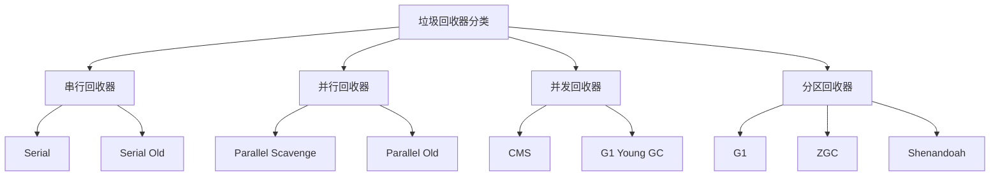
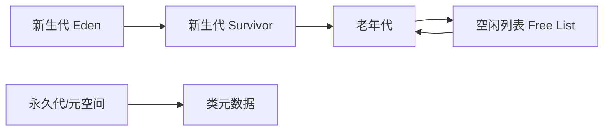

## 简介

垃圾回收器是JVM内存管理的核心组件，不同的回收器采用不同的算法和策略来平衡吞吐量、延迟和内存占用。本文将从源码层面深入解析主流垃圾回收器的实现原理，结合实际调优案例，帮助开发者选择最适合应用场景的GC策略。

## 架构原理与源码分析

### 垃圾回收器分类体系

JVM垃圾回收器按照工作方式和适用场景可分为以下几类：



### 1. Serial收集器

#### 实现原理

Serial收集器是单线程的垃圾回收器，采用复制算法进行新生代回收，标记-整理算法进行老年代回收。

```java
// HotSpot源码中的Serial收集器核心逻辑
public class SerialGC {
    
    // 新生代回收 - 复制算法
    public void youngGC() {
        // 1. 暂停所有应用线程(STW)
        VMThread.suspendAllThreads();
        
        // 2. 从GC Roots开始标记存活对象
        markLiveObjects();
        
        // 3. 将存活对象复制到Survivor区
        copyToSurvivor();
        
        // 4. 清空Eden区
        clearEdenSpace();
        
        // 5. 恢复应用线程
        VMThread.resumeAllThreads();
    }
    
    // 老年代回收 - 标记整理算法
    public void fullGC() {
        VMThread.suspendAllThreads();
        
        // 标记阶段
        markPhase();
        
        // 整理阶段 - 移动对象消除碎片
        compactPhase();
        
        VMThread.resumeAllThreads();
    }
}
```

**适用场景**：客户端应用、单核CPU环境、小内存应用

**启动参数**：`-XX:+UseSerialGC`

### 2. Parallel收集器

#### 实现原理

Parallel收集器（吞吐量优先收集器）使用多线程进行垃圾回收，显著提高吞吐量。

```java
// Parallel收集器多线程回收实现
public class ParallelGC {
    
    private final int parallelThreadCount;
    
    public ParallelGC() {
        // 默认线程数为CPU核心数
        this.parallelThreadCount = Runtime.getRuntime().availableProcessors();
    }
    
    public void youngGC() {
        // 创建并行回收线程池
        ExecutorService executor = Executors.newFixedThreadPool(parallelThreadCount);
        
        // 分区并行标记
        List<Future<Void>> futures = new ArrayList<>();
        for (int i = 0; i < parallelThreadCount; i++) {
            final int partition = i;
            futures.add(executor.submit(() -> {
                markPartition(partition);
                return null;
            }));
        }
        
        // 等待所有标记任务完成
        for (Future<Void> future : futures) {
            future.get();
        }
        
        // 并行复制存活对象
        copySurvivingObjectsInParallel();
        
        executor.shutdown();
    }
}
```

**核心调优参数**：
- `-XX:ParallelGCThreads`：并行GC线程数
- `-XX:MaxGCPauseMillis`：最大GC停顿时间目标
- `-XX:GCTimeRatio`：GC时间与应用时间比例

### 3. CMS收集器

#### 实现原理

CMS（Concurrent Mark Sweep）收集器以获取最短回收停顿时间为目标，大部分工作与用户线程并发执行。

```java
// CMS收集器并发标记实现
public class CMSCollector {
    
    // CMS回收阶段
    public enum Phase {
        INITIAL_MARK,    // 初始标记(STW)
        CONCURRENT_MARK, // 并发标记
        REMARK,         // 重新标记(STW)
        CONCURRENT_SWEEP // 并发清除
    }
    
    public void collect() {
        // 阶段1: 初始标记(STW)
        initialMark();
        
        // 阶段2: 并发标记(与用户线程并发)
        concurrentMark();
        
        // 阶段3: 重新标记(STW)
        remark();
        
        // 阶段4: 并发清除
        concurrentSweep();
    }
    
    private void concurrentMark() {
        // 创建并发标记线程
        Thread markThread = new Thread(() -> {
            while (!markingComplete) {
                // 增量式标记，避免长时间停顿
                incrementalMark();
                
                // 短暂休眠，让出CPU给用户线程
                Thread.yield();
            }
        });
        markThread.start();
    }
}
```

**CMS内存布局**：


**CMS问题与解决方案**：
- **并发模式失败**：老年代空间不足 → 增大老年代或降低对象提升速率
- **内存碎片**：使用`-XX:+UseCMSCompactAtFullCollection`进行碎片整理
- **浮动垃圾**：预留足够空间(`-XX:CMSInitiatingOccupancyFraction`)

### 4. G1收集器

#### 实现原理

G1（Garbage First）收集器将堆内存划分为多个Region，通过预测停顿时间模型实现可控的停顿时间。

```java
// G1收集器Region管理
public class G1Collector {
    
    private final List<HeapRegion> regions;
    private final RememberedSet rememberedSet;
    
    // G1回收过程
    public void collect() {
        // 1. 初始标记(STW)
        initialMark();
        
        // 2. 根区域扫描
        rootRegionScanning();
        
        // 3. 并发标记
        concurrentMark();
        
        // 4. 最终标记(STW)
        finalMarking();
        
        // 5. 筛选回收
        evacuation();
    }
    
    // 基于停顿预测的Region选择
    private List<HeapRegion> selectRegionsForCollection() {
        List<HeapRegion> selected = new ArrayList<>();
        double predictedPauseTime = 0;
        
        // 按垃圾比例排序Region
        regions.sort(Comparator.comparingDouble(HeapRegion::getGarbageRatio).reversed());
        
        for (HeapRegion region : regions) {
            double regionPauseTime = predictPauseTime(region);
            if (predictedPauseTime + regionPauseTime <= maxGCPauseMillis) {
                selected.add(region);
                predictedPauseTime += regionPauseTime;
            } else {
                break;
            }
        }
        
        return selected;
    }
}
```

**G1关键特性**：
- **Region分区**：将堆划分为大小相等的Region
- **Remembered Set**：记录跨Region引用
- **停顿预测模型**：基于历史数据预测回收时间
- **混合回收**：同时回收新生代和老年代Region

### 5. ZGC收集器

#### 实现原理

ZGC（Z Garbage Collector）是低延迟垃圾回收器，目标停顿时间不超过10ms。

```java
// ZGC颜色指针和读屏障实现
public class ZGC {
    
    // ZGC颜色指针布局
    private static final long ADDRESS_MASK   = 0x0000_FFFF_FFFF_FFFFL;
    private static final long MARKED0        = 0x0001_0000_0000_0000L;
    private static final long MARKED1        = 0x0002_0000_0000_0000L;
    private static final long REMAPPED       = 0x0004_0000_0000_0000L;
    
    // 读屏障 - 在对象访问时执行
    public Object loadBarrier(Object obj) {
        if (obj == null) return null;
        
        long address = getAddress(obj);
        
        // 检查指针颜色
        if ((address & REMAPPED) != 0) {
            // 需要重映射，执行加载屏障操作
            return remapObject(obj);
        }
        
        return obj;
    }
    
    // 并发转移
    public void concurrentRelocate() {
        // 使用多个线程并发转移对象
        List<Thread> relocateThreads = new ArrayList<>();
        
        for (int i = 0; i < relocationThreads; i++) {
            Thread thread = new Thread(() -> {
                while (hasWork()) {
                    ZPage page = getNextPageToRelocate();
                    if (page != null) {
                        relocatePage(page);
                    }
                }
            });
            relocateThreads.add(thread);
            thread.start();
        }
        
        // 等待所有转移线程完成
        for (Thread thread : relocateThreads) {
            thread.join();
        }
    }
}
```

**ZGC核心技术**：
- **颜色指针**：在指针中存储元数据
- **读屏障**：在对象访问时执行屏障操作
- **并发转移**：对象移动与用户线程并发执行
- **内存多重映射**：同一物理内存映射到多个虚拟地址

## 使用场景与代码示例

### 不同场景下的GC选择策略

#### 1. Web应用服务器

```java
// Tomcat服务器GC配置示例
public class TomcatGCConfig {
    
    // 高吞吐量场景 - 使用Parallel GC
    public static String getParallelGCParams() {
        return "-XX:+UseParallelGC " +
               "-XX:ParallelGCThreads=4 " +
               "-XX:MaxGCPauseMillis=100 " +
               "-XX:GCTimeRatio=99";
    }
    
    // 低延迟场景 - 使用G1 GC
    public static String getG1GCParams() {
        return "-XX:+UseG1GC " +
               "-XX:MaxGCPauseMillis=200 " +
               "-XX:G1HeapRegionSize=4m " +
               "-XX:InitiatingHeapOccupancyPercent=45";
    }
}
```

#### 2. 大数据处理应用

```java
// Spark应用GC优化配置
public class SparkGCConfig {
    
    public static String getSparkExecutorGCParams() {
        return "-XX:+UseG1GC " +
               "-XX:InitiatingHeapOccupancyPercent=35 " +
               "-XX:ConcGCThreads=4 " +
               "-XX:G1ReservePercent=15 " +
               "-XX:G1HeapRegionSize=16m";
    }
    
    public static String getSparkDriverGCParams() {
        return "-XX:+UseConcMarkSweepGC " +
               "-XX:CMSInitiatingOccupancyFraction=75 " +
               "-XX:+UseCMSInitiatingOccupancyOnly " +
               "-XX:+ExplicitGCInvokesConcurrent";
    }
}
```

#### 3. 实时交易系统

```java
// 金融交易系统ZGC配置
public class TradingSystemGCConfig {
    
    public static String getLowLatencyGCParams() {
        return "-XX:+UseZGC " +
               "-Xms16g -Xmx16g " +  // 固定堆大小避免扩容
               "-XX:ConcGCThreads=8 " +
               "-XX:SoftMaxHeapSize=14g " +  // 软堆大小限制
               "-XX:ZAllocationSpikeTolerance=5.0";
    }
    
    // 关键服务线程GC优化
    public static void optimizeCriticalThreads() {
        // 设置关键线程为高优先级，减少GC影响
        Thread criticalThread = new Thread(() -> {
            Thread.currentThread().setPriority(Thread.MAX_PRIORITY);
            // 关键业务逻辑
            processTradingOrders();
        });
        criticalThread.start();
    }
}
```

### GC性能监控与诊断

#### JVM内置监控工具

```java
// GC日志分析与监控
public class GCMonitor {
    
    // 启用详细GC日志
    public static String getDetailedGCLogging() {
        return "-Xlog:gc*=debug:file=gc.log:time,uptime,level,tags:filecount=10,filesize=10m";
    }
    
    // 实时GC监控
    public void monitorGC() throws Exception {
        // 使用jstat监控GC情况
        ProcessBuilder pb = new ProcessBuilder(
            "jstat", "-gc", getCurrentPID(), "1s"
        );
        
        Process process = pb.start();
        BufferedReader reader = new BufferedReader(
            new InputStreamReader(process.getInputStream())
        );
        
        String line;
        while ((line = reader.readLine()) != null) {
            parseGCStats(line);
        }
    }
    
    private void parseGCStats(String stats) {
        // 解析jstat输出，监控关键指标
        String[] values = stats.trim().split("\\s+");
        if (values.length >= 15) {
            double youngGCTime = Double.parseDouble(values[12]);
            double fullGCTime = Double.parseDouble(values[13]);
            double totalGCTime = Double.parseDouble(values[14]);
            
            // 触发GC调优警报
            if (totalGCTime > 1000) { // GC时间超过1秒
                alertGCTuningNeeded();
            }
        }
    }
}
```

## 注意事项

### 1. GC选择考虑因素

- **应用类型**：OLTP vs OLAP，实时性要求
- **硬件资源**：CPU核心数，内存大小
- **性能目标**：吞吐量优先 vs 低延迟优先
- **对象生命周期**：短命对象 vs 长命对象比例

### 2. 常见配置错误

```java
// 错误的GC配置示例
public class BadGCConfig {
    
    // 错误1: 堆内存设置过小
    public static String badMemoryConfig() {
        return "-Xms512m -Xmx2g";  // 初始堆太小，频繁扩容
    }
    
    // 错误2: GC线程数设置不合理
    public static String badThreadConfig() {
        return "-XX:ParallelGCThreads=32";  // 线程数超过CPU核心数
    }
    
    // 错误3: 停顿时间目标不切实际
    public static String badPauseConfig() {
        return "-XX:MaxGCPauseMillis=10";  // 对于大堆不现实
    }
}
```

### 3. 生产环境调优步骤

1. **基准测试**：使用真实负载测试不同GC配置
2. **监控分析**：收集GC日志和性能指标
3. **渐进调优**：每次只调整一个参数
4. **验证效果**：对比调优前后的性能数据
5. **持续监控**：建立长期监控机制

## 常见问题与解决方案

### 问题1: Full GC频繁发生

**症状**：应用响应时间波动大，频繁出现长时间停顿

**解决方案**：
```java
// Full GC频繁的调优策略
public class FullGCOptimization {
    
    public static String optimizeForFrequentFullGC() {
        return "-XX:+UseG1GC " +
               "-XX:InitiatingHeapOccupancyPercent=40 " +  // 降低触发阈值
               "-XX:G1ReservePercent=20 " +  // 增加保留空间
               "-XX:MaxGCPauseMillis=200 " +
               "-XX:G1NewSizePercent=10 " +  // 增大新生代
               "-XX:G1MaxNewSizePercent=50";
    }
    
    // 对象分配优化
    public void optimizeObjectAllocation() {
        // 使用对象池减少对象创建
        ObjectPool<ExpensiveObject> pool = new ObjectPool<>(100);
        
        // 重用对象而不是频繁创建
        ExpensiveObject obj = pool.borrowObject();
        try {
            // 使用对象
            obj.doSomething();
        } finally {
            pool.returnObject(obj);
        }
    }
}
```

### 问题2: 内存碎片严重

**症状**：老年代使用率不高但频繁Full GC

**解决方案**：
```java
// 内存碎片优化
public class MemoryFragmentationSolution {
    
    public static String defragmentMemory() {
        return "-XX:+UseConcMarkSweepGC " +
               "-XX:+UseCMSCompactAtFullCollection " +  // Full GC时整理
               "-XX:CMSFullGCsBeforeCompaction=0 " +  // 每次Full GC都整理
               "-XX:+CMSParallelRemarkEnabled " +
               "-XX:+CMSScavengeBeforeRemark";  // 重新标记前先Young GC
    }
    
    // 或者切换到G1收集器
    public static String switchToG1() {
        return "-XX:+UseG1GC " +
               "-XX:G1HeapRegionSize=4m " +  // 合适的Region大小
               "-XX:MaxGCPauseMillis=200 " +
               "-XX:G1ReservePercent=15";
    }
}
```

### 问题3: 并发模式失败

**症状**：CMS收集器出现"Concurrent Mode Failure"

**解决方案**：
```java
// CMS并发模式失败优化
public class CMSConcurrentFailureFix {
    
    public static String preventConcurrentFailure() {
        return "-XX:+UseConcMarkSweepGC " +
               "-XX:CMSInitiatingOccupancyFraction=70 " +  // 降低触发阈值
               "-XX:+UseCMSInitiatingOccupancyOnly " +
               "-XX:+CMSScavengeBeforeRemark " +
               "-XX:ParallelGCThreads=4 " +
               "-XX:ConcGCThreads=2";
    }
    
    // 增加老年代空间
    public static String increaseOldGen() {
        return "-Xmn512m " +  // 减小新生代
               "-Xms4g -Xmx4g " +  // 增大总堆大小
               "-XX:NewRatio=3";  // 老年代与新生代比例
    }
}
```

## 总结

垃圾回收器的选择和应用调优是JVM性能优化的核心环节。通过深入理解不同回收器的工作原理和适用场景，结合具体的应用特征和性能要求，可以制定出最优的GC策略。

### 关键要点回顾：

1. **Serial/Parallel收集器**适合吞吐量优先的场景
2. **CMS收集器**在JDK8及以前版本适合低延迟应用
3. **G1收集器**是现代应用的默认选择，平衡吞吐量和延迟
4. **ZGC/Shenandoah**适合对停顿时间有严格要求的场景

### 最佳实践建议：

- 生产环境务必启用GC日志监控
- 调优过程要基于实际负载测试
- 关注GC频率和停顿时间的平衡
- 定期review和优化GC配置

通过系统的GC调优，可以显著提升Java应用的稳定性和性能表现，为业务提供更好的技术支撑。