> 深入解析 RabbitMQ 的核心原理、架构设计、消息流转机制以及高级特性

## 简介

RabbitMQ 是一个开源的消息代理和队列服务器，实现了 AMQP（Advanced Message Queuing Protocol，高级消息队列协议）。它由 Erlang 语言开发，具有高可靠性、高可用性、可扩展性等特点，广泛应用于分布式系统中的消息传递、异步处理、应用解耦等场景。

## AMQP 协议概述

### 1. AMQP 协议模型

AMQP 是一个应用层协议，定义了消息传递的标准格式和行为。其核心模型包括：

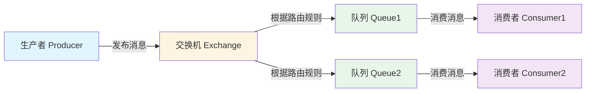

### 2. AMQP 核心概念

| 概念 | 说明 |
|------|------|
| Producer（生产者） | 消息的发送方，负责创建和发送消息 |
| Consumer（消费者） | 消息的接收方，负责处理消息 |
| Exchange（交换机） | 接收生产者发送的消息，根据路由规则将消息路由到一个或多个队列 |
| Queue（队列） | 消息的容器，用于存储消息，直到被消费者消费 |
| Binding（绑定） | 交换机和队列之间的关联关系，包含路由键 |
| Routing Key（路由键） | 交换机根据路由键决定将消息路由到哪个队列 |
| Virtual Host（虚拟主机） | 逻辑隔离单位，类似于数据库中的 schema |

## RabbitMQ 架构设计

### 1. 整体架构

RabbitMQ 的整体架构由以下几个核心组件构成：

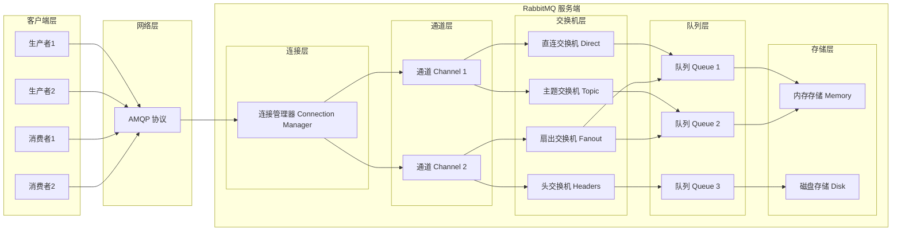

### 2. 连接与通道

RabbitMQ 使用连接（Connection）和通道（Channel）的概念来管理客户端与服务端的通信。

#### 连接（Connection）

连接是客户端与 RabbitMQ 服务端之间的 TCP 连接，是一个重量级的资源。建立连接需要进行身份验证、协议协商等操作。

**连接建立过程：**

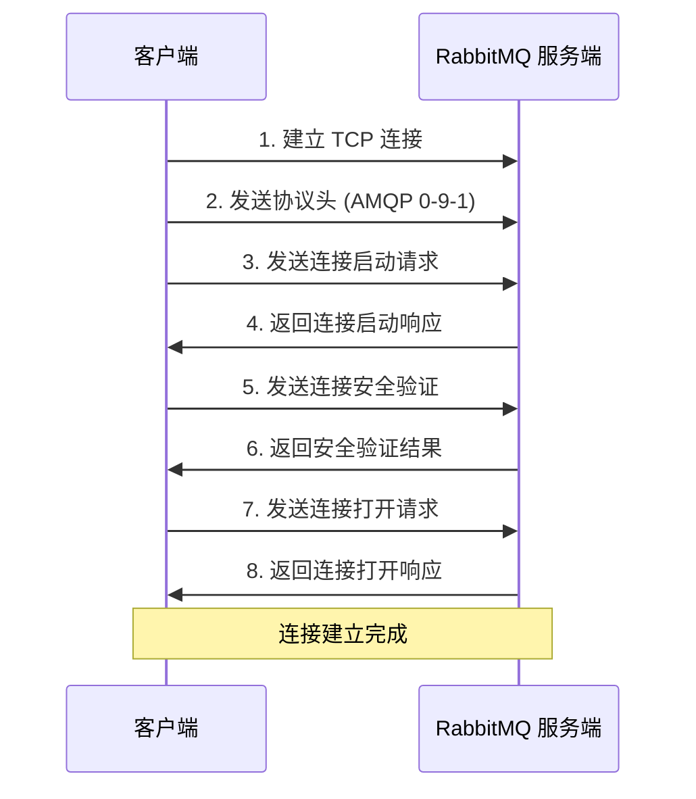

#### 通道（Channel）

通道是建立在连接之上的轻量级连接，用于 AMQP 方法调用。一个连接可以创建多个通道，每个通道可以独立进行消息的发送和接收，互不干扰。

**为什么需要通道？**

1. **性能优化**：建立 TCP 连接的开销较大，而通道的创建开销很小
2. **资源隔离**：每个通道有独立的消息序列号，可以独立进行确认
3. **并发处理**：多个通道可以并发处理消息，提高吞吐量

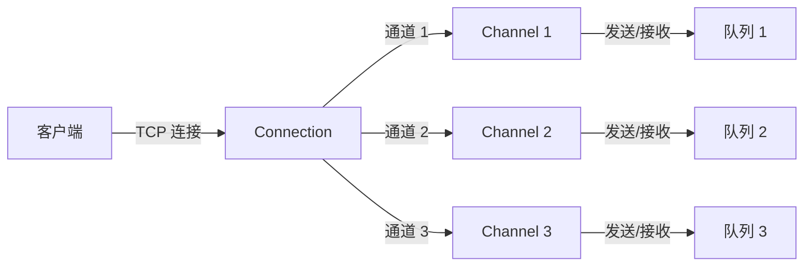

## 交换机类型与路由机制

RabbitMQ 提供了四种类型的交换机，每种交换机有不同的路由规则。

### 1. 直连交换机（Direct Exchange）

直连交换机根据消息的路由键（Routing Key）将消息精确匹配到绑定了相同路由键的队列。

**特点：**

- 精确匹配路由键
- 支持多队列绑定相同路由键
- 性能较高

**使用场景：**

- 点对点消息传递
- 需要精确路由的场景

**配置示例：**

```java
// 创建直连交换机
@Bean
public DirectExchange directExchange() {
    /**
     * 创建直连交换机
     * @param name 交换机名称
     * @param durable 是否持久化
     * @param autoDelete 是否自动删除
     */
    return new DirectExchange("direct.exchange", true, false);
}

// 绑定队列到交换机
@Bean
public Binding bindingDirect(Queue queue, DirectExchange exchange) {
    /**
     * 绑定队列和交换机
     * @param queue 队列
     * @param exchange 交换机
     * @param routingKey 路由键
     */
    return BindingBuilder.bind(queue).to(exchange).with("order.created");
}
```

**路由示意图：**

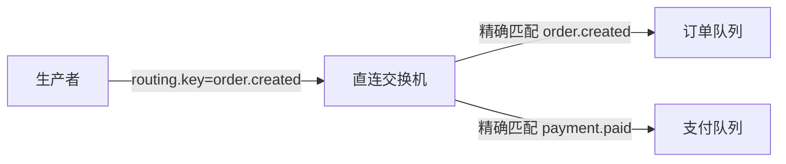

### 2. 主题交换机（Topic Exchange）

主题交换机根据路由键的模式匹配将消息路由到队列。路由键和绑定键支持通配符。

**通配符规则：**

- `*`：匹配一个单词
- `#`：匹配零个或多个单词

**特点：**

- 灵活的路由规则
- 支持多级路由
- 适用于复杂的消息分发场景

**使用场景：**

- 按类别分发消息
- 多级路由需求
- 订阅发布模式

**配置示例：**

```java
// 创建主题交换机
@Bean
public TopicExchange topicExchange() {
    /**
     * 创建主题交换机
     * @param name 交换机名称
     * @param durable 是否持久化
     * @param autoDelete 是否自动删除
     */
    return new TopicExchange("topic.exchange", true, false);
}

// 绑定队列到交换机
@Bean
public Binding bindingTopic1(Queue queue, TopicExchange exchange) {
    /**
     * 绑定队列和交换机
     * @param queue 队列
     * @param exchange 交换机
     * @param routingKey 绑定键，支持通配符
     */
    return BindingBuilder.bind(queue).to(exchange).with("order.*");
}

@Bean
public Binding bindingTopic2(Queue queue, TopicExchange exchange) {
    return BindingBuilder.bind(queue).to(exchange).with("*.created");
}

@Bean
public Binding bindingTopic3(Queue queue, TopicExchange exchange) {
    return BindingBuilder.bind(queue).to(exchange).with("#.paid");
}
```

**路由示意图：**

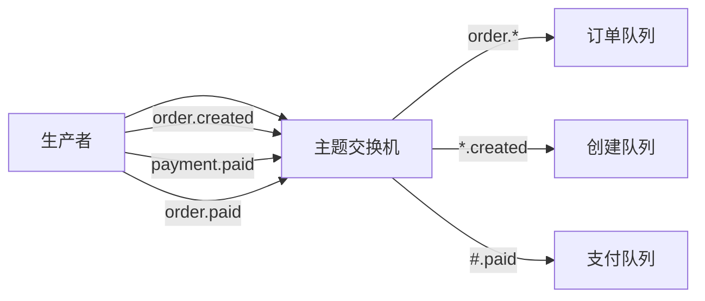

### 3. 扇出交换机（Fanout Exchange）

扇出交换机将消息广播到所有绑定到该交换机的队列，忽略路由键。

**特点：**

- 广播模式
- 性能最高
- 不需要路由键

**使用场景：**

- 广播消息
- 发布订阅模式
- 通知系统

**配置示例：**

```java
// 创建扇出交换机
@Bean
public FanoutExchange fanoutExchange() {
    /**
     * 创建扇出交换机
     * @param name 交换机名称
     * @param durable 是否持久化
     * @param autoDelete 是否自动删除
     */
    return new FanoutExchange("fanout.exchange", true, false);
}

// 绑定队列到交换机
@Bean
public Binding bindingFanout1(Queue queue, FanoutExchange exchange) {
    /**
     * 绑定队列和交换机
     * @param queue 队列
     * @param exchange 交换机
     */
    return BindingBuilder.bind(queue).to(exchange);
}

@Bean
public Binding bindingFanout2(Queue queue, FanoutExchange exchange) {
    return BindingBuilder.bind(queue).to(exchange);
}
```

**路由示意图：**

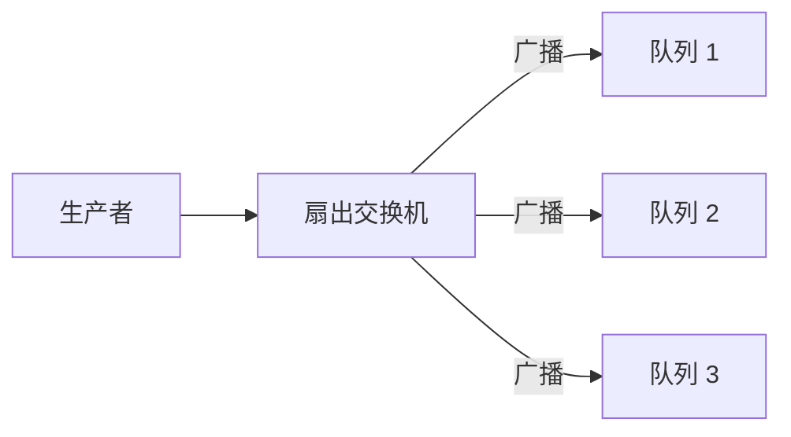

### 4. 头交换机（Headers Exchange）

头交换机根据消息头（Headers）中的键值对进行路由匹配，而不是路由键。

**特点：**

- 基于消息头匹配
- 支持多条件匹配
- 性能相对较低

**使用场景：**

- 需要根据消息属性路由
- 复杂的路由条件
- 需要多个匹配条件

**配置示例：**

```java
// 创建头交换机
@Bean
public HeadersExchange headersExchange() {
    /**
     * 创建头交换机
     * @param name 交换机名称
     * @param durable 是否持久化
     * @param autoDelete 是否自动删除
     */
    return new HeadersExchange("headers.exchange", true, false);
}

// 绑定队列到交换机
@Bean
public Binding bindingHeaders(Queue queue, HeadersExchange exchange) {
    /**
     * 绑定队列和交换机
     * @param queue 队列
     * @param exchange 交换机
     * @param where 匹配条件
     */
    return BindingBuilder.bind(queue).to(exchange)
            .where("type").matches("notification")
            .and("priority").matches("high");
}
```

**路由示意图：**

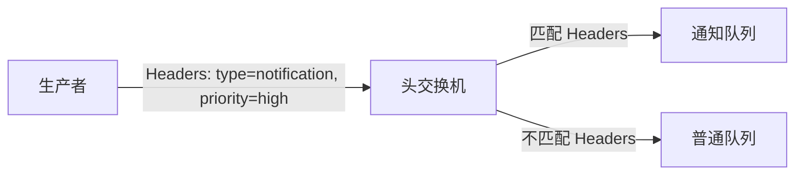

## 消息流转机制

### 1. 消息发送流程

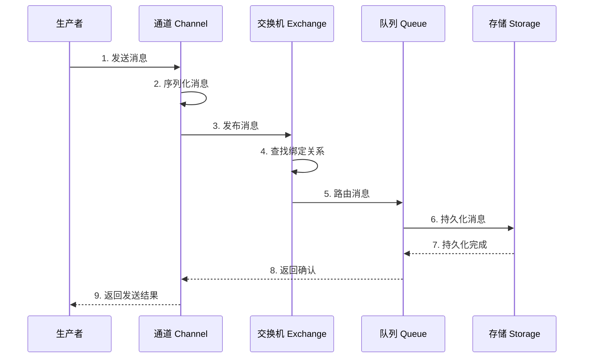

### 2. 消息接收流程

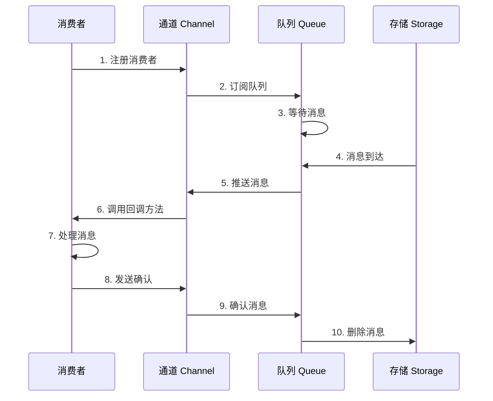

### 3. 消息确认机制

RabbitMQ 提供了两种消息确认机制：

#### 生产者确认（Publisher Confirm）

生产者确认机制确保消息成功发送到交换机。

**确认类型：**

- `ConfirmCallback`：确认消息是否到达交换机
- `ReturnsCallback`：确认消息是否路由到队列

**配置示例：**

```java
@Configuration
public class RabbitMQConfirmConfig {

    @Autowired
    private RabbitTemplate rabbitTemplate;

    @PostConstruct
    public void init() {
        /**
         * 设置确认回调
         * @param correlationData 关联数据
         * @param ack 是否确认
         * @param cause 失败原因
         */
        rabbitTemplate.setConfirmCallback((correlationData, ack, cause) -> {
            if (ack) {
                System.out.println("消息发送到交换机成功");
            } else {
                System.out.println("消息发送到交换机失败: " + cause);
            }
        });

        /**
         * 设置返回回调
         * @param message 消息
         * @param replyCode 响应码
         * @param replyText 响应文本
         * @param exchange 交换机
         * @param routingKey 路由键
         */
        rabbitTemplate.setReturnCallback((message, replyCode, replyText, exchange, routingKey) -> {
            System.out.println("消息未路由到队列: " + replyText);
        });
    }
}
```

#### 消费者确认（Consumer Ack）

消费者确认机制确保消息被正确处理。

**确认模式：**

- `AUTO`：自动确认（默认）
- `MANUAL`：手动确认
- `NONE`：不确认

**配置示例：**

```java
/**
 * 手动确认模式的消息监听器
 * @param queues 监听的队列名称
 * @param ackMode 确认模式，MANUAL 表示手动确认
 */
@RabbitListener(
    queues = RabbitMQConfig.QUEUE_NAME,
    ackMode = "MANUAL"
)
public void receiveMessage(Message message, Channel channel) throws IOException {
    try {
        System.out.println("接收到消息: " + new String(message.getBody()));
        // 处理消息逻辑
        /**
         * 确认消息
         * @param deliveryTag 消息标签
         * @param multiple 是否批量确认
         */
        channel.basicAck(message.getMessageProperties().getDeliveryTag(), false);
    } catch (Exception e) {
        /**
         * 拒绝消息
         * @param deliveryTag 消息标签
         * @param multiple 是否批量拒绝
         * @param requeue 是否重新入队
         */
        channel.basicNack(message.getMessageProperties().getDeliveryTag(), false, true);
    }
}
```

## 消息存储机制

RabbitMQ 提供了两种消息存储方式：内存存储和磁盘存储。

### 1. 内存存储

**特点：**

- 读写速度快
- 数据不持久化
- 适用于临时消息

**使用场景：**

- 临时消息
- 高吞吐量场景
- 消息量不大

### 2. 磁盘存储

**特点：**

- 数据持久化
- 读写速度较慢
- 适用于重要消息

**使用场景：**

- 重要消息
- 需要持久化的场景
- 消息量较大

### 3. 混合存储

RabbitMQ 默认使用混合存储策略：消息先存储在内存中，当内存不足时，将消息写入磁盘。

**存储策略配置：**

RabbitMQ 的存储策略在服务器端配置文件中配置：

**rabbitmq.conf：**

```ini
# 内存存储相关配置
vm_memory_high_watermark.relative = 0.4
vm_memory_high_watermark_paging_ratio = 0.5

# 磁盘存储相关配置
disk_free_limit.relative = 1.0

# 队列存储模式
queue_index_embed_msgs_below = 4096
```

**配置说明：**

| 配置项 | 说明 | 默认值 |
|--------|------|--------|
| vm_memory_high_watermark.relative | 内存高水位标记（相对值） | 0.4 |
| vm_memory_high_watermark_paging_ratio | 内存分页比例 | 0.5 |
| disk_free_limit.relative | 磁盘空间限制（相对值） | 1.0 |
| queue_index_embed_msgs_below | 嵌入队列索引的消息大小阈值 | 4096 |

**工作原理：**

- 当内存使用超过 `vm_memory_high_watermark.relative` 时，RabbitMQ 开始将内存中的消息写入磁盘
- `queue_index_embed_msgs_below` 设置小于该值的消息直接嵌入队列索引中存储
- 当磁盘空间低于 `disk_free_limit.relative` 时，RabbitMQ 会停止接受新消息

**队列存储模式：**

```java
// 创建队列时指定存储模式
Queue queue = QueueBuilder.durable("my_queue")
    .lazy()  // 懒加载队列，消息直接存储在磁盘
    .build();

// 普通队列，消息先存储在内存
Queue normalQueue = QueueBuilder.durable("my_queue")
    .build();
```

**队列类型说明：**

- **普通队列**：消息先存储在内存，内存不足时写入磁盘
- **懒队列（Lazy Queue）**：消息直接存储在磁盘，减少内存使用

## 高级特性

### 1. 死信队列（Dead Letter Queue）

死信队列用于存储无法被正常消费的消息。

**消息成为死信的条件：**

- 消息被拒绝且不重新入队
- 消息过期
- 队列达到最大长度

**配置示例：**

```java
@Configuration
public class DeadLetterConfig {

    // 死信队列
    public static final String DEAD_LETTER_QUEUE = "dead_letter_queue";
    // 死信交换机
    public static final String DEAD_LETTER_EXCHANGE = "dead_letter_exchange";
    // 死信路由键
    public static final String DEAD_LETTER_ROUTING_KEY = "dead.letter.routing.key";

    // 死信队列
    @Bean
    public Queue deadLetterQueue() {
        /**
         * 创建队列
         * @param name 队列名称
         * @param durable 是否持久化
         * @param exclusive 是否排他性队列
         * @param autoDelete 是否自动删除
         */
        return new Queue(DEAD_LETTER_QUEUE);
    }

    // 死信交换机
    @Bean
    public DirectExchange deadLetterExchange() {
        /**
         * 创建直连交换机
         * @param name 交换机名称
         * @param durable 是否持久化
         * @param autoDelete 是否自动删除
         */
        return new DirectExchange(DEAD_LETTER_EXCHANGE);
    }

    // 绑定死信队列和交换机
    @Bean
    public Binding deadLetterBinding() {
        /**
         * 绑定队列和交换机
         * @param queue 队列
         * @param exchange 交换机
         * @param routingKey 路由键
         */
        return BindingBuilder.bind(deadLetterQueue())
                .to(deadLetterExchange())
                .with(DEAD_LETTER_ROUTING_KEY);
    }

    // 普通队列（设置死信属性）
    @Bean
    public Queue normalQueue() {
        return QueueBuilder.durable("normal_queue")
                /**
                 * 设置死信交换机
                 * @param argument 死信交换机名称
                 */
                .withArgument("x-dead-letter-exchange", DEAD_LETTER_EXCHANGE)
                /**
                 * 设置死信路由键
                 * @param argument 死信路由键
                 */
                .withArgument("x-dead-letter-routing-key", DEAD_LETTER_ROUTING_KEY)
                /**
                 * 设置消息过期时间
                 * @param argument 过期时间（毫秒）
                 */
                .withArgument("x-message-ttl", 10000)
                .build();
    }
}
```

**死信队列工作流程：**

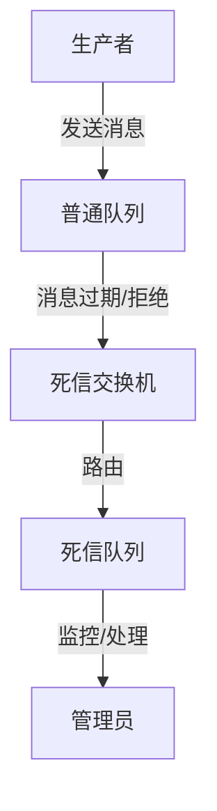

### 2. 延迟队列（Delay Queue）

RabbitMQ 本身不支持延迟队列，但可以通过死信队列实现延迟队列功能。

**实现原理：**

1. 创建一个临时队列，设置消息过期时间
2. 消息过期后，自动转发到死信队列
3. 消费者从死信队列消费消息

**配置示例：**

```java
@Configuration
public class DelayQueueConfig {

    // 延迟队列
    public static final String DELAY_QUEUE = "delay_queue";
    // 延迟交换机
    public static final String DELAY_EXCHANGE = "delay_exchange";
    // 处理队列
    public static final String PROCESS_QUEUE = "process_queue";
    // 处理交换机
    public static final String PROCESS_EXCHANGE = "process_exchange";

    // 延迟队列（实际是死信队列）
    @Bean
    public Queue delayQueue() {
        return QueueBuilder.durable(DELAY_QUEUE)
                /**
                 * 设置死信交换机
                 * @param argument 死信交换机名称
                 */
                .withArgument("x-dead-letter-exchange", PROCESS_EXCHANGE)
                /**
                 * 设置死信路由键
                 * @param argument 死信路由键
                 */
                .withArgument("x-dead-letter-routing-key", "process.routing.key")
                .build();
    }

    // 延迟交换机
    @Bean
    public DirectExchange delayExchange() {
        /**
         * 创建直连交换机
         * @param name 交换机名称
         * @param durable 是否持久化
         * @param autoDelete 是否自动删除
         */
        return new DirectExchange(DELAY_EXCHANGE);
    }

    // 绑定延迟队列和交换机
    @Bean
    public Binding delayBinding() {
        /**
         * 绑定队列和交换机
         * @param queue 队列
         * @param exchange 交换机
         * @param routingKey 路由键
         */
        return BindingBuilder.bind(delayQueue())
                .to(delayExchange())
                .with("delay.routing.key");
    }

    // 处理队列
    @Bean
    public Queue processQueue() {
        /**
         * 创建队列
         * @param name 队列名称
         * @param durable 是否持久化
         * @param exclusive 是否排他性队列
         * @param autoDelete 是否自动删除
         */
        return new Queue(PROCESS_QUEUE);
    }

    // 处理交换机
    @Bean
    public DirectExchange processExchange() {
        /**
         * 创建直连交换机
         * @param name 交换机名称
         * @param durable 是否持久化
         * @param autoDelete 是否自动删除
         */
        return new DirectExchange(PROCESS_EXCHANGE);
    }

    // 绑定处理队列和交换机
    @Bean
    public Binding processBinding() {
        /**
         * 绑定队列和交换机
         * @param queue 队列
         * @param exchange 交换机
         * @param routingKey 路由键
         */
        return BindingBuilder.bind(processQueue())
                .to(processExchange())
                .with("process.routing.key");
    }
}
```

**发送延迟消息：**

```java
/**
 * 发送延迟消息
 * @param message 消息内容
 * @param delayMillis 延迟时间（毫秒）
 */
public void sendDelayMessage(String message, long delayMillis) {
    /**
     * 发送消息并设置消息属性
     * @param exchange 交换机名称
     * @param routingKey 路由键
     * @param message 消息内容
     * @param messagePostProcessor 消息处理器，用于设置消息属性
     */
    rabbitTemplate.convertAndSend(
        DelayQueueConfig.DELAY_EXCHANGE,
        "delay.routing.key",
        message,
        messagePostProcessor -> {
            /**
             * 设置消息过期时间
             * @param expiration 过期时间（毫秒）
             */
            messagePostProcessor.getMessageProperties().setExpiration(String.valueOf(delayMillis));
            return messagePostProcessor;
        }
    );
}
```

**延迟队列工作流程：**

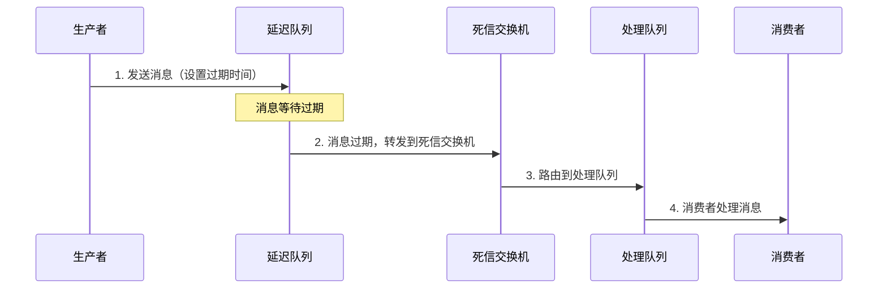

### 3. 消息优先级

RabbitMQ 支持消息优先级，高优先级的消息会被优先消费。

**配置示例：**

```java
@Bean
public Queue priorityQueue() {
    /**
     * 创建队列
     * @param name 队列名称
     * @param durable 是否持久化
     * @param exclusive 是否排他性队列
     * @param autoDelete 是否自动删除
     */
    return QueueBuilder.durable("priority_queue")
            /**
             * 设置最大优先级
             * @param argument 最大优先级（0-255）
             */
            .withArgument("x-max-priority", 10)
            .build();
}
```

**发送优先级消息：**

```java
public void sendPriorityMessage(String message, int priority) {
    /**
     * 发送消息并设置消息属性
     * @param exchange 交换机名称
     * @param routingKey 路由键
     * @param message 消息内容
     * @param messagePostProcessor 消息处理器，用于设置消息属性
     */
    rabbitTemplate.convertAndSend(
        "priority.exchange",
        "priority.routing.key",
        message,
        messagePostProcessor -> {
            /**
             * 设置消息优先级
             * @param priority 优先级（0-255）
             */
            messagePostProcessor.getMessageProperties().setPriority(priority);
            return messagePostProcessor;
        }
    );
}
```

### 4. 消息持久化

消息持久化确保消息在 RabbitMQ 重启后不会丢失。

**配置示例：**

```java
@Bean
public Queue durableQueue() {
    /**
     * 创建队列
     * @param name 队列名称
     * @param durable 是否持久化
     * @param exclusive 是否排他性队列
     * @param autoDelete 是否自动删除
     */
    return new Queue("durable_queue", true, false, false);
}

@Bean
public DirectExchange durableExchange() {
    /**
     * 创建直连交换机
     * @param name 交换机名称
     * @param durable 是否持久化
     * @param autoDelete 是否自动删除
     */
    return new DirectExchange("durable.exchange", true, false);
}
```

**发送持久化消息：**

```java
public void sendDurableMessage(String message) {
    /**
     * 发送消息并设置消息属性
     * @param exchange 交换机名称
     * @param routingKey 路由键
     * @param message 消息内容
     * @param messagePostProcessor 消息处理器，用于设置消息属性
     */
    rabbitTemplate.convertAndSend(
        "durable.exchange",
        "durable.routing.key",
        message,
        messagePostProcessor -> {
            /**
             * 设置消息持久化
             * @param deliveryMode 投递模式，PERSISTENT 表示持久化
             */
            messagePostProcessor.getMessageProperties().setDeliveryMode(MessageDeliveryMode.PERSISTENT);
            return messagePostProcessor;
        }
    );
}
```

## 集群与高可用

### 1. RabbitMQ 集群架构

RabbitMQ 支持集群部署，提供高可用性和负载均衡能力。

**集群特点：**

- 消息队列在集群中复制
- 节点之间共享元数据
- 客户端可以连接到任意节点

**集群架构图：**

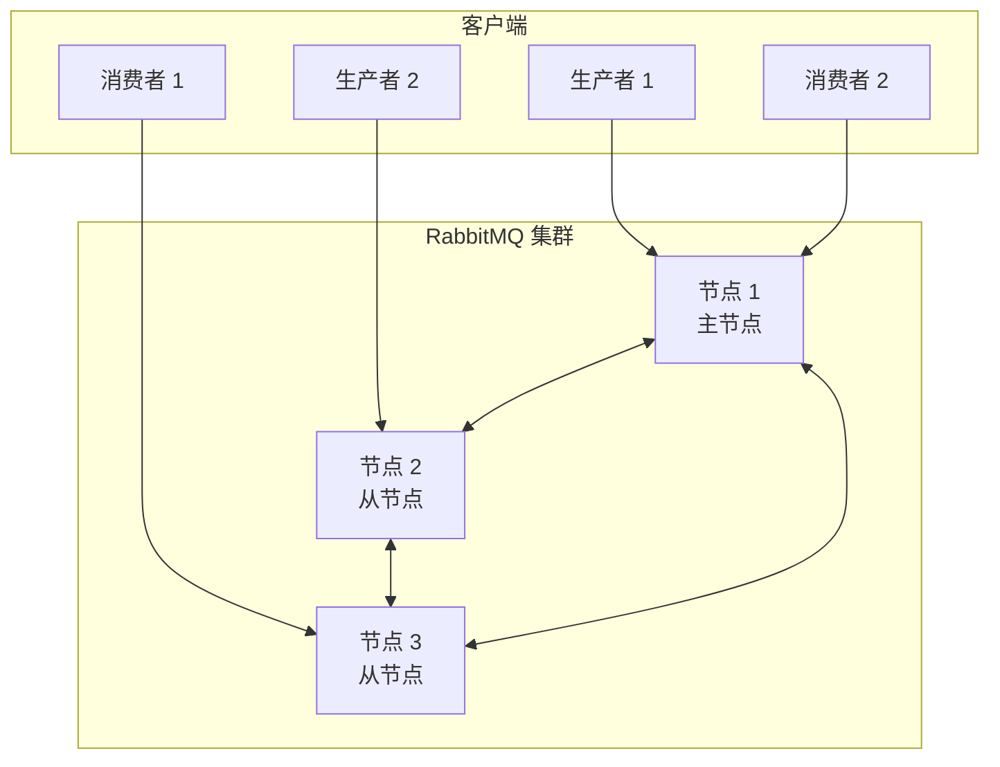

### 2. 镜像队列

镜像队列是 RabbitMQ 集群中实现高可用的重要机制。

**镜像队列特点：**

- 消息在多个节点上复制
- 主节点故障时，从节点自动接管
- 提供数据冗余和故障恢复

**镜像队列配置：**

```bash
# 设置镜像队列策略
rabbitmqctl set_policy ha-all "^ha\." '{"ha-mode":"all","ha-sync-mode":"automatic"}'
```

**镜像队列工作流程：**

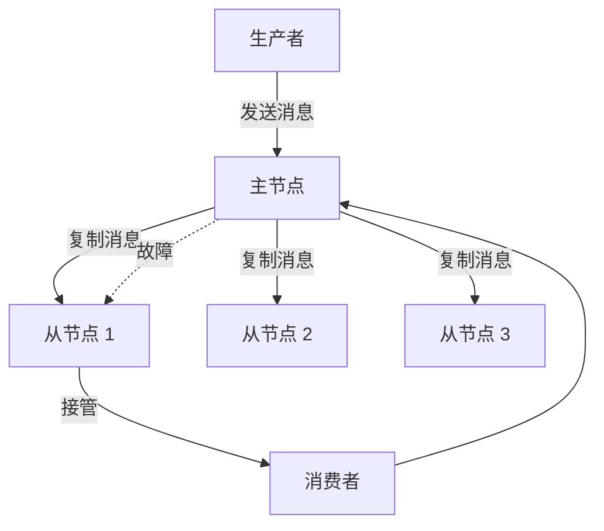

### 3. 负载均衡

RabbitMQ 集群支持负载均衡，提高系统吞吐量。

**负载均衡策略：**

- 客户端随机连接到集群节点
- 消息在集群节点间分发
- 消费者可以连接到任意节点

## 性能优化

### 1. 连接池管理

使用连接池可以减少连接创建和销毁的开销。

**配置示例：**

```yaml
spring:
  rabbitmq:
    # 其他配置...
    cache:
      channel:
        size: 25
        checkout-timeout: 30s
      connection:
        mode: channel
```

### 2. 批量发送消息

批量发送消息可以减少网络开销，提高吞吐量。

**配置示例：**

```java
public void sendBatchMessages(List<String> messages) {
    /**
     * 批量发送消息
     * @param exchange 交换机名称
     * @param routingKey 路由键
     * @param messages 消息列表
     */
    messages.forEach(message -> {
        rabbitTemplate.convertAndSend(
            "batch.exchange",
            "batch.routing.key",
            message
        );
    });
}
```

### 3. 消费者并发配置

配置多个消费者并发处理消息，提高消费速度。

**配置示例：**

```yaml
spring:
  rabbitmq:
    listener:
      simple:
        concurrency: 5
        max-concurrency: 10
        prefetch: 1
```

## 常见问题与解决方案

### 1. 消息丢失

**原因：**

- 生产者未确认消息发送成功
- 消费者未确认消息处理成功
- 队列未持久化

**解决方案：**

- 开启生产者确认机制
- 使用手动确认模式
- 配置队列和消息持久化

### 2. 消息重复消费

**原因：**

- 消费者确认超时
- 网络波动导致确认消息丢失

**解决方案：**

- 实现幂等性处理
- 使用唯一消息ID
- 设置合理的确认超时时间

### 3. 消息堆积

**原因：**

- 消费者处理能力不足
- 生产速度大于消费速度

**解决方案：**

- 增加消费者数量
- 优化消费者处理逻辑
- 使用消息分片

### 4. 连接泄漏

**原因：**

- 连接未正确关闭
- 通道未正确关闭

**解决方案：**

- 使用连接池
- 及时关闭连接和通道
- 监控连接使用情况

## 总结

本文详细介绍了 RabbitMQ 的核心原理和架构设计，包括：

1. **AMQP 协议**：协议模型和核心概念
2. **架构设计**：整体架构、连接与通道机制
3. **交换机类型**：直连、主题、扇出、头交换机
4. **消息流转**：发送、接收、确认机制
5. **存储机制**：内存、磁盘、混合存储
6. **高级特性**：死信队列、延迟队列、消息优先级、消息持久化
7. **集群高可用**：集群架构、镜像队列、负载均衡
8. **性能优化**：连接池、批量发送、并发配置
9. **常见问题**：消息丢失、重复消费、消息堆积、连接泄漏

通过本文的学习，你应该能够深入理解 RabbitMQ 的工作原理，并在实际项目中正确使用 RabbitMQ 构建可靠的消息传递系统。

## 参考资料

- [RabbitMQ 官方文档](https://www.rabbitmq.com/documentation.html)
- [AMQP 0-9-1 协议规范](https://www.rabbitmq.com/amqp-0-9-1-reference.html)
- [Spring AMQP 官方文档](https://docs.spring.io/spring-amqp/docs/current/reference/html/)
