> 深入解析 RocketMQ 的核心原理、架构设计、消息存储机制以及高级特性

## 简介

RocketMQ 是阿里巴巴开源的分布式消息中间件，采用 Java 语言开发，具有高吞吐量、高可用性、高可靠性等特点。它广泛应用于电商、金融、物流等领域，支撑着阿里巴巴双十一等大规模业务场景。

### RocketMQ 与 RabbitMQ 对比

| 特性 | RocketMQ | RabbitMQ |
|------|----------|----------|
| 开发语言 | Java | Erlang |
| 协议支持 | 自定义协议 | AMQP |
| 消息存储 | 文件存储 | 内存/磁盘 |
| 吞吐量 | 高 | 中 |
| 延迟 | 低 | 中 |
| 事务消息 | 支持 | 不支持 |
| 延迟消息 | 支持 | 需要插件 |
| 消息回溯 | 支持 | 不支持 |

## 核心概念

### 1. 架构组件

RocketMQ 的架构由以下核心组件构成：

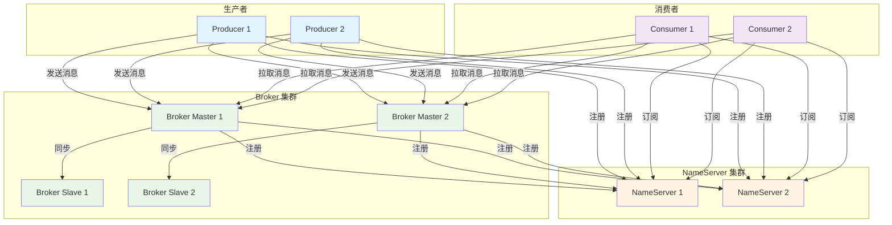

### 2. 核心概念详解

| 概念 | 说明 |
|------|------|
| Producer（生产者） | 消息的发送方，负责创建和发送消息 |
| Consumer（消费者） | 消息的接收方，负责处理消息 |
| Broker | 消息服务器，负责存储和转发消息 |
| NameServer | 路由注册中心，类似于注册中心 |
| Topic | 消息主题，消息的第一级分类 |
| Queue | 消息队列，消息的第二级分类 |
| Message | 消息，包含消息体和属性 |
| Tag | 消息标签，消息的第三级分类 |
| Group | 生产者或消费者组，用于集群部署 |
| Offset | 消息偏移量，表示消息在队列中的位置 |

## 架构设计

### 1. NameServer 架构

NameServer 是 RocketMQ 的路由注册中心，类似于注册中心，但比注册中心更轻量。

**NameServer 特点：**
- 无状态设计，节点之间不通信
- 轻量级，启动快，资源消耗低
- 支持多节点部署，提供高可用性

**NameServer 工作流程：**

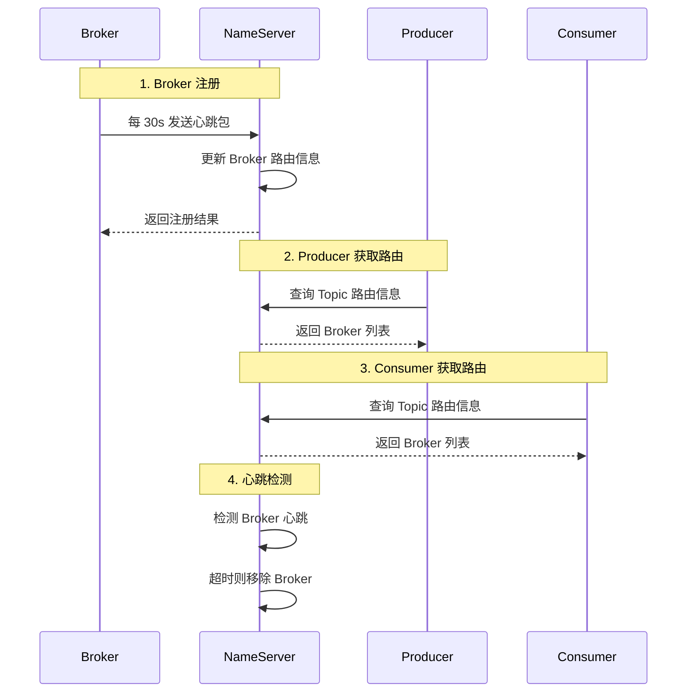

**NameServer 路由信息：**

```java
public class RouteInfoManager {
    /**
     * Topic -> QueueData 映射
     * 存储每个 Topic 的队列信息
     */
    private final HashMap<String/* topic */, Map<String /* brokerName */, QueueData>> topicQueueTable;
    
    /**
     * BrokerName -> BrokerData 映射
     * 存储每个 Broker 的地址信息
     */
    private final HashMap<String/* brokerName */, BrokerData> brokerAddrTable;
    
    /**
     * 集群名称 -> BrokerName 集合
     * 存储每个集群下的 Broker 列表
     */
    private final HashMap<String/* clusterName */, Set<String/* brokerName */>> clusterAddrTable;
    
    /**
     * Broker 地址 -> BrokerLiveInfo
     * 存储 Broker 的存活信息
     */
    private final HashMap<String/* brokerAddr */, BrokerLiveInfo> brokerLiveTable;
}
```

### 2. Broker 架构

Broker 是 RocketMQ 的消息服务器，负责消息的存储、转发和查询。

**Broker 组件架构：**

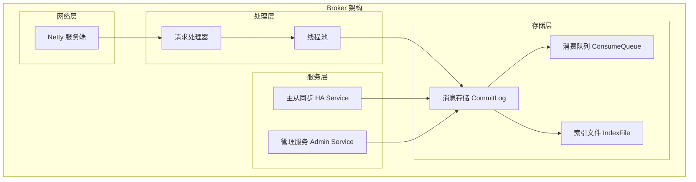

**Broker 主从架构：**

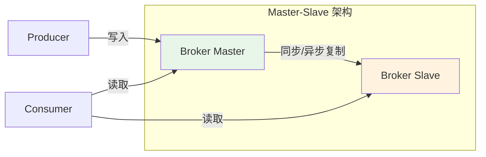

**主从同步模式：**

| 同步模式 | 说明 | 优点 | 缺点 |
|----------|------|------|------|
| 同步复制 | Master 写入成功后，等待 Slave 复制成功 | 数据不丢失 | 性能较低 |
| 异步复制 | Master 写入成功后，立即返回，异步复制到 Slave | 性能较高 | 可能丢失数据 |

### 3. Producer 架构

Producer 是消息的发送方，支持多种发送方式。

**Producer 发送流程：**

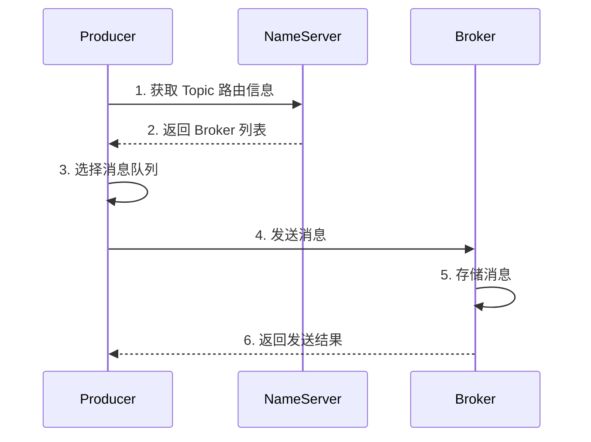

**Producer 核心类：**

```java
public class DefaultMQProducer {
    /**
     * 生产者组名
     */
    private String producerGroup;
    
    /**
     * NameServer 地址
     */
    private String namesrvAddr;
    
    /**
     * 发送消息超时时间
     */
    private int sendMsgTimeout = 3000;
    
    /**
     * 消息最大大小
     */
    private int maxMessageSize = 4 * 1024 * 1024;
    
    /**
     * 发送消息
     * @param msg 消息
     * @return 发送结果
     */
    public SendResult send(Message msg) {
        // 发送消息逻辑
    }
    
    /**
     * 发送同步消息
     * @param msg 消息
     * @return 发送结果
     */
    public SendResult send(Message msg) {
        // 同步发送逻辑
    }
    
    /**
     * 发送异步消息
     * @param msg 消息
     * @param sendCallback 回调函数
     */
    public void send(Message msg, SendCallback sendCallback) {
        // 异步发送逻辑
    }
    
    /**
     * 发送单向消息
     * @param msg 消息
     */
    public void sendOneway(Message msg) {
        // 单向发送逻辑
    }
}
```

### 4. Consumer 架构

Consumer 是消息的接收方，支持两种消费模式：集群消费和广播消费。

**Consumer 消费模式：**

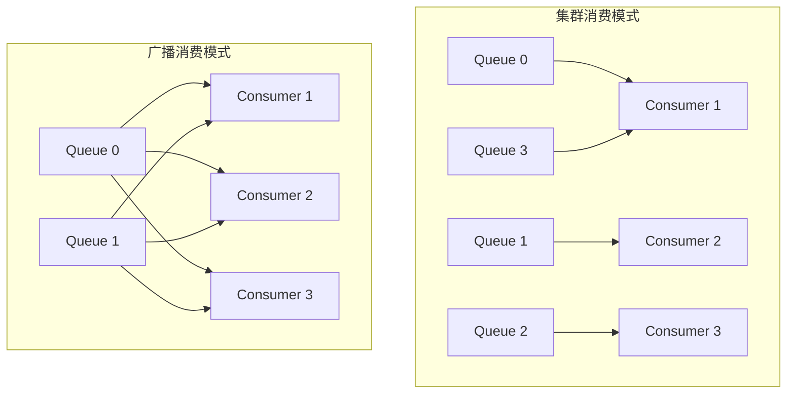

**消费模式对比：**

| 消费模式 | 说明 | 适用场景 |
|----------|------|----------|
| 集群消费 | 同一 Consumer Group 下的消费者平均分摊消息 | 订阅者需要处理消息 |
| 广播消费 | 同一 Consumer Group 下的消费者都消费全量消息 | 订阅者都需要处理消息 |

**Consumer 核心类：**

```java
public class DefaultMQPushConsumer {
    /**
     * 消费者组名
     */
    private String consumerGroup;
    
    /**
     * NameServer 地址
     */
    private String namesrvAddr;
    
    /**
     * 消费模式
     */
    private MessageModel messageModel = MessageModel.CLUSTERING;
    
    /**
     * 消费起点
     */
    private ConsumeFromWhere consumeFromWhere = ConsumeFromWhere.CONSUME_FROM_LAST_OFFSET;
    
    /**
     * 订阅主题
     * @param topic 主题
     * @param subExpression 订阅表达式
     */
    public void subscribe(String topic, String subExpression) {
        // 订阅逻辑
    }
    
    /**
     * 注册消息监听器
     * @param messageListener 消息监听器
     */
    public void registerMessageListener(MessageListenerConcurrently messageListener) {
        // 注册监听器逻辑
    }
    
    /**
     * 启动消费者
     */
    public void start() {
        // 启动逻辑
    }
}
```

## 消息存储机制

### 1. 存储架构

RocketMQ 的消息存储采用 CommitLog + ConsumeQueue + IndexFile 的架构。

**存储架构图：**

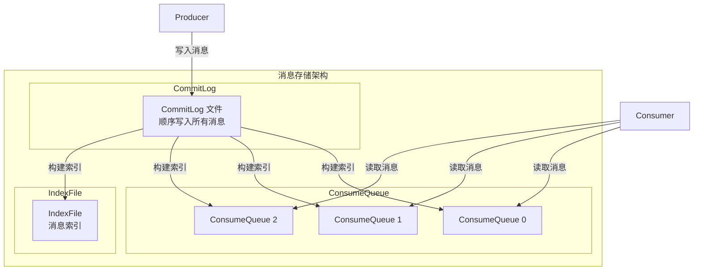

### 2. CommitLog

CommitLog 是消息存储的核心文件，所有消息都顺序写入 CommitLog。

**CommitLog 特点：**
- 顺序写入，性能高
- 所有 Topic 的消息混合存储
- 文件大小固定（默认 1GB）
- 文件名以起始偏移量命名

**CommitLog 文件结构：**

```
CommitLog 文件目录结构：
${ROCKETMQ_HOME}/store/commitlog/
├── 00000000000000000000  (第一个文件，偏移量 0)
├── 00000000001073741824  (第二个文件，偏移量 1GB)
├── 00000000002147483648  (第三个文件，偏移量 2GB)
└── ...
```

**CommitLog 消息格式：**

```java
public class CommitLog {
    /**
     * 消息存储格式
     */
    public static class MessageExtBatch {
        // 消息总长度 (4 bytes)
        private int totalSize;
        // 魔数 (4 bytes)
        private int magicCode;
        // 消息 CRC32 (4 bytes)
        private int crc32;
        // 队列 ID (4 bytes)
        private int queueId;
        // 存储时间戳 (8 bytes)
        private long storeTimestamp;
        // 消息长度 (4 bytes)
        private int bodyLength;
        // 消息体
        private byte[] body;
        // Topic 长度 (1 byte)
        private byte topicLength;
        // Topic
        private String topic;
        // 属性长度 (2 bytes)
        private short propertiesLength;
        // 属性
        private String properties;
    }
}
```

### 3. ConsumeQueue

ConsumeQueue 是消息的逻辑队列，存储消息在 CommitLog 中的索引。

**ConsumeQueue 特点：**
- 按 Topic 和 QueueId 组织
- 存储消息在 CommitLog 中的偏移量
- 文件大小固定（默认 600 万条）
- 支持快速定位消息

**ConsumeQueue 文件结构：**

```
ConsumeQueue 文件目录结构：
${ROCKETMQ_HOME}/store/consumequeue/
├── TopicA/
│   ├── 0/
│   │   ├── 00000000000000000000
│   │   └── 00000000000006291456
│   ├── 1/
│   │   └── 00000000000000000000
│   └── ...
├── TopicB/
│   └── ...
└── ...
```

**ConsumeQueue 条目格式：**

```java
public class ConsumeQueue {
    /**
     * ConsumeQueue 条目格式
     * 每个条目固定 20 字节
     */
    public static class CqExt {
        // CommitLog 偏移量 (8 bytes)
        private long commitLogOffset;
        // 消息大小 (4 bytes)
        private int size;
        // 消息 Tag 的 HashCode (8 bytes)
        private long tagsCode;
    }
}
```

### 4. IndexFile

IndexFile 是消息的索引文件，支持按 Key 查询消息。

**IndexFile 特点：**
- 基于 Hash 索引
- 支持按 Key 快速查询
- 文件大小固定（默认 2000 万条）
- 支持时间范围查询

**IndexFile 文件结构：**

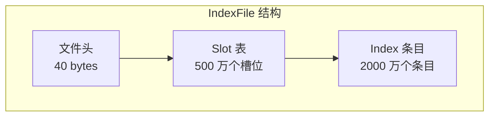

**IndexFile 条目格式：**

```java
public class IndexFile {
    /**
     * IndexFile 条目格式
     * 每个条目固定 20 字节
     */
    public static class Index {
        // Key 的 HashCode (4 bytes)
        private int keyHash;
        // CommitLog 偏移量 (8 bytes)
        private long commitLogOffset;
        // 时间戳差值 (4 bytes)
        private int timeDiff;
        // 前一个 Index 的偏移量 (4 bytes)
        private int prevIndexOffset;
    }
}
```

### 5. 消息写入流程

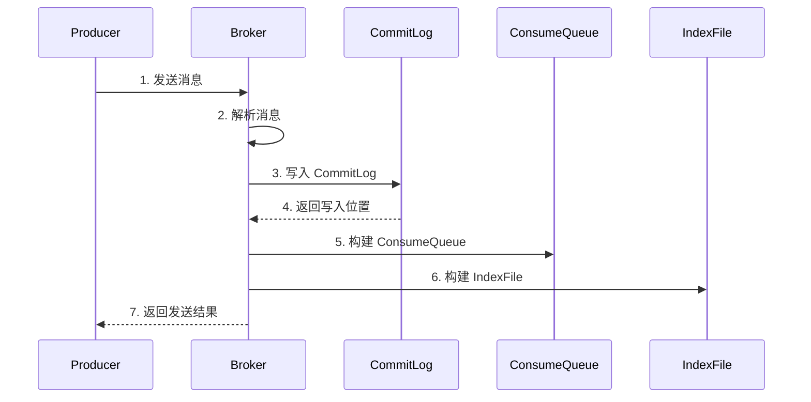

### 6. 消息读取流程

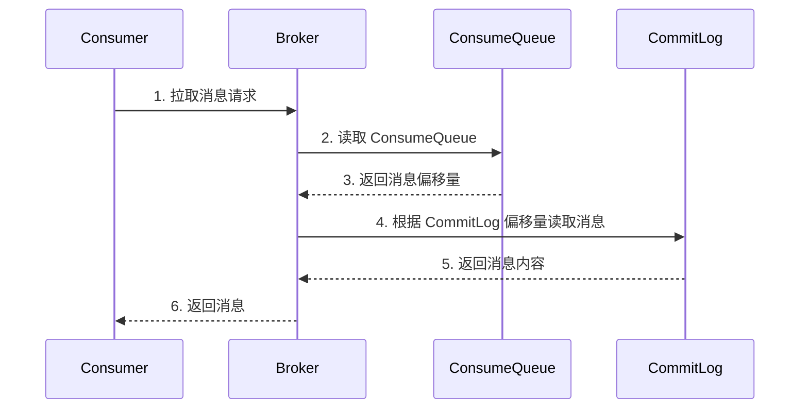

## 高级特性

### 1. 事务消息

RocketMQ 提供了事务消息机制，保证本地事务和消息发送的原子性。

**事务消息流程：**

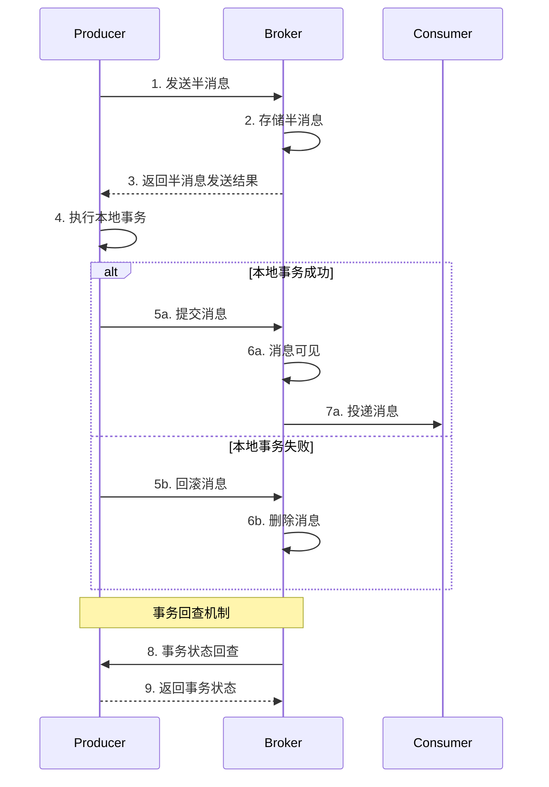

**事务消息配置：**

```java
public class TransactionProducer {
    public static void main(String[] args) {
        /**
         * 创建事务消息生产者
         * @param producerGroup 生产者组名
         */
        TransactionMQProducer producer = new TransactionMQProducer("transaction_producer_group");
        
        /**
         * 设置事务监听器
         * @param transactionListener 事务监听器
         */
        producer.setTransactionListener(new TransactionListener() {
            /**
             * 执行本地事务
             * @param msg 消息
             * @param arg 参数
             * @return 事务状态
             */
            @Override
            public LocalTransactionState executeLocalTransaction(Message msg, Object arg) {
                // 执行本地事务
                try {
                    // 本地事务逻辑
                    return LocalTransactionState.COMMIT_MESSAGE;
                } catch (Exception e) {
                    return LocalTransactionState.ROLLBACK_MESSAGE;
                }
            }
            
            /**
             * 事务状态回查
             * @param msg 消息
             * @return 事务状态
             */
            @Override
            public LocalTransactionState checkLocalTransaction(MessageExt msg) {
                // 检查本地事务状态
                return LocalTransactionState.COMMIT_MESSAGE;
            }
        });
        
        producer.start();
        
        /**
         * 发送事务消息
         * @param msg 消息
         * @param arg 参数
         * @return 发送结果
         */
        Message msg = new Message("TransactionTopic", "Hello Transaction".getBytes());
        TransactionSendResult result = producer.sendMessageInTransaction(msg, null);
    }
}
```

### 2. 延迟消息

RocketMQ 支持延迟消息，消息在指定时间后才能被消费。

**延迟消息级别：**

```java
public class ScheduleMessageService {
    /**
     * 延迟级别定义
     * 1s 5s 10s 30s 1m 2m 3m 4m 5m 6m 7m 8m 9m 10m 20m 30m 1h 2h
     */
    public static final int DELAY_LEVEL = 18;
    
    /**
     * 延迟级别对应的延迟时间
     */
    private static final Map<Integer, Long> delayLevelTable = new HashMap<>();
    
    static {
        delayLevelTable.put(1, 1L);    // 1s
        delayLevelTable.put(2, 5L);    // 5s
        delayLevelTable.put(3, 10L);   // 10s
        delayLevelTable.put(4, 30L);   // 30s
        delayLevelTable.put(5, 60L);   // 1m
        delayLevelTable.put(6, 120L);  // 2m
        delayLevelTable.put(7, 180L);  // 3m
        delayLevelTable.put(8, 240L);  // 4m
        delayLevelTable.put(9, 300L);  // 5m
        delayLevelTable.put(10, 360L); // 6m
        delayLevelTable.put(11, 420L); // 7m
        delayLevelTable.put(12, 480L); // 8m
        delayLevelTable.put(13, 540L); // 9m
        delayLevelTable.put(14, 600L); // 10m
        delayLevelTable.put(15, 1200L);// 20m
        delayLevelTable.put(16, 1800L);// 30m
        delayLevelTable.put(17, 3600L);// 1h
        delayLevelTable.put(18, 7200L);// 2h
    }
}
```

**延迟消息配置：**

```java
public class DelayProducer {
    public static void main(String[] args) {
        DefaultMQProducer producer = new DefaultMQProducer("delay_producer_group");
        producer.start();
        
        Message msg = new Message("DelayTopic", "Hello Delay".getBytes());
        
        /**
         * 设置延迟级别
         * @param delayTimeLevel 延迟级别
         * 1: 1s
         * 2: 5s
         * 3: 10s
         * ...
         * 18: 2h
         */
        msg.setDelayTimeLevel(3); // 10 秒后消费
        
        /**
         * 发送延迟消息
         * @param msg 消息
         * @return 发送结果
         */
        SendResult result = producer.send(msg);
    }
}
```

**延迟消息流程：**

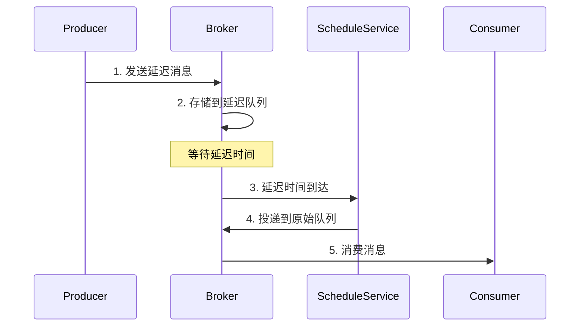

### 3. 顺序消息

RocketMQ 支持顺序消息，保证消息按照发送顺序被消费。

**顺序消息类型：**

| 类型 | 说明 | 适用场景 |
|------|------|----------|
| 全局顺序消息 | 所有消息按照先进先出顺序消费 | 需要全局有序的场景 |
| 分区顺序消息 | 同一分区内的消息按照先进先出顺序消费 | 需要分区有序的场景 |

**顺序消息配置：**

```java
public class OrderProducer {
    public static void main(String[] args) {
        DefaultMQProducer producer = new DefaultMQProducer("order_producer_group");
        producer.start();
        
        /**
         * 发送顺序消息
         * @param msg 消息
         * @param messageQueueSelector 队列选择器
         * @param arg 选择参数（如订单 ID）
         * @return 发送结果
         */
        for (int i = 0; i < 10; i++) {
            int orderId = i % 3;
            Message msg = new Message("OrderTopic", ("Order " + i).getBytes());
            
            SendResult result = producer.send(msg, new MessageQueueSelector() {
                /**
                 * 选择消息队列
                 * @param mqs 队列列表
                 * @param msg 消息
                 * @param arg 选择参数
                 * @return 选中的队列
                 */
                @Override
                public MessageQueue select(List<MessageQueue> mqs, Message msg, Object arg) {
                    Integer id = (Integer) arg;
                    int index = id % mqs.size();
                    return mqs.get(index);
                }
            }, orderId);
        }
    }
}
```

**顺序消息消费：**

```java
public class OrderConsumer {
    public static void main(String[] args) {
        DefaultMQPushConsumer consumer = new DefaultMQPushConsumer("order_consumer_group");
        
        /**
         * 订阅主题
         * @param topic 主题
         * @param subExpression 订阅表达式
         */
        consumer.subscribe("OrderTopic", "*");
        
        /**
         * 注册顺序消息监听器
         * @param messageListenerOrderly 顺序消息监听器
         */
        consumer.registerMessageListener(new MessageListenerOrderly() {
            /**
             * 消费消息
             * @param msgs 消息列表
             * @param context 消费上下文
             * @return 消费状态
             */
            @Override
            public ConsumeOrderlyStatus consumeMessage(List<MessageExt> msgs, ConsumeOrderlyContext context) {
                for (MessageExt msg : msgs) {
                    System.out.println("消费消息: " + new String(msg.getBody()));
                }
                return ConsumeOrderlyStatus.SUCCESS;
            }
        });
        
        consumer.start();
    }
}
```

**顺序消息流程：**

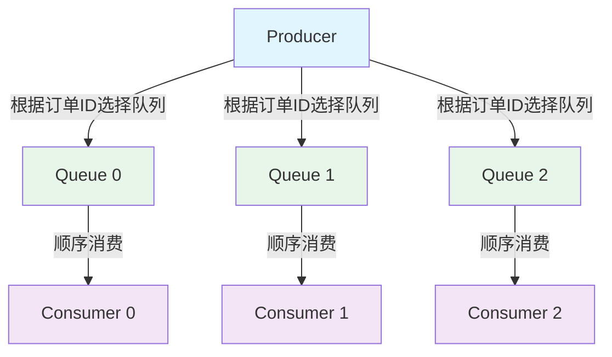

### 4. 消息过滤

RocketMQ 支持多种消息过滤方式，提高消息消费效率。

**过滤方式：**

| 过滤方式 | 说明 | 性能 |
|----------|------|------|
| Tag 过滤 | 根据消息标签过滤 | 高 |
| SQL92 过滤 | 根据 SQL 表达式过滤 | 中 |
| Filter 过滤 | 自定义过滤逻辑 | 低 |

**Tag 过滤配置：**

```java
public class TagConsumer {
    public static void main(String[] args) {
        DefaultMQPushConsumer consumer = new DefaultMQPushConsumer("tag_consumer_group");
        
        /**
         * 订阅主题，指定 Tag
         * @param topic 主题
         * @param subExpression 订阅表达式
         * 支持 || 或 && 运算
         * TagA || TagB 表示订阅 TagA 或 TagB 的消息
         * TagA && TagB 表示订阅同时包含 TagA 和 TagB 的消息
         * * 表示订阅所有消息
         */
        consumer.subscribe("TagTopic", "TagA || TagB");
        
        consumer.registerMessageListener(new MessageListenerConcurrently() {
            @Override
            public ConsumeConcurrentlyStatus consumeMessage(List<MessageExt> msgs, ConsumeConcurrentlyContext context) {
                for (MessageExt msg : msgs) {
                    System.out.println("消费消息: " + new String(msg.getBody()));
                }
                return ConsumeConcurrentlyStatus.CONSUME_SUCCESS;
            }
        });
        
        consumer.start();
    }
}
```

**SQL92 过滤配置：**

```java
public class SqlConsumer {
    public static void main(String[] args) {
        DefaultMQPushConsumer consumer = new DefaultMQPushConsumer("sql_consumer_group");
        
        /**
         * 订阅主题，指定 SQL 过滤表达式
         * @param topic 主题
         * @param subExpression SQL 过滤表达式
         * 支持的语法：
         * 数值比较：>、>=、<、<=、=
         * 字符串比较：=、<>、IN
         * 逻辑运算：AND、OR、NOT
         * 函数：IS NULL、IS NOT NULL、BETWEEN
         */
        consumer.subscribe("SqlTopic", MessageSelector.bySql("age > 18 AND region = 'CN'"));
        
        consumer.registerMessageListener(new MessageListenerConcurrently() {
            @Override
            public ConsumeConcurrentlyStatus consumeMessage(List<MessageExt> msgs, ConsumeConcurrentlyContext context) {
                for (MessageExt msg : msgs) {
                    System.out.println("消费消息: " + new String(msg.getBody()));
                }
                return ConsumeConcurrentlyStatus.CONSUME_SUCCESS;
            }
        });
        
        consumer.start();
    }
}
```

**发送带属性的消息：**

```java
public class SqlProducer {
    public static void main(String[] args) {
        DefaultMQProducer producer = new DefaultMQProducer("sql_producer_group");
        producer.start();
        
        Message msg = new Message("SqlTopic", "Hello SQL".getBytes());
        
        /**
         * 设置消息属性
         * @param key 属性名
         * @param value 属性值
         */
        msg.putUserProperty("age", "25");
        msg.putUserProperty("region", "CN");
        
        /**
         * 发送消息
         * @param msg 消息
         * @return 发送结果
         */
        SendResult result = producer.send(msg);
    }
}
```

### 5. 消息重试与死信队列

RocketMQ 提供了消息重试机制，消费失败的消息会被重新投递。

**消息重试机制：**

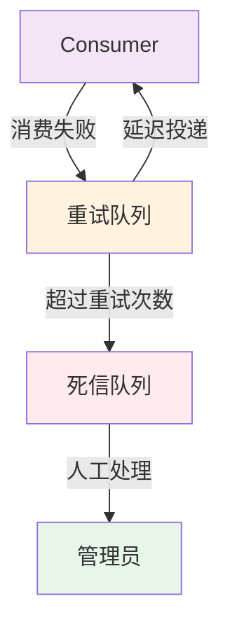

**重试配置：**

```java
public class RetryConsumer {
    public static void main(String[] args) {
        DefaultMQPushConsumer consumer = new DefaultMQPushConsumer("retry_consumer_group");
        
        /**
         * 设置最大重试次数
         * @param maxReconsumeTimes 最大重试次数
         * 默认 16 次
         */
        consumer.setMaxReconsumeTimes(5);
        
        consumer.subscribe("RetryTopic", "*");
        
        consumer.registerMessageListener(new MessageListenerConcurrently() {
            @Override
            public ConsumeConcurrentlyStatus consumeMessage(List<MessageExt> msgs, ConsumeConcurrentlyContext context) {
                for (MessageExt msg : msgs) {
                    try {
                        // 处理消息
                        System.out.println("消费消息: " + new String(msg.getBody()));
                    } catch (Exception e) {
                        /**
                         * 返回消费失败，消息会被重新投递
                         * @return 消费状态
                         */
                        return ConsumeConcurrentlyStatus.RECONSUME_LATER;
                    }
                }
                return ConsumeConcurrentlyStatus.CONSUME_SUCCESS;
            }
        });
        
        consumer.start();
    }
}
```

**死信队列处理：**

```java
public class DlqConsumer {
    public static void main(String[] args) {
        DefaultMQPushConsumer consumer = new DefaultMQPushConsumer("dlq_consumer_group");
        
        /**
         * 订阅死信队列
         * 死信队列主题格式：%DLQ% + ConsumerGroup
         */
        consumer.subscribe("%DLQ%retry_consumer_group", "*");
        
        consumer.registerMessageListener(new MessageListenerConcurrently() {
            @Override
            public ConsumeConcurrentlyStatus consumeMessage(List<MessageExt> msgs, ConsumeConcurrentlyContext context) {
                for (MessageExt msg : msgs) {
                    System.out.println("处理死信消息: " + new String(msg.getBody()));
                    // 人工处理或告警
                }
                return ConsumeConcurrentlyStatus.CONSUME_SUCCESS;
            }
        });
        
        consumer.start();
    }
}
```

### 6. 消息回溯

RocketMQ 支持消息回溯，可以重新消费历史消息。

**消息回溯配置：**

```java
public class ResetConsumer {
    public static void main(String[] args) {
        DefaultMQPushConsumer consumer = new DefaultMQPushConsumer("reset_consumer_group");
        
        /**
         * 设置消费起点
         * @param consumeFromWhere 消费起点
         * CONSUME_FROM_LAST_OFFSET: 从最后的偏移量开始消费
         * CONSUME_FROM_FIRST_OFFSET: 从最早的偏移量开始消费
         * CONSUME_FROM_TIMESTAMP: 从指定时间戳开始消费
         */
        consumer.setConsumeFromWhere(ConsumeFromWhere.CONSUME_FROM_TIMESTAMP);
        
        /**
         * 设置消费时间戳
         * @param timestamp 时间戳
         */
        consumer.setConsumeTimestamp("20230101000000");
        
        consumer.subscribe("ResetTopic", "*");
        
        consumer.registerMessageListener(new MessageListenerConcurrently() {
            @Override
            public ConsumeConcurrentlyStatus consumeMessage(List<MessageExt> msgs, ConsumeConcurrentlyContext context) {
                for (MessageExt msg : msgs) {
                    System.out.println("消费消息: " + new String(msg.getBody()));
                }
                return ConsumeConcurrentlyStatus.CONSUME_SUCCESS;
            }
        });
        
        consumer.start();
    }
}
```

## 集群部署

### 1. 集群架构模式

RocketMQ 支持多种集群部署模式：

| 模式 | 说明 | 优点 | 缺点 |
|------|------|------|------|
| 单 Master | 单个 Broker | 部署简单 | 无容错能力 |
| 多 Master | 多个 Master Broker | 性能高 | 无主从同步 |
| 多 Master 多 Slave（异步） | Master 异步复制到 Slave | 性能高 | 可能丢失数据 |
| 多 Master 多 Slave（同步） | Master 同步复制到 Slave | 数据不丢失 | 性能较低 |

### 2. 多 Master 多 Slave 架构

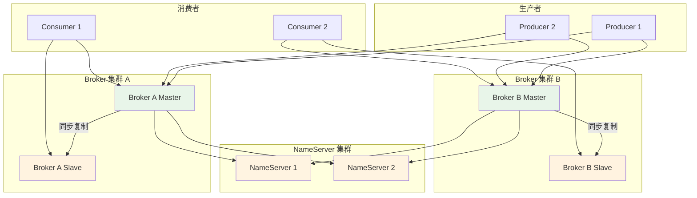

### 3. Broker 配置

**Master Broker 配置：**

```properties
# Broker 基本配置
brokerClusterName = DefaultCluster
brokerName = broker-a
brokerId = 0
brokerRole = SYNC_MASTER

# 网络配置
namesrvAddr = 192.168.1.1:9876;192.168.1.2:9876
brokerIP1 = 192.168.1.1
listenPort = 10911

# 存储配置
storePathRootDir = /data/rocketmq/store
storePathCommitLog = /data/rocketmq/store/commitlog

# 主从同步配置
haListenPort = 10912
haSendHeartbeatTimeout = 10000
haTransferBatchSize = 32768
```

**Slave Broker 配置：**

```properties
# Broker 基本配置
brokerClusterName = DefaultCluster
brokerName = broker-a
brokerId = 1
brokerRole = SLAVE

# 网络配置
namesrvAddr = 192.168.1.1:9876;192.168.1.2:9876
brokerIP1 = 192.168.1.2
listenPort = 10911

# 存储配置
storePathRootDir = /data/rocketmq/store
storePathCommitLog = /data/rocketmq/store/commitlog

# 主从同步配置
haMasterAddress = 192.168.1.1:10912
```

## 性能优化

### 1. Producer 优化

**批量发送：**

```java
public class BatchProducer {
    public static void main(String[] args) {
        DefaultMQProducer producer = new DefaultMQProducer("batch_producer_group");
        producer.start();
        
        List<Message> messages = new ArrayList<>();
        for (int i = 0; i < 100; i++) {
            messages.add(new Message("BatchTopic", ("Message " + i).getBytes()));
        }
        
        /**
         * 批量发送消息
         * @param msgs 消息列表
         * @return 发送结果
         * 注意：批量消息的 Topic 必须相同
         */
        SendResult result = producer.send(messages);
    }
}
```

**发送超时配置：**

```java
/**
 * 设置发送超时时间
 * @param sendMsgTimeout 超时时间（毫秒）
 */
producer.setSendMsgTimeout(5000);

/**
 * 设置消息最大大小
 * @param maxMessageSize 最大大小（字节）
 */
producer.setMaxMessageSize(4 * 1024 * 1024);

/**
 * 设置重试次数
 * @param retryTimesWhenSendFailed 重试次数
 */
producer.setRetryTimesWhenSendFailed(3);
```

### 2. Consumer 优化

**并发消费配置：**

```java
/**
 * 设置最小消费线程数
 * @param consumeThreadMin 最小线程数
 */
consumer.setConsumeThreadMin(20);

/**
 * 设置最大消费线程数
 * @param consumeThreadMax 最大线程数
 */
consumer.setConsumeThreadMax(50);

/**
 * 设置批量消费大小
 * @param consumeMessageBatchMaxSize 批量大小
 */
consumer.setConsumeMessageBatchMaxSize(10);

/**
 * 设置拉取批量大小
 * @param pullBatchSize 拉取批量大小
 */
consumer.setPullBatchSize(32);
```

### 3. Broker 优化

**内存配置：**

```properties
# JVM 配置
JAVA_OPT="${JAVA_OPT} -server -Xms8g -Xmx8g -Xmn4g"
JAVA_OPT="${JAVA_OPT} -XX:+UseG1GC -XX:G1HeapRegionSize=16m"
JAVA_OPT="${JAVA_OPT} -XX:InitiatingHeapOccupancyPercent=45"
JAVA_OPT="${JAVA_OPT} -XX:+UseFastAccessorMethods"

# 页缓存配置
pageCacheLockTimeMills = 1000
```

**刷盘配置：**

```properties
# 异步刷盘（性能高，可能丢失数据）
flushDiskType = ASYNC_FLUSH

# 同步刷盘（数据安全，性能低）
flushDiskType = SYNC_FLUSH

# 刷盘间隔
flushCommitLogTimed = true
flushCommitLogInterval = 500
```

## 常见问题与解决方案

### 1. 消息丢失

**原因：**
- 异步刷盘
- 异步复制
- 生产者未确认

**解决方案：**
- 使用同步刷盘
- 使用同步复制
- 开启生产者确认机制

### 2. 消息重复

**原因：**
- 网络波动
- 消费者重启
- 生产者重试

**解决方案：**
- 实现幂等性处理
- 使用唯一消息 Key
- 业务层去重

### 3. 消息堆积

**原因：**
- 消费者处理慢
- 消费者数量不足
- 消费者异常

**解决方案：**
- 增加消费者数量
- 优化消费逻辑
- 扩容 Topic 队列数

### 4. NameServer 故障

**原因：**
- NameServer 宕机
- 网络分区

**解决方案：**
- 部署多个 NameServer
- 配置多个 NameServer 地址
- 监控 NameServer 状态

## 总结

本文详细介绍了 RocketMQ 的核心原理和架构设计，包括：

1. **核心概念**：Producer、Consumer、Broker、NameServer、Topic、Queue
2. **架构设计**：NameServer、Broker、Producer、Consumer 架构
3. **消息存储**：CommitLog、ConsumeQueue、IndexFile 存储机制
4. **高级特性**：事务消息、延迟消息、顺序消息、消息过滤、消息重试、消息回溯
5. **集群部署**：多 Master 多 Slave 架构、主从同步
6. **性能优化**：Producer、Consumer、Broker 优化
7. **常见问题**：消息丢失、消息重复、消息堆积、NameServer 故障

通过本文的学习，你应该能够深入理解 RocketMQ 的工作原理，并在实际项目中正确使用 RocketMQ 构建高可靠、高性能的消息传递系统。

## 参考资料

- [RocketMQ 官方文档](https://rocketmq.apache.org/docs/quick-start/)
- [RocketMQ 源码](https://github.com/apache/rocketmq)
- [RocketMQ 设计文档](https://rocketmq.apache.org/docs/rmq-architecture/)
