> 深入解析 Kafka 的核心原理、架构设计、消息存储机制以及高级特性

## 简介

Kafka 是 Apache 基金会开源的分布式流处理平台，由 LinkedIn 开发，采用 Scala 和 Java 语言编写。Kafka 具有高吞吐量、低延迟、高可用性等特点，广泛应用于大数据实时处理、日志收集、流处理等场景。

### Kafka 与其他消息中间件对比

| 特性 | Kafka | RocketMQ | RabbitMQ |
|------|-------|----------|----------|
| 开发语言 | Scala/Java | Java | Erlang |
| 协议支持 | 自定义协议 | 自定义协议 | AMQP |
| 消息存储 | 顺序写磁盘 | 文件存储 | 内存/磁盘 |
| 吞吐量 | 极高 | 高 | 中 |
| 延迟 | 低 | 低 | 中 |
| 事务消息 | 支持 | 支持 | 不支持 |
| 延迟消息 | 不支持 | 支持 | 需要插件 |
| 消息回溯 | 支持 | 支持 | 不支持 |
| 流处理 | 支持 | 不支持 | 不支持 |

## 核心概念

### 1. 架构组件

Kafka 的架构由以下核心组件构成：

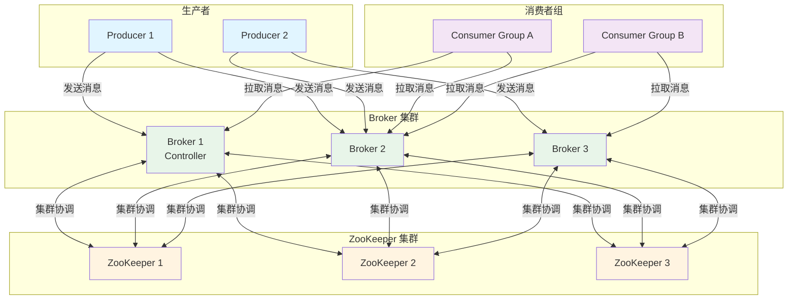

### 2. 核心概念详解

| 概念 | 说明 |
|------|------|
| Producer（生产者） | 消息的发送方，负责创建和发送消息 |
| Consumer（消费者） | 消息的接收方，负责处理消息 |
| Broker | Kafka 节点，负责存储和转发消息 |
| Topic | 消息主题，消息的逻辑分类 |
| Partition | 分区，Topic 的物理分片，消息真正存储的地方 |
| Segment | 段，Partition 的物理划分，包含日志文件和索引文件 |
| Offset | 消息偏移量，表示消息在分区中的位置 |
| Consumer Group | 消费者组，实现消息的广播和单播 |
| ZooKeeper | 集群协调服务，管理 Broker 元数据和选举 |
| Controller | 控制器，负责分区 Leader 选举和副本管理 |
| Replica | 副本，分区的备份，分为 Leader 和 Follower |
| ISR | In-Sync Replicas，同步副本集合 |

## 架构设计

### 1. Topic 与 Partition

Topic 是消息的逻辑分类，Partition 是 Topic 的物理分片。

**Topic 与 Partition 关系：**

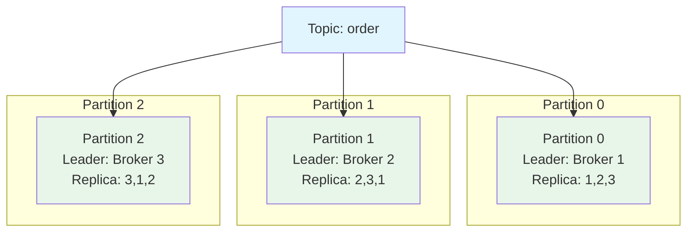

**Partition 的作用：**

1. **提高并发性**：多个分区可以并行处理消息
2. **提高吞吐量**：分区分布在多个 Broker 上，实现负载均衡
3. **提高可用性**：每个分区有多个副本，实现容错

**分区策略：**

```java
public class PartitionerDemo implements Partitioner {
    /**
     * 计算分区号
     * @param topic 主题
     * @param key 消息 Key
     * @param keyBytes 消息 Key 字节数组
     * @param value 消息 Value
     * @param valueBytes 消息 Value 字节数组
     * @param cluster 集群信息
     * @return 分区号
     */
    @Override
    public int partition(String topic, Object key, byte[] keyBytes, Object value, byte[] valueBytes, Cluster cluster) {
        // 获取分区数量
        int partitionCount = cluster.partitionCountForTopic(topic);
        
        if (key == null) {
            // 随机选择分区
            return ThreadLocalRandom.current().nextInt(partitionCount);
        }
        
        // 根据 Key 的 Hash 值选择分区
        return Math.abs(key.hashCode()) % partitionCount;
    }
    
    @Override
    public void close() {
    }
    
    @Override
    public void configure(Map<String, ?> configs) {
    }
}
```

### 2. 副本机制

Kafka 通过副本机制实现数据冗余和高可用。

**副本类型：**

| 类型 | 说明 | 职责 |
|------|------|------|
| Leader | 主副本 | 处理读写请求 |
| Follower | 从副本 | 同步 Leader 数据，不处理读写请求 |
| ISR | 同步副本集合 | 与 Leader 保持同步的副本集合 |

**副本分布架构：**

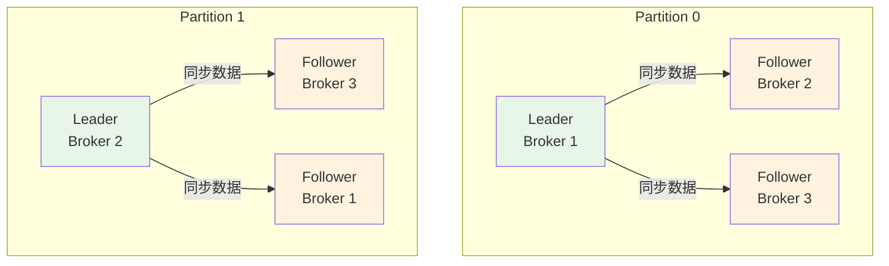

**副本同步流程：**

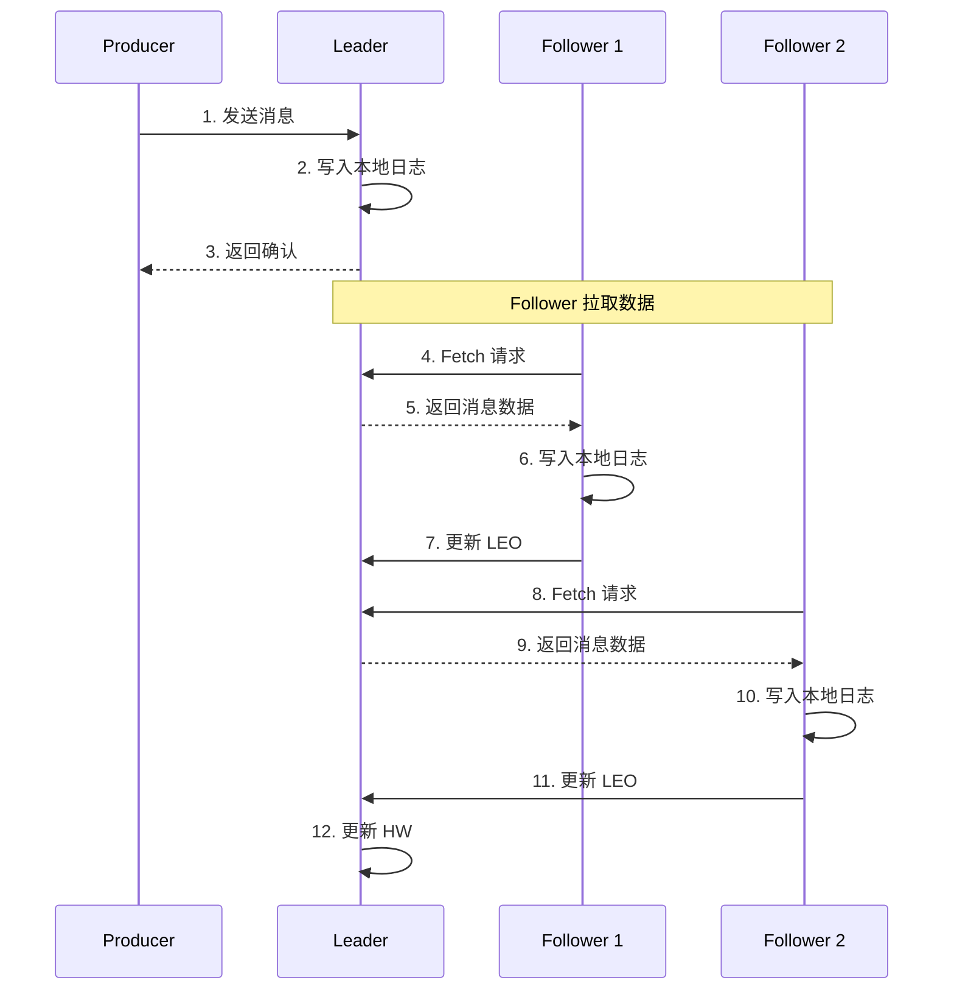

**ISR 机制：**

```java
public class ISRManager {
    /**
     * ISR 相关概念
     * LEO (Log End Offset): 日志末端偏移量，表示下一条待写入消息的偏移量
     * HW (High Watermark): 高水位，表示 ISR 中所有副本都同步的消息偏移量
     * 只有 HW 之前的消息才对消费者可见
     */
    
    /**
     * ISR 收缩条件
     * 1. Follower 长时间未发送 Fetch 请求
     * 2. Follower 的 LEO 远落后于 Leader 的 LEO
     */
    
    /**
     * ISR 扩张条件
     * 1. Follower 的 LEO 追上 Leader 的 HW
     * 2. Follower 被加入 ISR 集合
     */
}
```

### 3. Controller 机制

Controller 是 Kafka 集群的核心组件，负责分区 Leader 选举和副本管理。

**Controller 职责：**

1. **分区 Leader 选举**：当 Leader 故障时，从 ISR 中选举新 Leader
2. **副本重分配**：管理副本的分布和迁移
3. **Preferred Leader 选举**：优先选举 Preferred Leader
4. **集群元数据管理**：管理 Topic、Partition、Replica 等元数据

**Controller 选举流程：**

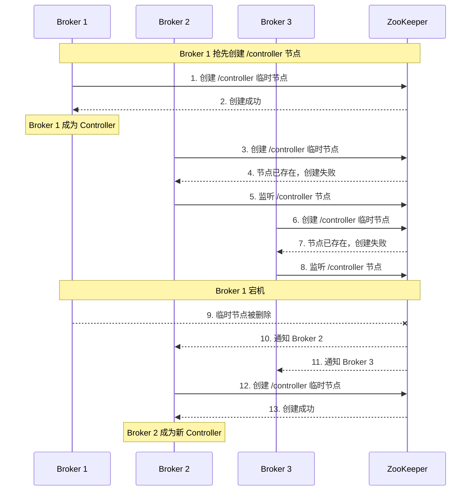

### 4. ZooKeeper 的作用

ZooKeeper 在 Kafka 中扮演重要角色（注：Kafka 2.8+ 支持去 ZooKeeper 模式）。

**ZooKeeper 存储的信息：**

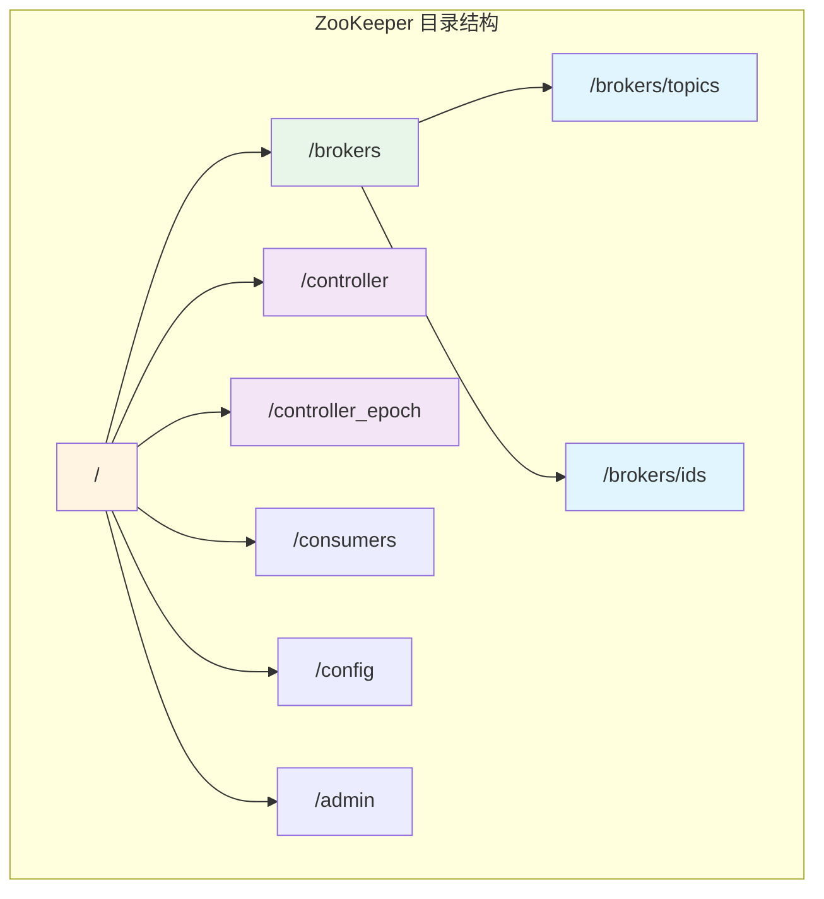

**ZooKeeper 的职责：**

| 职责 | 说明 |
|------|------|
| Broker 注册 | 管理 Broker 的上线和下线 |
| Topic 注册 | 管理 Topic 的分区和副本信息 |
| Controller 选举 | 通过临时节点选举 Controller |
| 消费者组管理 | 管理消费者组的偏移量（旧版本） |
| 配置管理 | 管理 Topic 和 Broker 的动态配置 |

### 5. Producer 架构

Producer 负责消息的发送，支持多种发送方式。

**Producer 发送流程：**

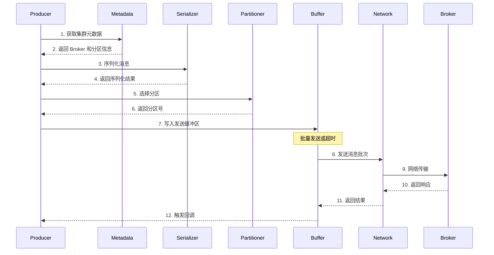

**Producer 核心配置：**

```java
public class ProducerConfig {
    /**
     * Producer 核心配置
     */
    
    /**
     * Broker 地址列表
     * @param bootstrap.servers Broker 地址
     */
    public static final String BOOTSTRAP_SERVERS = "bootstrap.servers";
    
    /**
     * Key 序列化器
     * @param key.serializer Key 序列化器类
     */
    public static final String KEY_SERIALIZER = "key.serializer";
    
    /**
     * Value 序列化器
     * @param value.serializer Value 序列化器类
     */
    public static final String VALUE_SERIALIZER = "value.serializer";
    
    /**
     * 确认机制
     * @param acks 确认级别
     * 0: 不等待确认
     * 1: 等待 Leader 确认
     * -1 或 all: 等待 ISR 所有副本确认
     */
    public static final String ACKS = "acks";
    
    /**
     * 重试次数
     * @param retries 重试次数
     */
    public static final String RETRIES = "retries";
    
    /**
     * 批量大小
     * @param batch.size 批量大小（字节）
     */
    public static final String BATCH_SIZE = "batch.size";
    
    /**
     * 批量等待时间
     * @param linger.ms 等待时间（毫秒）
     */
    public static final String LINGER_MS = "linger.ms";
    
    /**
     * 缓冲区大小
     * @param buffer.memory 缓冲区大小（字节）
     */
    public static final String BUFFER_MEMORY = "buffer.memory";
}
```

**Producer 发送示例：**

```java
public class KafkaProducerDemo {
    public static void main(String[] args) {
        Properties props = new Properties();
        /**
         * 配置 Broker 地址
         * @param key 配置项名称
         * @param value 配置值
         */
        props.put("bootstrap.servers", "localhost:9092");
        props.put("key.serializer", "org.apache.kafka.common.serialization.StringSerializer");
        props.put("value.serializer", "org.apache.kafka.common.serialization.StringSerializer");
        props.put("acks", "all");
        props.put("retries", 3);
        props.put("batch.size", 16384);
        props.put("linger.ms", 1);
        props.put("buffer.memory", 33554432);
        
        /**
         * 创建 Producer
         * @param props 配置属性
         */
        KafkaProducer<String, String> producer = new KafkaProducer<>(props);
        
        /**
         * 发送消息（异步）
         * @param record 消息记录
         * @param callback 回调函数
         */
        producer.send(new ProducerRecord<>("test-topic", "key", "value"), new Callback() {
            /**
             * 发送完成回调
             * @param metadata 消息元数据
             * @param exception 异常信息
             */
            @Override
            public void onCompletion(RecordMetadata metadata, Exception exception) {
                if (exception != null) {
                    System.err.println("发送失败: " + exception.getMessage());
                } else {
                    System.out.println("发送成功: partition=" + metadata.partition() + 
                                     ", offset=" + metadata.offset());
                }
            }
        });
        
        /**
         * 发送消息（同步）
         * @param record 消息记录
         * @return 消息元数据
         */
        try {
            RecordMetadata metadata = producer.send(new ProducerRecord<>("test-topic", "key", "value")).get();
            System.out.println("发送成功: partition=" + metadata.partition() + 
                             ", offset=" + metadata.offset());
        } catch (Exception e) {
            System.err.println("发送失败: " + e.getMessage());
        }
        
        producer.close();
    }
}
```

### 6. Consumer 架构

Consumer 负责消息的消费，支持消费者组机制。

**Consumer Group 机制：**

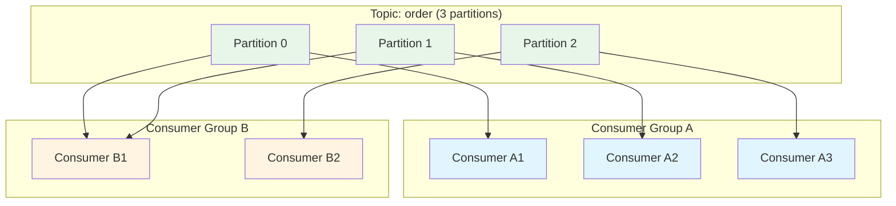

**Rebalance 机制：**

当消费者组内消费者数量变化或分区数量变化时，会触发 Rebalance。

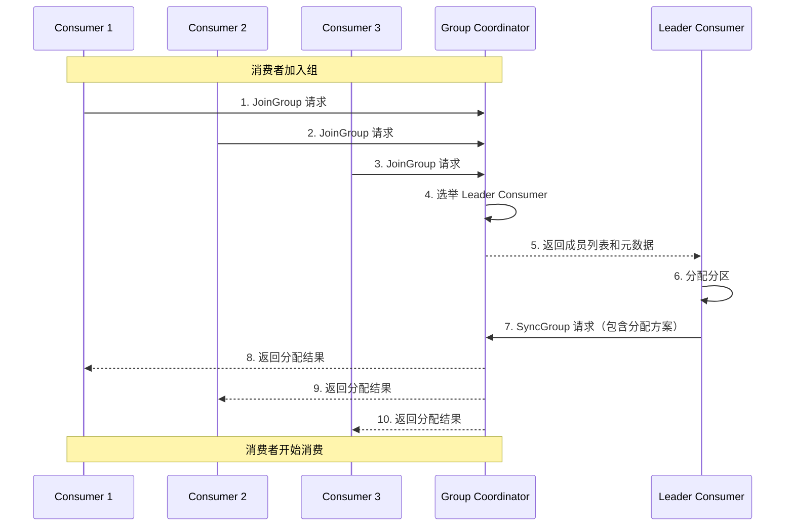

**Consumer 核心配置：**

```java
public class ConsumerConfig {
    /**
     * Consumer 核心配置
     */
    
    /**
     * Broker 地址列表
     * @param bootstrap.servers Broker 地址
     */
    public static final String BOOTSTRAP_SERVERS = "bootstrap.servers";
    
    /**
     * 消费者组 ID
     * @param group.id 消费者组 ID
     */
    public static final String GROUP_ID = "group.id";
    
    /**
     * Key 反序列化器
     * @param key.deserializer Key 反序列化器类
     */
    public static final String KEY_DESERIALIZER = "key.deserializer";
    
    /**
     * Value 反序列化器
     * @param value.deserializer Value 反序列化器类
     */
    public static final String VALUE_DESERIALIZER = "value.deserializer";
    
    /**
     * 消费起点
     * @param auto.offset.reset 消费起点
     * earliest: 从最早的偏移量开始
     * latest: 从最新的偏移量开始
     * none: 抛出异常
     */
    public static final String AUTO_OFFSET_RESET = "auto.offset.reset";
    
    /**
     * 自动提交偏移量
     * @param enable.auto.commit 是否自动提交
     */
    public static final String ENABLE_AUTO_COMMIT = "enable.auto.commit";
    
    /**
     * 自动提交间隔
     * @param auto.commit.interval.ms 自动提交间隔（毫秒）
     */
    public static final String AUTO_COMMIT_INTERVAL_MS = "auto.commit.interval.ms";
    
    /**
     * 单次拉取最大记录数
     * @param max.poll.records 最大记录数
     */
    public static final String MAX_POLL_RECORDS = "max.poll.records";
}
```

**Consumer 消费示例：**

```java
public class KafkaConsumerDemo {
    public static void main(String[] args) {
        Properties props = new Properties();
        /**
         * 配置 Broker 地址
         * @param key 配置项名称
         * @param value 配置值
         */
        props.put("bootstrap.servers", "localhost:9092");
        props.put("group.id", "test-group");
        props.put("key.deserializer", "org.apache.kafka.common.serialization.StringDeserializer");
        props.put("value.deserializer", "org.apache.kafka.common.serialization.StringDeserializer");
        props.put("auto.offset.reset", "earliest");
        props.put("enable.auto.commit", "false");
        props.put("max.poll.records", "100");
        
        /**
         * 创建 Consumer
         * @param props 配置属性
         */
        KafkaConsumer<String, String> consumer = new KafkaConsumer<>(props);
        
        /**
         * 订阅主题
         * @param topics 主题列表
         */
        consumer.subscribe(Arrays.asList("test-topic"));
        
        while (true) {
            /**
             * 拉取消息
             * @param timeout 超时时间（毫秒）
             * @return 消息记录
             */
            ConsumerRecords<String, String> records = consumer.poll(Duration.ofMillis(100));
            
            for (ConsumerRecord<String, String> record : records) {
                System.out.printf("partition = %d, offset = %d, key = %s, value = %s%n",
                    record.partition(), record.offset(), record.key(), record.value());
            }
            
            /**
             * 手动提交偏移量
             * 同步提交
             */
            consumer.commitSync();
            
            /**
             * 手动提交偏移量
             * 异步提交
             * @param callback 回调函数
             */
            consumer.commitAsync(new OffsetCommitCallback() {
                /**
                 * 提交完成回调
                 * @param offsets 偏移量映射
                 * @param exception 异常信息
                 */
                @Override
                public void onComplete(Map<TopicPartition, OffsetAndMetadata> offsets, Exception exception) {
                    if (exception != null) {
                        System.err.println("提交失败: " + exception.getMessage());
                    } else {
                        System.out.println("提交成功: " + offsets);
                    }
                }
            });
        }
    }
}
```

## 消息存储机制

### 1. 存储架构

Kafka 的消息存储采用分区 + 段的架构。

**存储架构图：**

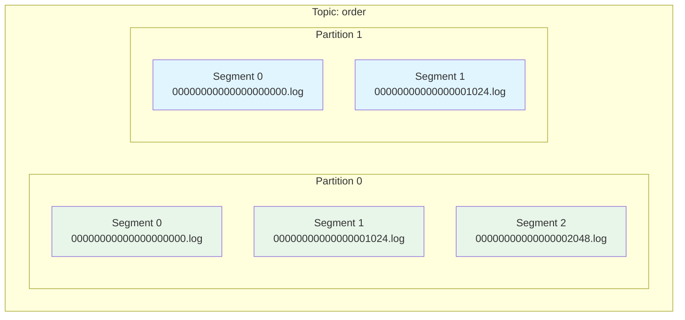

### 2. 日志文件结构

每个 Segment 包含三个文件：日志文件、索引文件和时间索引文件。

**文件结构：**

```
Segment 文件目录结构：
/data/kafka-logs/order-0/
├── 00000000000000000000.log      # 日志文件
├── 00000000000000000000.index    # 偏移量索引文件
├── 00000000000000000000.timeindex # 时间索引文件
├── 00000000000000001024.log
├── 00000000000000001024.index
├── 00000000000000001024.timeindex
└── ...
```

**日志文件格式：**

```java
public class LogEntry {
    /**
     * 日志条目格式
     */
    
    // 消息总长度 (4 bytes)
    private int length;
    
    // CRC32 校验码 (4 bytes)
    private int crc;
    
    // 魔数 (1 byte)
    private byte magic;
    
    // 属性 (1 byte)
    private byte attributes;
    
    // 时间戳 (8 bytes)
    private long timestamp;
    
    // Key 长度 (4 bytes)
    private int keyLength;
    
    // Key
    private byte[] key;
    
    // Value 长度 (4 bytes)
    private int valueLength;
    
    // Value
    private byte[] value;
}
```

### 3. 索引文件

Kafka 提供两种索引文件：偏移量索引和时间索引。

**偏移量索引文件：**

```java
public class OffsetIndex {
    /**
     * 偏移量索引条目格式
     * 每个条目固定 8 字节
     */
    
    // 相对偏移量 (4 bytes)
    private int relativeOffset;
    
    // 物理位置 (4 bytes)
    private int position;
    
    /**
     * 查找流程：
     * 1. 根据目标偏移量，二分查找索引文件
     * 2. 找到小于等于目标偏移量的最大索引条目
     * 3. 根据物理位置，从日志文件中查找消息
     */
}
```

**时间索引文件：**

```java
public class TimeIndex {
    /**
     * 时间索引条目格式
     * 每个条目固定 12 字节
     */
    
    // 时间戳 (8 bytes)
    private long timestamp;
    
    // 相对偏移量 (4 bytes)
    private int relativeOffset;
    
    /**
     * 查找流程：
     * 1. 根据目标时间戳，二分查找索引文件
     * 2. 找到小于等于目标时间戳的最大索引条目
     * 3. 根据相对偏移量，从偏移量索引中查找物理位置
     * 4. 根据物理位置，从日志文件中查找消息
     */
}
```

**索引查找流程：**

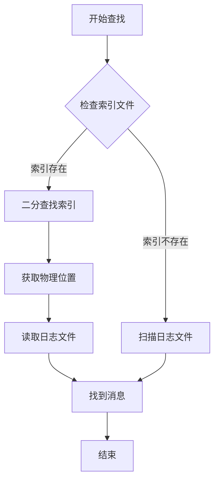

### 4. 日志清理策略

Kafka 提供两种日志清理策略：删除和压缩。

**删除策略：**

```properties
# 日志保留时间（小时）
log.retention.hours=168

# 日志保留大小（字节）
log.retention.bytes=1073741824

# 日志段大小（字节）
log.segment.bytes=1073741824

# 日志清理间隔（毫秒）
log.retention.check.interval.ms=300000
```

**压缩策略：**

```properties
# 启用日志压缩
log.cleanup.policy=compact

# 压缩线程数
log.cleaner.threads=1

# 压缩比率
log.cleaner.min.cleanable.ratio=0.5
```

**日志压缩原理：**

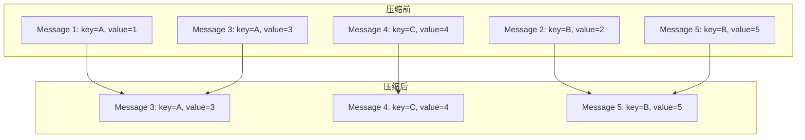

### 5. 零拷贝技术

Kafka 使用零拷贝技术提高消息传输效率。

**传统数据拷贝：**

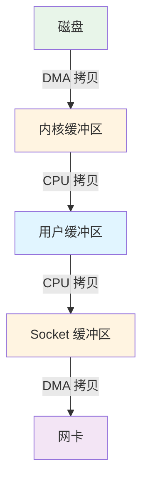

**零拷贝（sendfile）：**

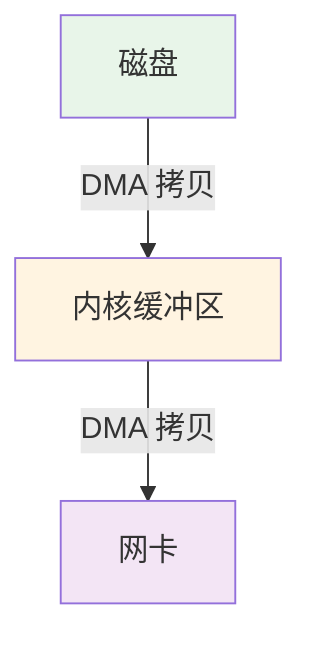

**零拷贝配置：**

```java
public class ZeroCopyConfig {
    /**
     * 零拷贝相关配置
     */
    
    /**
     * 启用零拷贝
     * @param value 是否启用
     */
    public static final String TRANSFER_TO = "transfer.to";
    
    /**
     * 发送缓冲区大小
     * @param value 缓冲区大小（字节）
     */
    public static final String SOCKET_SEND_BUFFER = "socket.send.buffer.bytes";
    
    /**
     * 接收缓冲区大小
     * @param value 缓冲区大小（字节）
     */
    public static final String SOCKET_RECEIVE_BUFFER = "socket.receive.buffer.bytes";
}
```

## 高级特性

### 1. 事务消息

Kafka 提供事务消息机制，保证跨分区消息的原子性。

**事务消息流程：**

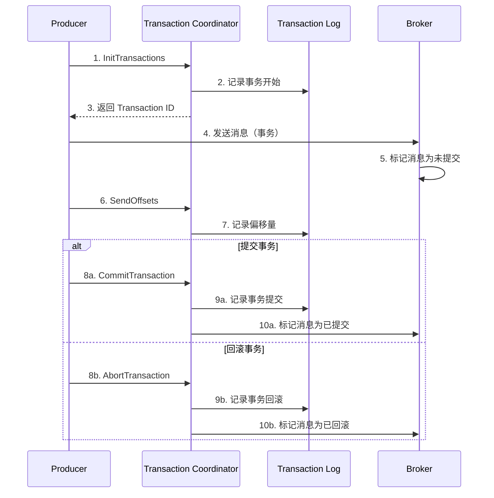

**事务消息配置：**

```java
public class TransactionProducer {
    public static void main(String[] args) {
        Properties props = new Properties();
        props.put("bootstrap.servers", "localhost:9092");
        props.put("key.serializer", "org.apache.kafka.common.serialization.StringSerializer");
        props.put("value.serializer", "org.apache.kafka.common.serialization.StringSerializer");
        
        /**
         * 配置事务
         * @param transactional.id 事务 ID，必须唯一
         */
        props.put("transactional.id", "my-transactional-id");
        
        /**
         * 配置确认机制
         * @param acks 确认级别
         * 事务消息必须设置为 all
         */
        props.put("acks", "all");
        
        /**
         * 配置幂等性
         * @param enable.idempotence 是否启用幂等性
         * 事务消息必须启用幂等性
         */
        props.put("enable.idempotence", "true");
        
        KafkaProducer<String, String> producer = new KafkaProducer<>(props);
        
        /**
         * 初始化事务
         */
        producer.initTransactions();
        
        try {
            /**
             * 开始事务
             */
            producer.beginTransaction();
            
            /**
             * 发送消息
             * @param record 消息记录
             */
            producer.send(new ProducerRecord<>("topic1", "key1", "value1"));
            producer.send(new ProducerRecord<>("topic2", "key2", "value2"));
            
            /**
             * 提交事务
             */
            producer.commitTransaction();
        } catch (Exception e) {
            /**
             * 回滚事务
             */
            producer.abortTransaction();
        }
        
        producer.close();
    }
}
```

### 2. 幂等性生产者

Kafka 提供幂等性生产者机制，防止消息重复。

**幂等性原理：**

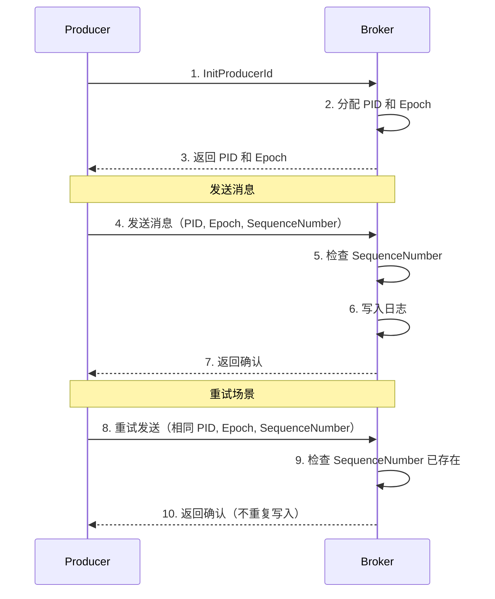

**幂等性配置：**

```java
public class IdempotentProducer {
    public static void main(String[] args) {
        Properties props = new Properties();
        props.put("bootstrap.servers", "localhost:9092");
        props.put("key.serializer", "org.apache.kafka.common.serialization.StringSerializer");
        props.put("value.serializer", "org.apache.kafka.common.serialization.StringSerializer");
        
        /**
         * 启用幂等性
         * @param enable.idempotence 是否启用
         * 启用后，Producer 会自动分配 PID 和维护 SequenceNumber
         */
        props.put("enable.idempotence", "true");
        
        /**
         * 配置确认机制
         * @param acks 确认级别
         * 幂等性必须设置为 all
         */
        props.put("acks", "all");
        
        /**
         * 配置重试次数
         * @param retries 重试次数
         */
        props.put("retries", "3");
        
        KafkaProducer<String, String> producer = new KafkaProducer<>(props);
        
        /**
         * 发送消息
         * @param record 消息记录
         * 幂等性保证：即使重试，消息也不会重复
         */
        producer.send(new ProducerRecord<>("test-topic", "key", "value"));
        
        producer.close();
    }
}
```

### 3. 消息压缩

Kafka 支持多种消息压缩算法，减少网络传输和存储开销。

**压缩类型：**

| 压缩类型 | 说明 | 压缩比 | CPU 消耗 |
|----------|------|--------|----------|
| none | 不压缩 | 1:1 | 低 |
| gzip | GZIP 压缩 | 高 | 高 |
| snappy | Snappy 压缩 | 中 | 低 |
| lz4 | LZ4 压缩 | 中 | 低 |
| zstd | ZSTD 压缩 | 高 | 中 |

**压缩配置：**

```java
public class CompressionProducer {
    public static void main(String[] args) {
        Properties props = new Properties();
        props.put("bootstrap.servers", "localhost:9092");
        props.put("key.serializer", "org.apache.kafka.common.serialization.StringSerializer");
        props.put("value.serializer", "org.apache.kafka.common.serialization.StringSerializer");
        
        /**
         * 配置压缩类型
         * @param compression.type 压缩类型
         * none: 不压缩
         * gzip: GZIP 压缩
         * snappy: Snappy 压缩
         * lz4: LZ4 压缩
         * zstd: ZSTD 压缩
         */
        props.put("compression.type", "snappy");
        
        /**
         * 配置批量大小
         * @param batch.size 批量大小（字节）
         * 压缩对大批量效果更好
         */
        props.put("batch.size", "32768");
        
        /**
         * 配置批量等待时间
         * @param linger.ms 等待时间（毫秒）
         */
        props.put("linger.ms", "10");
        
        KafkaProducer<String, String> producer = new KafkaProducer<>(props);
        
        /**
         * 发送消息
         * @param record 消息记录
         * 消息会被批量压缩后发送
         */
        for (int i = 0; i < 1000; i++) {
            producer.send(new ProducerRecord<>("test-topic", "key" + i, "value" + i));
        }
        
        producer.close();
    }
}
```

### 4. 消息时间戳

Kafka 支持两种消息时间戳：创建时间和日志追加时间。

**时间戳类型：**

| 类型 | 说明 | 配置值 |
|------|------|--------|
| CreateTime | 消息创建时间 | 0 |
| LogAppendTime | 日志追加时间 | 1 |

**时间戳配置：**

```java
public class TimestampProducer {
    public static void main(String[] args) {
        Properties props = new Properties();
        props.put("bootstrap.servers", "localhost:9092");
        props.put("key.serializer", "org.apache.kafka.common.serialization.StringSerializer");
        props.put("value.serializer", "org.apache.kafka.common.serialization.StringSerializer");
        
        KafkaProducer<String, String> producer = new KafkaProducer<>(props);
        
        /**
         * 创建消息并设置时间戳
         * @param topic 主题
         * @param partition 分区（可选）
         * @param timestamp 时间戳（毫秒）
         * @param key Key
         * @param value Value
         */
        ProducerRecord<String, String> record = new ProducerRecord<>(
            "test-topic",
            null,
            System.currentTimeMillis(),
            "key",
            "value"
        );
        
        /**
         * 发送消息
         * @param record 消息记录
         */
        producer.send(record);
        
        producer.close();
    }
}
```

**Broker 端时间戳配置：**

```properties
# 消息时间戳类型
# CreateTime: 使用 Producer 指定的时间戳
# LogAppendTime: 使用 Broker 追加日志的时间
log.message.timestamp.type=CreateTime

# 消息时间戳差异阈值（毫秒）
# 当时间戳差异超过此值时，拒绝消息
log.message.timestamp.difference.max.ms=9223372036854775807
```

### 5. 消息拦截器

Kafka 提供消息拦截器机制，允许在消息发送和接收前后进行自定义处理。

**Producer 拦截器：**

```java
public class ProducerInterceptorDemo implements ProducerInterceptor<String, String> {
    /**
     * 发送消息前拦截
     * @param record 消息记录
     * @return 修改后的消息记录
     */
    @Override
    public ProducerRecord<String, String> onSend(ProducerRecord<String, String> record) {
        // 添加自定义 Header
        Headers headers = record.headers();
        headers.add("timestamp", String.valueOf(System.currentTimeMillis()).getBytes());
        
        return new ProducerRecord<>(
            record.topic(),
            record.partition(),
            record.timestamp(),
            record.key(),
            record.value(),
            headers
        );
    }
    
    /**
     * 发送消息后拦截（确认）
     * @param metadata 消息元数据
     * @param exception 异常信息
     */
    @Override
    public void onAcknowledgement(RecordMetadata metadata, Exception exception) {
        if (exception != null) {
            System.err.println("发送失败: " + exception.getMessage());
        } else {
            System.out.println("发送成功: partition=" + metadata.partition() + 
                             ", offset=" + metadata.offset());
        }
    }
    
    @Override
    public void close() {
    }
    
    @Override
    public void configure(Map<String, ?> configs) {
    }
}
```

**Consumer 拦截器：**

```java
public class ConsumerInterceptorDemo implements ConsumerInterceptor<String, String> {
    /**
     * 消费消息前拦截
     * @param records 消息记录集合
     * @return 修改后的消息记录集合
     */
    @Override
    public ConsumerRecords<String, String> onConsume(ConsumerRecords<String, String> records) {
        // 过滤或修改消息
        Map<TopicPartition, List<ConsumerRecord<String, String>>> newRecords = new HashMap<>();
        
        for (TopicPartition partition : records.partitions()) {
            List<ConsumerRecord<String, String>> partitionRecords = records.records(partition);
            List<ConsumerRecord<String, String>> filteredRecords = new ArrayList<>();
            
            for (ConsumerRecord<String, String> record : partitionRecords) {
                // 过滤条件
                if (record.value() != null && !record.value().isEmpty()) {
                    filteredRecords.add(record);
                }
            }
            
            newRecords.put(partition, filteredRecords);
        }
        
        return new ConsumerRecords<>(newRecords);
    }
    
    /**
     * 提交偏移量后拦截
     * @param offsets 偏移量映射
     * @param exception 异常信息
     */
    @Override
    public void onCommit(Map<TopicPartition, OffsetAndMetadata> offsets) {
        System.out.println("提交偏移量: " + offsets);
    }
    
    @Override
    public void close() {
    }
    
    @Override
    public void configure(Map<String, ?> configs) {
    }
}
```

**拦截器配置：**

```java
public class InterceptorConfig {
    public static void main(String[] args) {
        Properties props = new Properties();
        props.put("bootstrap.servers", "localhost:9092");
        
        /**
         * 配置 Producer 拦截器
         * @param interceptor.classes 拦截器类列表
         * 多个拦截器按顺序执行
         */
        props.put("interceptor.classes", "com.example.ProducerInterceptorDemo");
        
        /**
         * 配置 Consumer 拦截器
         * @param interceptor.classes 拦截器类列表
         */
        props.put("interceptor.classes", "com.example.ConsumerInterceptorDemo");
    }
}
```

## 集群部署

### 1. 集群架构

Kafka 集群由多个 Broker 组成，通过 ZooKeeper 进行协调。

**集群架构图：**

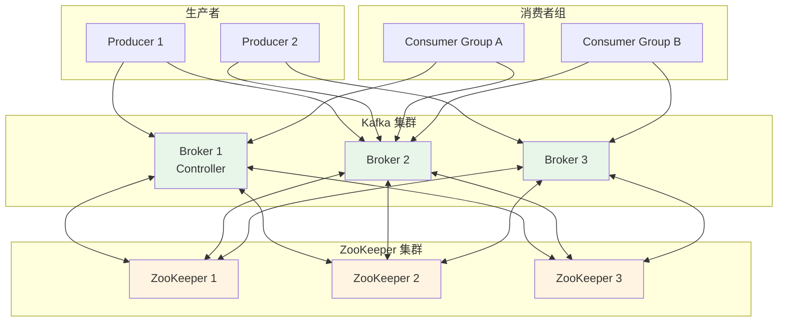

### 2. Broker 配置

**核心配置：**

```properties
# Broker 基本配置
broker.id=0
listeners=PLAINTEXT://localhost:9092
advertised.listeners=PLAINTEXT://localhost:9092
num.network.threads=3
num.io.threads=8
socket.send.buffer.bytes=102400
socket.receive.buffer.bytes=102400
socket.request.max.bytes=104857600

# 日志配置
log.dirs=/data/kafka-logs
num.partitions=1
num.recovery.threads.per.data.dir=1
log.retention.hours=168
log.segment.bytes=1073741824
log.retention.check.interval.ms=300000

# ZooKeeper 配置
zookeeper.connect=localhost:2181
zookeeper.connection.timeout.ms=6000

# 副本配置
default.replication.factor=3
min.insync.replicas=2
```

### 3. Topic 配置

**创建 Topic：**

```bash
# 创建 Topic
kafka-topics.sh --create \
  --bootstrap-server localhost:9092 \
  --replication-factor 3 \
  --partitions 3 \
  --topic test-topic

# 查看 Topic 详情
kafka-topics.sh --describe \
  --bootstrap-server localhost:9092 \
  --topic test-topic

# 修改 Topic 配置
kafka-configs.sh --alter \
  --bootstrap-server localhost:9092 \
  --entity-type topics \
  --entity-name test-topic \
  --add-config retention.ms=86400000
```

**Topic 配置参数：**

```properties
# 分区数量
num.partitions=3

# 副本数量
default.replication.factor=3

# 最小同步副本数
min.insync.replicas=2

# 消息保留时间（毫秒）
retention.ms=604800000

# 消息保留大小（字节）
retention.bytes=1073741824

# 段文件大小（字节）
segment.bytes=1073741824

# 清理策略
cleanup.policy=delete
```

## 性能优化

### 1. Producer 优化

```java
public class ProducerOptimization {
    public static void main(String[] args) {
        Properties props = new Properties();
        props.put("bootstrap.servers", "localhost:9092");
        
        /**
         * 批量大小
         * @param batch.size 批量大小（字节）
         * 增大可以提高吞吐量，但会增加延迟
         */
        props.put("batch.size", "32768");
        
        /**
         * 批量等待时间
         * @param linger.ms 等待时间（毫秒）
         * 增大可以提高批量效果
         */
        props.put("linger.ms", "10");
        
        /**
         * 缓冲区大小
         * @param buffer.memory 缓冲区大小（字节）
         */
        props.put("buffer.memory", "67108864");
        
        /**
         * 压缩类型
         * @param compression.type 压缩类型
         */
        props.put("compression.type", "snappy");
        
        /**
         * 确认机制
         * @param acks 确认级别
         * 0: 不等待确认，性能最高
         * 1: 等待 Leader 确认
         * all: 等待 ISR 所有副本确认，可靠性最高
         */
        props.put("acks", "1");
        
        /**
         * 重试次数
         * @param retries 重试次数
         */
        props.put("retries", "3");
        
        /**
         * 请求超时时间
         * @param request.timeout.ms 超时时间（毫秒）
         */
        props.put("request.timeout.ms", "30000");
    }
}
```

### 2. Consumer 优化

```java
public class ConsumerOptimization {
    public static void main(String[] args) {
        Properties props = new Properties();
        props.put("bootstrap.servers", "localhost:9092");
        props.put("group.id", "test-group");
        
        /**
         * 单次拉取最大记录数
         * @param max.poll.records 最大记录数
         */
        props.put("max.poll.records", "1000");
        
        /**
         * 单次拉取最大字节数
         * @param max.partition.fetch.bytes 最大字节数
         */
        props.put("max.partition.fetch.bytes", "1048576");
        
        /**
         * 拉取等待时间
         * @param fetch.max.wait.ms 等待时间（毫秒）
         */
        props.put("fetch.max.wait.ms", "500");
        
        /**
         * 拉取最小字节数
         * @param fetch.min.bytes 最小字节数
         */
        props.put("fetch.min.bytes", "1");
        
        /**
         * 会话超时时间
         * @param session.timeout.ms 超时时间（毫秒）
         */
        props.put("session.timeout.ms", "10000");
        
        /**
         * 心跳间隔
         * @param heartbeat.interval.ms 心跳间隔（毫秒）
         */
        props.put("heartbeat.interval.ms", "3000");
    }
}
```

### 3. Broker 优化

```properties
# JVM 配置
export KAFKA_HEAP_OPTS="-Xms8g -Xmx8g"
export KAFKA_JVM_PERFORMANCE_OPTS="-XX:+UseG1GC -XX:MaxGCPauseMillis=20 -XX:InitiatingHeapOccupancyPercent=35 -XX:+ExplicitGCInvokesConcurrent"

# 网络配置
num.network.threads=3
num.io.threads=8
socket.send.buffer.bytes=102400
socket.receive.buffer.bytes=102400
socket.request.max.bytes=104857600

# 日志配置
num.partitions=8
num.recovery.threads.per.data.dir=1
log.flush.interval.messages=10000
log.flush.interval.ms=1000

# 副本配置
num.replica.fetchers=4
replica.fetch.max.bytes=1048576
replica.fetch.wait.max.ms=500
```

## 常见问题与解决方案

### 1. 消息丢失

**原因：**
- acks 配置不当
- 副本数量不足
- ISR 为空

**解决方案：**
- 设置 acks=all
- 配置合理的副本数量
- 设置 min.insync.replicas

### 2. 消息重复

**原因：**
- Producer 重试
- Consumer 重复消费

**解决方案：**
- 启用幂等性生产者
- 实现业务层去重
- 使用事务消息

### 3. 消息堆积

**原因：**
- Consumer 处理慢
- Consumer 数量不足
- 分区数量不足

**解决方案：**
- 增加 Consumer 数量
- 优化消费逻辑
- 扩容分区数量

### 4. Rebalance 频繁

**原因：**
- Consumer 频繁上下线
- session.timeout.ms 配置过小
- Consumer 处理时间过长

**解决方案：**
- 增加 session.timeout.ms
- 增加 max.poll.interval.ms
- 优化消费逻辑

## 总结

本文详细介绍了 Kafka 的核心原理和架构设计，包括：

1. **核心概念**：Producer、Consumer、Broker、Topic、Partition、Segment、Offset
2. **架构设计**：Topic 与 Partition、副本机制、Controller 机制、ZooKeeper 作用
3. **消息存储**：日志文件结构、索引文件、日志清理策略、零拷贝技术
4. **高级特性**：事务消息、幂等性生产者、消息压缩、消息时间戳、消息拦截器
5. **集群部署**：集群架构、Broker 配置、Topic 配置
6. **性能优化**：Producer、Consumer、Broker 优化
7. **常见问题**：消息丢失、消息重复、消息堆积、Rebalance 频繁

通过本文的学习，你应该能够深入理解 Kafka 的工作原理，并在实际项目中正确使用 Kafka 构建高吞吐量、高可靠性的消息传递系统。

## 参考资料

- [Kafka 官方文档](https://kafka.apache.org/documentation/)
- [Kafka 源码](https://github.com/apache/kafka)
- [Kafka 设计文档](https://kafka.apache.org/documentation/#design)
