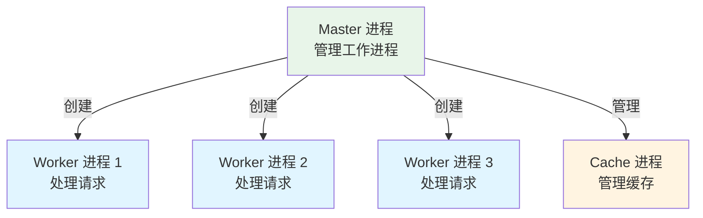
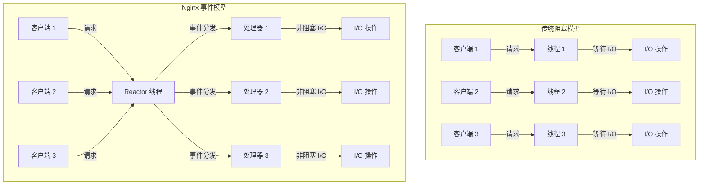
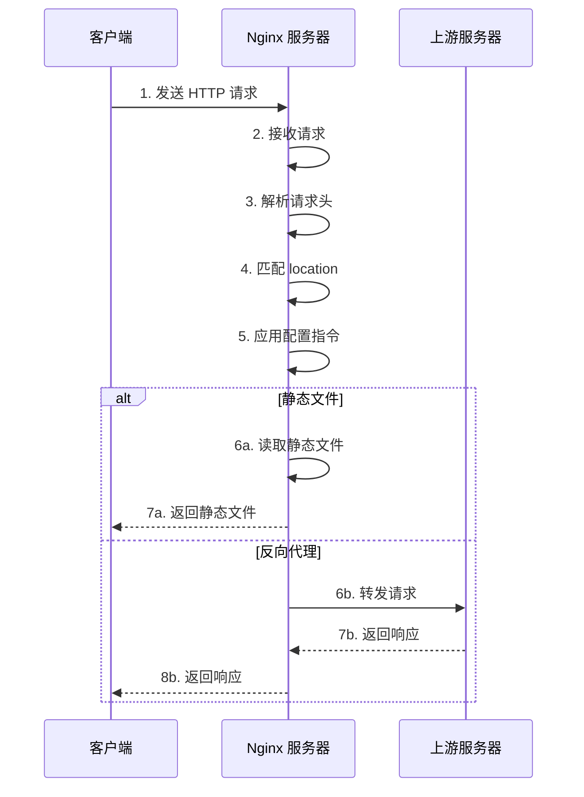

> 深入解析 Nginx 的核心原理、配置方法、匹配规则以及实战应用

## 简介

Nginx 是一个高性能的 HTTP 和反向代理服务器，由 Igor Sysoev 开发，以其稳定性、丰富的功能集、简单的配置和低资源消耗而闻名。Nginx 广泛应用于网站服务器、负载均衡器、反向代理、API 网关等场景。

### Nginx 的主要特点

| 特点 | 说明 |
|------|------|
| 高性能 | 采用事件驱动架构，处理并发连接能力强 |
| 高可靠性 | 稳定运行时间长，几乎不需要重启 |
| 低资源消耗 | 内存占用小，CPU 利用率高 |
| 丰富的功能 | 支持反向代理、负载均衡、SSL/TLS、缓存等 |
| 灵活的配置 | 模块化设计，配置简单直观 |
| 热部署 | 支持在线配置重载，无需重启 |

## 核心架构原理

### 1. 架构模型

Nginx 采用多进程多线程架构，由以下核心进程组成：



### 2. 事件处理模型

Nginx 使用异步非阻塞事件处理模型，基于 epoll (Linux)、kqueue (BSD)、select (通用) 等事件通知机制。

**传统阻塞模型 vs Nginx 事件模型：**



### 3. 模块化设计

Nginx 采用模块化设计，由核心模块和第三方模块组成：

| 模块类型 | 说明 | 示例 |
|----------|------|------|
| 核心模块 | 基础功能 | ngx_core_module |
| 事件模块 | 事件处理 | ngx_event_core_module |
| HTTP 模块 | HTTP 协议处理 | ngx_http_core_module |
| 邮件模块 | 邮件代理 | ngx_mail_core_module |
| 流模块 | TCP/UDP 代理 | ngx_stream_core_module |
| 第三方模块 | 扩展功能 | ngx_http_rewrite_module |

### 4. 请求处理流程



## 安装与配置

### 1. 安装 Nginx

**Ubuntu/Debian：**

```bash
# 安装 Nginx
sudo apt update
sudo apt install nginx

# 启动 Nginx
sudo systemctl start nginx

# 查看状态
sudo systemctl status nginx

# 设置开机自启
sudo systemctl enable nginx
```

**CentOS/RHEL：**

```bash
# 安装 Nginx
sudo yum install nginx

# 启动 Nginx
sudo systemctl start nginx

# 查看状态
sudo systemctl status nginx

# 设置开机自启
sudo systemctl enable nginx
```

**Windows：**

1. 从 [Nginx 官网](https://nginx.org/en/download.html) 下载 Windows 版本
2. 解压到指定目录
3. 运行 `nginx.exe` 启动服务

### 2. 配置文件结构

Nginx 配置文件主要由以下部分组成：

```nginx
# 全局配置
user nginx;
worker_processes auto;
error_log /var/log/nginx/error.log;
pid /run/nginx.pid;

# 事件配置
events {
    worker_connections 1024;
}

# HTTP 配置
http {
    include /etc/nginx/mime.types;
    default_type application/octet-stream;
    
    # 日志配置
    log_format main '$remote_addr - $remote_user [$time_local] "$request" '
                      '$status $body_bytes_sent "$http_referer" '
                      '"$http_user_agent" "$http_x_forwarded_for"';
    access_log /var/log/nginx/access.log main;
    
    # 核心配置
    sendfile on;
    tcp_nopush on;
    tcp_nodelay on;
    keepalive_timeout 65;
    
    # 包含其他配置文件
    include /etc/nginx/conf.d/*.conf;
    
    # 虚拟主机配置
    server {
        listen 80;
        server_name example.com;
        
        location / {
            root /usr/share/nginx/html;
            index index.html index.htm;
        }
    }
}

# 流配置（可选）
stream {
    # 流代理配置
}
```

## 核心指令与配置

### 1. 全局指令

| 指令 | 说明 | 示例 |
|------|------|------|
| `user` | 指定 Nginx 进程运行的用户 | `user nginx;` |
| `worker_processes` | 工作进程数量 | `worker_processes auto;` |
| `error_log` | 错误日志路径 | `error_log /var/log/nginx/error.log;` |
| `pid` | PID 文件路径 | `pid /run/nginx.pid;` |

### 2. 事件指令

| 指令 | 说明 | 示例 |
|------|------|------|
| `worker_connections` | 每个工作进程的最大连接数 | `worker_connections 1024;` |
| `use` | 指定事件模型 | `use epoll;` |
| `multi_accept` | 是否批量接受连接 | `multi_accept on;` |

### 3. HTTP 核心指令

| 指令 | 说明 | 示例 |
|------|------|------|
| `include` | 包含其他配置文件 | `include /etc/nginx/mime.types;` |
| `default_type` | 默认 MIME 类型 | `default_type application/octet-stream;` |
| `log_format` | 日志格式 | `log_format main '$remote_addr - $remote_user [$time_local] "$request" $status $body_bytes_sent "$http_referer" "$http_user_agent"';` |
| `access_log` | 访问日志路径 | `access_log /var/log/nginx/access.log main;` |
| `sendfile` | 启用 sendfile 系统调用 | `sendfile on;` |
| `tcp_nopush` | 启用 TCP_NOPUSH 选项 | `tcp_nopush on;` |
| `tcp_nodelay` | 启用 TCP_NODELAY 选项 | `tcp_nodelay on;` |
| `keepalive_timeout` | 长连接超时时间 | `keepalive_timeout 65;` |

### 4. 服务器配置

```nginx
server {
    # 监听端口和地址
    listen 80;
    listen [::]:80;
    
    # 服务器名称
    server_name example.com www.example.com;
    
    # 根目录
    root /usr/share/nginx/html;
    
    # 索引文件
    index index.html index.htm index.php;
    
    # 编码
    charset utf-8;
    
    # 日志
    access_log /var/log/nginx/example.access.log main;
    error_log /var/log/nginx/example.error.log error;
    
    # 位置匹配
    location / {
        try_files $uri $uri/ =404;
    }
    
    # PHP 配置
    location ~ \.php$ {
        fastcgi_pass unix:/var/run/php-fpm/php-fpm.sock;
        fastcgi_index index.php;
        fastcgi_param SCRIPT_FILENAME $document_root$fastcgi_script_name;
        include fastcgi_params;
    }
}
```

## 匹配规则详解

### 1. 位置匹配类型

Nginx 提供多种位置匹配类型，按优先级从高到低排列：

| 类型 | 语法 | 说明 | 示例 |
|------|------|------|------|
| 精确匹配 | `location = /path` | 完全匹配路径 | `location = /` |
| 前缀匹配 | `location ^~ /path` | 前缀匹配，不进行正则匹配 | `location ^~ /static/` |
| 正则匹配 | `location ~ pattern` | 区分大小写的正则匹配 | `location ~ \.php$` |
| 正则匹配 | `location ~* pattern` | 不区分大小写的正则匹配 | `location ~* \.(jpg|jpeg|png|gif)$` |
| 普通前缀匹配 | `location /path` | 普通前缀匹配 | `location /api/` |
| 默认匹配 | `location /` | 匹配所有路径 | `location /` |

### 2. 匹配规则示例

```nginx
# 精确匹配根路径
location = / {
    # 配置
}

# 前缀匹配静态文件目录
location ^~ /static/ {
    # 配置
}

# 正则匹配图片文件
location ~* \.(jpg|jpeg|png|gif|webp)$ {
    # 配置
}

# 正则匹配 PHP 文件
location ~ \.php$ {
    # 配置
}

# 普通前缀匹配 API 路径
location /api/ {
    # 配置
}

# 默认匹配
location / {
    # 配置
}
```

### 3. 变量使用

Nginx 提供丰富的变量，可在配置中使用：

| 变量 | 说明 | 示例 |
|------|------|------|
| `$uri` | 请求的 URI | `/index.html` |
| `$request_uri` | 完整的请求 URI，包含查询参数 | `/index.html?foo=bar` |
| `$args` | 请求参数 | `foo=bar` |
| `$remote_addr` | 客户端 IP 地址 | `192.168.1.1` |
| `$remote_user` | 认证用户 | `user1` |
| `$host` | 主机名 | `example.com` |
| `$server_name` | 服务器名称 | `example.com` |
| `$server_port` | 服务器端口 | `80` |
| `$request_method` | 请求方法 | `GET` |
| `$status` | 响应状态码 | `200` |
| `$body_bytes_sent` | 发送的字节数 | `1024` |
| `$http_user_agent` | User-Agent 头 | `Mozilla/5.0...` |
| `$http_referer` | Referer 头 | `https://example.com` |

## 反向代理配置

### 1. 基本反向代理

```nginx
server {
    listen 80;
    server_name example.com;
    
    location / {
        # 反向代理到后端服务器
        proxy_pass http://localhost:8080;
        
        # 代理请求头
        proxy_set_header Host $host;
        proxy_set_header X-Real-IP $remote_addr;
        proxy_set_header X-Forwarded-For $proxy_add_x_forwarded_for;
        proxy_set_header X-Forwarded-Proto $scheme;
        
        # 代理超时
        proxy_connect_timeout 60s;
        proxy_send_timeout 60s;
        proxy_read_timeout 60s;
        
        # 缓冲区
        proxy_buffers 8 16k;
        proxy_buffer_size 32k;
    }
}
```

### 2. 路径重写

```nginx
server {
    listen 80;
    server_name example.com;
    
    location /api/ {
        # 重写路径
        rewrite ^/api/(.*)$ /$1 break;
        proxy_pass http://localhost:8080;
    }
}
```

### 3. HTTPS 反向代理

```nginx
server {
    listen 443 ssl http2;
    server_name example.com;
    
    # SSL 配置
    ssl_certificate /etc/nginx/ssl/example.com.crt;
    ssl_certificate_key /etc/nginx/ssl/example.com.key;
    ssl_protocols TLSv1.2 TLSv1.3;
    ssl_ciphers ECDHE-RSA-AES256-GCM-SHA512:DHE-RSA-AES256-GCM-SHA512:ECDHE-RSA-AES256-GCM-SHA384:DHE-RSA-AES256-GCM-SHA384:ECDHE-RSA-AES256-SHA384;
    ssl_prefer_server_ciphers on;
    ssl_session_cache shared:SSL:10m;
    ssl_session_timeout 10m;
    
    location / {
        proxy_pass http://localhost:8080;
        proxy_set_header Host $host;
        proxy_set_header X-Real-IP $remote_addr;
        proxy_set_header X-Forwarded-For $proxy_add_x_forwarded_for;
        proxy_set_header X-Forwarded-Proto $scheme;
    }
}

# HTTP 重定向到 HTTPS
server {
    listen 80;
    server_name example.com;
    return 301 https://$host$request_uri;
}
```

## 负载均衡配置

### 1. 基本负载均衡

```nginx
# 上游服务器配置
upstream backend {
    server localhost:8080;
    server localhost:8081;
    server localhost:8082;
}

server {
    listen 80;
    server_name example.com;
    
    location / {
        proxy_pass http://backend;
        proxy_set_header Host $host;
        proxy_set_header X-Real-IP $remote_addr;
        proxy_set_header X-Forwarded-For $proxy_add_x_forwarded_for;
    }
}
```

### 2. 负载均衡算法

| 算法 | 说明 | 配置 |
|------|------|------|
| 轮询（默认） | 按顺序分配请求 | `upstream backend { server 192.168.1.10; server 192.168.1.11; }` |
| 权重 | 按权重分配请求 | `upstream backend { server 192.168.1.10 weight=5; server 192.168.1.11 weight=1; }` |
| ip_hash | 基于客户端 IP 分配请求 | `upstream backend { ip_hash; server 192.168.1.10; server 192.168.1.11; }` |
| least_conn | 分配到连接数最少的服务器 | `upstream backend { least_conn; server 192.168.1.10; server 192.168.1.11; }` |
| hash | 基于指定变量分配请求 | `upstream backend { hash $request_uri consistent; server 192.168.1.10; server 192.168.1.11; }` |

### 3. 健康检查

```nginx
upstream backend {
    server localhost:8080 max_fails=3 fail_timeout=30s;
    server localhost:8081 max_fails=3 fail_timeout=30s;
    server localhost:8082 backup;  # 备用服务器
}
```

### 4. 会话保持

**使用 ip_hash：**

```nginx
upstream backend {
    ip_hash;
    server localhost:8080;
    server localhost:8081;
}
```

**使用 sticky 模块：**

```nginx
upstream backend {
    server localhost:8080;
    server localhost:8081;
    sticky cookie srv_id expires=1h domain=.example.com path=/;
}
```

## 静态文件服务

### 1. 基本配置

```nginx
server {
    listen 80;
    server_name example.com;
    
    root /usr/share/nginx/html;
    index index.html index.htm;
    
    location / {
        try_files $uri $uri/ =404;
    }
    
    # 静态文件缓存
    location ~* \.(css|js|jpg|jpeg|png|gif|ico|svg)$ {
        expires 7d;
        add_header Cache-Control "public, immutable";
        try_files $uri =404;
    }
}
```

### 2. 压缩配置

```nginx
http {
    # 启用 gzip 压缩
    gzip on;
    gzip_vary on;
    gzip_min_length 1024;
    gzip_types text/plain text/css application/json application/javascript text/xml application/xml application/xml+rss text/javascript;
    gzip_proxied any;
    gzip_comp_level 6;
    gzip_buffers 16 8k;
    gzip_http_version 1.1;
    
    # 其他配置...
}
```

### 3. 防盗链配置

```nginx
server {
    # 其他配置...
    
    location ~* \.(jpg|jpeg|png|gif|webp)$ {
        # 只允许指定域名访问
        valid_referers none blocked example.com *.example.com;
        if ($invalid_referer) {
            return 403;
        }
        
        try_files $uri =404;
    }
}
```

## 缓存配置

### 1. 代理缓存

```nginx
http {
    # 缓存路径
    proxy_cache_path /var/cache/nginx levels=1:2 keys_zone=my_cache:10m max_size=10g inactive=60m use_temp_path=off;
    
    server {
        listen 80;
        server_name example.com;
        
        location / {
            proxy_cache my_cache;
            proxy_cache_key "$scheme$request_method$host$request_uri";
            proxy_cache_valid 200 302 10m;
            proxy_cache_valid 404 1m;
            proxy_ignore_headers Set-Cookie;
            proxy_hide_header Set-Cookie;
            
            proxy_pass http://localhost:8080;
        }
    }
}
```

### 2. 清除缓存

```nginx
http {
    # 其他配置...
    
    server {
        listen 80;
        server_name example.com;
        
        # 清除缓存的接口
        location /purge/ {
            allow 127.0.0.1;
            deny all;
            proxy_cache_purge my_cache "$scheme$request_method$host$request_uri";
        }
    }
}
```

## 常用模块

### 1. rewrite 模块

```nginx
server {
    listen 80;
    server_name example.com;
    
    # 重写规则
    location / {
        # 重写到 index.php
        rewrite ^/$ /index.php last;
        
        # 重写带参数的 URL
        rewrite ^/user/([0-9]+)$ /user.php?id=$1 last;
        
        # 重定向
        rewrite ^/old-path$ /new-path permanent;
    }
}
```

### 2. auth_basic 模块

```nginx
server {
    listen 80;
    server_name example.com;
    
    location /admin/ {
        auth_basic "Restricted Area";
        auth_basic_user_file /etc/nginx/.htpasswd;
        
        # 其他配置...
    }
}
```

**生成密码文件：**

```bash
sudo apt install apache2-utils  # Ubuntu/Debian
sudo yum install httpd-tools     # CentOS/RHEL
sudo htpasswd -c /etc/nginx/.htpasswd admin
```

### 3. headers 模块

```nginx
server {
    listen 80;
    server_name example.com;
    
    location / {
        # 安全头
        add_header X-Content-Type-Options nosniff;
        add_header X-Frame-Options SAMEORIGIN;
        add_header X-XSS-Protection "1; mode=block";
        add_header Content-Security-Policy "default-src 'self'; script-src 'self' 'unsafe-inline'; style-src 'self' 'unsafe-inline';";
        add_header Referrer-Policy "strict-origin-when-cross-origin";
        
        # 其他配置...
    }
}
```

## 实战案例

### 1. 部署静态网站

```nginx
server {
    listen 80;
    server_name example.com;
    
    root /var/www/example.com;
    index index.html;
    
    location / {
        try_files $uri $uri/ =404;
    }
    
    # 静态文件缓存
    location ~* \.(css|js|jpg|jpeg|png|gif|ico|svg)$ {
        expires 30d;
        add_header Cache-Control "public, immutable";
    }
    
    # 日志
    access_log /var/log/nginx/example.com.access.log;
    error_log /var/log/nginx/example.com.error.log;
}
```

### 2. 部署 PHP 应用

```nginx
server {
    listen 80;
    server_name example.com;
    
    root /var/www/example.com;
    index index.php index.html;
    
    location / {
        try_files $uri $uri/ /index.php?$args;
    }
    
    location ~ \.php$ {
        include snippets/fastcgi-php.conf;
        fastcgi_pass unix:/run/php/php7.4-fpm.sock;
    }
    
    location ~ /\.ht {
        deny all;
    }
}
```

### 3. 部署 Node.js 应用

```nginx
upstream nodejs_app {
    server localhost:3000;
    keepalive 64;
}

server {
    listen 80;
    server_name example.com;
    
    location / {
        proxy_pass http://nodejs_app;
        proxy_http_version 1.1;
        proxy_set_header Upgrade $http_upgrade;
        proxy_set_header Connection 'upgrade';
        proxy_set_header Host $host;
        proxy_set_header X-Real-IP $remote_addr;
        proxy_set_header X-Forwarded-For $proxy_add_x_forwarded_for;
        proxy_set_header X-Forwarded-Proto $scheme;
        proxy_cache_bypass $http_upgrade;
    }
}
```

### 4. 部署 Java 应用

```nginx
upstream java_app {
    server localhost:8080;
    server localhost:8081;
}

server {
    listen 80;
    server_name example.com;
    
    location / {
        proxy_pass http://java_app;
        proxy_set_header Host $host;
        proxy_set_header X-Real-IP $remote_addr;
        proxy_set_header X-Forwarded-For $proxy_add_x_forwarded_for;
        proxy_set_header X-Forwarded-Proto $scheme;
    }
}
```

### 5. API 网关

```nginx
upstream api_backend {
    server localhost:8000;
}

server {
    listen 80;
    server_name api.example.com;
    
    # 限流
    limit_req_zone $binary_remote_addr zone=api:10m rate=10r/s;
    
    location / {
        limit_req zone=api burst=20 nodelay;
        
        # 验证 API Key
        if ($http_x_api_key != "your-secret-key") {
            return 401;
        }
        
        proxy_pass http://api_backend;
        proxy_set_header Host $host;
        proxy_set_header X-Real-IP $remote_addr;
        proxy_set_header X-Forwarded-For $proxy_add_x_forwarded_for;
    }
}
```

## 性能优化

### 1. 核心优化

```nginx
# 全局配置
worker_processes auto;
worker_cpu_affinity auto;
worker_rlimit_nofile 65535;

# 事件配置
events {
    worker_connections 10240;
    use epoll;
    multi_accept on;
}

# HTTP 配置
http {
    # 连接优化
    keepalive_timeout 65;
    keepalive_requests 10000;
    
    # 缓冲区优化
    client_body_buffer_size 16k;
    client_header_buffer_size 1k;
    large_client_header_buffers 4 8k;
    
    # 发送优化
    sendfile on;
    tcp_nopush on;
    tcp_nodelay on;
    
    # 其他配置...
}
```

### 2. 缓存优化

```nginx
http {
    # 代理缓存
    proxy_cache_path /var/cache/nginx levels=1:2 keys_zone=proxy_cache:10m max_size=10g inactive=60m use_temp_path=off;
    
    # 快速 CGI 缓存
    fastcgi_cache_path /var/cache/nginx/fastcgi levels=1:2 keys_zone=fastcgi_cache:10m max_size=10g inactive=60m use_temp_path=off;
    
    # 其他配置...
}
```

### 3. 日志优化

```nginx
http {
    # 访问日志配置
    log_format main '$remote_addr - $remote_user [$time_local] "$request" '
                      '$status $body_bytes_sent "$http_referer" '
                      '"$http_user_agent" "$http_x_forwarded_for"';
    
    # 关闭不需要的日志
    access_log off;
    
    # 只记录错误日志
    error_log /var/log/nginx/error.log warn;
    
    # 其他配置...
}
```

## 监控与日志

### 1. 日志管理

**错误日志级别：**

| 级别 | 说明 |
|------|------|
| debug | 详细调试信息 |
| info | 一般信息 |
| notice | 通知信息 |
| warn | 警告信息 |
| error | 错误信息 |
| crit | 严重错误 |
| alert | 警报信息 |
| emerg | 紧急信息 |

**配置示例：**

```nginx
error_log /var/log/nginx/error.log warn;
```

### 2. 访问监控

**使用 nginx-stats 模块：**

```nginx
location /nginx_status {
    stub_status on;
    access_log off;
    allow 127.0.0.1;
    deny all;
}
```

**访问监控页面：**

```bash
curl http://localhost/nginx_status
```

**输出示例：**

```
Active connections: 2 
server accepts handled requests
 1000 1000 1000 
Reading: 0 Writing: 1 Waiting: 1 
```

### 3. 第三方监控工具

| 工具 | 说明 |
|------|------|
| Prometheus + Grafana | 监控系统和数据可视化 |
| ELK Stack | 日志收集和分析 |
| Datadog | 综合监控平台 |
| New Relic | 应用性能监控 |

## 常见问题与解决方案

### 1. 502 Bad Gateway

**原因：**
- 后端服务器未运行
- 后端服务器端口错误
- 后端服务器响应超时

**解决方案：**
- 检查后端服务器状态
- 检查端口配置
- 调整超时设置

### 2. 403 Forbidden

**原因：**
- 文件权限错误
- 目录索引未启用
- 防盗链配置

**解决方案：**
- 检查文件权限
- 启用目录索引
- 调整防盗链配置

### 3. 404 Not Found

**原因：**
- 文件不存在
- 路径配置错误
- try_files 配置错误

**解决方案：**
- 检查文件路径
- 修正配置文件
- 调整 try_files 规则

### 4. 504 Gateway Timeout

**原因：**
- 后端服务器响应超时
- 网络连接问题

**解决方案：**
- 调整代理超时设置
- 检查网络连接
- 优化后端服务性能

### 5. 配置重载失败

**原因：**
- 配置文件语法错误
- 端口被占用

**解决方案：**
- 检查配置文件语法：`nginx -t`
- 检查端口占用：`netstat -tulpn | grep 80`

## 命令行工具

### 1. 基本命令

| 命令 | 说明 | 示例 |
|------|------|------|
| `nginx -t` | 测试配置文件 | `nginx -t` |
| `nginx -s reload` | 重载配置 | `nginx -s reload` |
| `nginx -s stop` | 停止服务 | `nginx -s stop` |
| `nginx -s quit` | 优雅退出 | `nginx -s quit` |
| `nginx -v` | 查看版本 | `nginx -v` |
| `nginx -V` | 查看详细版本信息 | `nginx -V` |

### 2. 信号控制

| 信号 | 说明 | 示例 |
|------|------|------|
| `HUP` | 重载配置 | `kill -HUP $(cat /run/nginx.pid)` |
| `TERM` | 立即停止 | `kill -TERM $(cat /run/nginx.pid)` |
| `QUIT` | 优雅停止 | `kill -QUIT $(cat /run/nginx.pid)` |
| `USR1` | 重新打开日志文件 | `kill -USR1 $(cat /run/nginx.pid)` |
| `USR2` | 平滑升级 Nginx | `kill -USR2 $(cat /run/nginx.pid)` |

## 部署最佳实践

### 1. 目录结构

```
/etc/nginx/
├── nginx.conf          # 主配置文件
├── conf.d/             # 配置文件目录
│   ├── default.conf    # 默认配置
│   └── example.conf    # 站点配置
├── sites-available/    # 可用站点
├── sites-enabled/      # 启用的站点（符号链接）
└── ssl/                # SSL 证书
```

### 2. 配置管理

**使用版本控制：**
- 将配置文件纳入版本控制
- 配置变更前备份
- 记录配置变更历史

**使用配置模板：**
- 为不同环境创建配置模板
- 使用变量管理环境差异
- 自动化配置部署

### 3. 安全最佳实践

**限制访问：**
- 配置防火墙
- 限制管理端口访问
- 使用 HTTPS

**减少攻击面：**
- 隐藏 Nginx 版本号
- 禁用不必要的模块
- 配置安全头

**定期更新：**
- 定期更新 Nginx
- 及时修补安全漏洞
- 监控安全公告

## 总结

本文详细介绍了 Nginx 的核心原理、配置方法、匹配规则以及实战应用，包括：

1. **核心架构**：多进程多线程架构、事件处理模型、模块化设计
2. **配置基础**：安装方法、配置文件结构、核心指令
3. **匹配规则**：位置匹配类型、匹配优先级、变量使用
4. **反向代理**：基本配置、路径重写、HTTPS 代理
5. **负载均衡**：负载均衡算法、健康检查、会话保持
6. **静态文件**：基本配置、压缩、防盗链
7. **缓存配置**：代理缓存、缓存清除
8. **常用模块**：rewrite、auth_basic、headers
9. **实战案例**：静态网站、PHP 应用、Node.js 应用、Java 应用、API 网关
10. **性能优化**：核心优化、缓存优化、日志优化
11. **监控与日志**：日志管理、访问监控、第三方工具
12. **常见问题**：502、403、404、504 错误
13. **命令行工具**：基本命令、信号控制
14. **部署最佳实践**：目录结构、配置管理、安全最佳实践

通过本文的学习，你应该能够掌握 Nginx 的核心原理和配置方法，并在实际项目中灵活应用 Nginx 来构建高性能、可靠的 Web 服务。

## 参考资料

- [Nginx 官方文档](http://nginx.org/en/docs/)
- [Nginx 中文文档](https://nginx.org/en/docs/)
- [Nginx 配置示例](https://www.nginx.com/resources/wiki/start/topics/examples/full/)
- [Nginx 性能调优](https://www.nginx.com/blog/tuning-nginx/)
- [Nginx 安全配置](https://www.nginx.com/blog/nginx-ssl-termination/)
