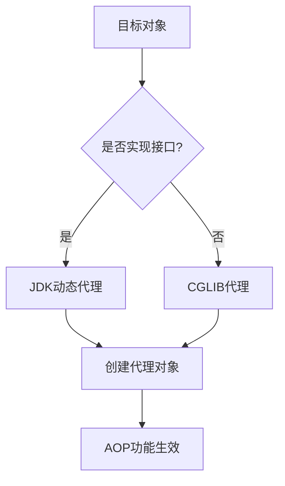
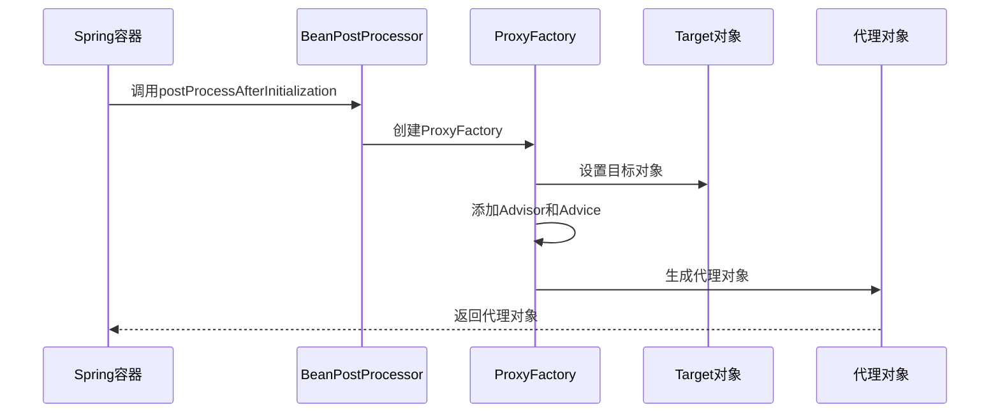
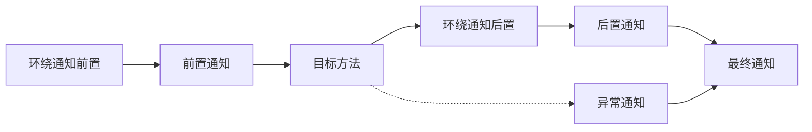

## 概述

Spring AOP（Aspect-Oriented Programming）是Spring框架中实现面向切面编程的核心模块。它通过代理机制在不修改原有代码的基础上，为程序动态添加横切关注点功能。本文将深入分析Spring AOP的实现原理，包括代理机制、织入过程、通知类型等核心概念。

## AOP核心概念

### 1. 基本术语

- **切面（Aspect）**：横切关注点的模块化，包含通知和切点
- **连接点（JoinPoint）**：程序执行过程中的特定点，如方法调用、异常抛出
- **通知（Advice）**：在特定连接点执行的动作
- **切点（Pointcut）**：匹配连接点的谓词
- **引入（Introduction）**：为类添加新的方法或属性
- **目标对象（Target Object）**：被一个或多个切面通知的对象
- **织入（Weaving）**：将切面应用到目标对象创建新代理对象的过程

### 2. 通知类型

Spring AOP支持五种通知类型：

- **前置通知（Before Advice）**：在方法执行前执行
- **后置通知（After Returning Advice）**：方法正常返回后执行
- **异常通知（After Throwing Advice）**：方法抛出异常后执行
- **最终通知（After (Finally) Advice）**：方法执行后执行（无论是否异常）
- **环绕通知（Around Advice）**：包围方法执行，可控制是否执行目标方法

## Spring AOP实现机制

### 1. 代理模式基础

Spring AOP基于代理模式实现，主要使用两种代理方式：

#### JDK动态代理
```java
public interface UserService {
    void addUser(String name);
}

public class UserServiceImpl implements UserService {
    @Override
    public void addUser(String name) {
        System.out.println("添加用户: " + name);
    }
}

// JDK动态代理实现
public class JdkProxyHandler implements InvocationHandler {
    private Object target;
    
    public JdkProxyHandler(Object target) {
        this.target = target;
    }
    
    @Override
    public Object invoke(Object proxy, Method method, Object[] args) throws Throwable {
        // 前置处理
        System.out.println("方法执行前: " + method.getName());
        
        // 执行目标方法
        Object result = method.invoke(target, args);
        
        // 后置处理
        System.out.println("方法执行后: " + method.getName());
        
        return result;
    }
}
```

#### CGLIB代理
```java
public class UserService {
    public void addUser(String name) {
        System.out.println("添加用户: " + name);
    }
}

// CGLIB代理实现
public class CglibProxyInterceptor implements MethodInterceptor {
    @Override
    public Object intercept(Object obj, Method method, Object[] args, MethodProxy proxy) throws Throwable {
        // 前置处理
        System.out.println("CGLIB代理 - 方法执行前: " + method.getName());
        
        // 执行目标方法
        Object result = proxy.invokeSuper(obj, args);
        
        // 后置处理
        System.out.println("CGLIB代理 - 方法执行后: " + method.getName());
        
        return result;
    }
}
```

### 2. Spring AOP代理选择策略

Spring AOP根据目标对象的类型自动选择代理方式：

- **如果目标对象实现了接口**：使用JDK动态代理
- **如果目标对象没有实现接口**：使用CGLIB代理
- **可通过配置强制使用CGLIB**：`@EnableAspectJAutoProxy(proxyTargetClass = true)`



## Spring AOP织入过程分析

### 1. 配置解析阶段

Spring容器启动时，会解析AOP相关配置：

```java
// Spring AOP配置解析核心流程
public class AspectJAwareAdvisorAutoProxyCreator extends AbstractAdvisorAutoProxyCreator {
    
    @Override
    protected Object[] getAdvicesAndAdvisorsForBean(Class<?> beanClass, String beanName, TargetSource targetSource) {
        // 1. 查找所有Advisor
        List<Advisor> candidateAdvisors = findCandidateAdvisors();
        
        // 2. 筛选适用于当前bean的Advisor
        List<Advisor> eligibleAdvisors = findAdvisorsThatCanApply(candidateAdvisors, beanClass, beanName);
        
        // 3. 对Advisor进行排序
        eligibleAdvisors.sort(AnnotationAwareOrderComparator.INSTANCE);
        
        return eligibleAdvisors.toArray();
    }
}
```

### 2. 代理对象创建过程



### 3. 方法调用拦截流程

```java
// JDK动态代理方法调用拦截
public class JdkDynamicAopProxy implements AopProxy, InvocationHandler {
    
    @Override
    public Object invoke(Object proxy, Method method, Object[] args) throws Throwable {
        // 获取方法调用链
        List<Object> chain = this.advised.getInterceptorsAndDynamicInterceptionAdvice(method, targetClass);
        
        // 创建方法调用对象
        ReflectiveMethodInvocation invocation = new ReflectiveMethodInvocation(
            proxy, target, method, args, targetClass, chain);
        
        // 执行拦截器链
        return invocation.proceed();
    }
}

// CGLIB代理方法调用拦截
public class CglibAopProxy implements MethodInterceptor {
    
    @Override
    public Object intercept(Object proxy, Method method, Object[] args, MethodProxy methodProxy) throws Throwable {
        // 获取方法调用链
        List<Object> chain = this.advised.getInterceptorsAndDynamicInterceptionAdvice(method, targetClass);
        
        // 创建CGLIB方法调用对象
        CglibMethodInvocation invocation = new CglibMethodInvocation(
            proxy, target, method, args, targetClass, chain, methodProxy);
        
        // 执行拦截器链
        return invocation.proceed();
    }
}
```

## 通知执行顺序与拦截器链

### 1. 拦截器链构建

Spring AOP将不同类型的通知转换为MethodInterceptor：

```java
// 通知类型转换
public class DefaultAdvisorAdapterRegistry implements AdvisorAdapterRegistry {
    
    public MethodInterceptor[] getInterceptors(Advisor advisor) {
        List<MethodInterceptor> interceptors = new ArrayList<>();
        
        Advice advice = advisor.getAdvice();
        if (advice instanceof MethodInterceptor) {
            interceptors.add((MethodInterceptor) advice);
        }
        
        // 适配不同类型的通知
        for (AdvisorAdapter adapter : this.adapters) {
            if (adapter.supportsAdvice(advice)) {
                interceptors.add(adapter.getInterceptor(advisor));
            }
        }
        
        return interceptors.toArray(new MethodInterceptor[0]);
    }
}
```

### 2. 通知执行顺序



### 3. 拦截器链执行流程

```java
public class ReflectiveMethodInvocation implements ProxyMethodInvocation {
    
    private int currentInterceptorIndex = -1;
    
    public Object proceed() throws Throwable {
        // 如果所有拦截器都执行完毕，执行目标方法
        if (this.currentInterceptorIndex == this.interceptorsAndDynamicMethodMatchers.size() - 1) {
            return invokeJoinpoint();
        }
        
        // 获取下一个拦截器
        Object interceptorOrInterceptionAdvice = 
            this.interceptorsAndDynamicMethodMatchers.get(++this.currentInterceptorIndex);
        
        // 执行拦截器
        if (interceptorOrInterceptionAdvice instanceof InterceptorAndDynamicMethodMatcher) {
            InterceptorAndDynamicMethodMatcher dm = 
                (InterceptorAndDynamicMethodMatcher) interceptorOrInterceptionAdvice;
            
            if (dm.methodMatcher.matches(this.method, this.targetClass, this.arguments)) {
                return dm.interceptor.invoke(this);
            } else {
                // 不匹配，跳过当前拦截器
                return proceed();
            }
        } else {
            return ((MethodInterceptor) interceptorOrInterceptionAdvice).invoke(this);
        }
    }
}
```

## 高级特性与性能优化

### 1. 引入（Introduction）机制

引入允许为现有类添加新的接口实现：

```java
public interface Monitorable {
    void setMonitorActive(boolean active);
}

@Aspect
public class MonitorIntroduction {
    
    @DeclareParents(value = "com.example.service.*Service", defaultImpl = DefaultMonitorable.class)
    public static Monitorable mixin;
}

// 使用引入
@Service
public class UserService {
    // 通过引入获得Monitorable接口能力
}
```

### 2. 性能优化策略

#### 代理对象缓存
Spring容器会缓存代理对象，避免重复创建：

```java
public abstract class AbstractAutoProxyCreator extends ProxyProcessorSupport {
    
    private final Map<Object, Object> proxyCache = new ConcurrentHashMap<>(256);
    
    protected Object getCacheKey(Class<?> beanClass, String beanName) {
        if (StringUtils.hasLength(beanName)) {
            return beanName;
        }
        return beanClass;
    }
}
```

#### 切点表达式优化
避免使用过于复杂的切点表达式：

```java
// 不推荐的复杂切点
@Pointcut("execution(* com.example..*.*(..)) && within(com.example.service..*) && !execution(* com.example.service.internal.*.*(..))")

// 推荐的精确切点
@Pointcut("execution(* com.example.service.UserService.*(..))")
```

### 3. 调试与监控

#### AOP调试配置
```properties
# 开启AOP调试日志
logging.level.org.springframework.aop=DEBUG
logging.level.org.springframework.beans=DEBUG

# 查看代理对象创建过程
spring.aop.auto=false
spring.aop.proxy-target-class=true
```

#### 性能监控切面
```java
@Aspect
@Component
public class PerformanceMonitorAspect {
    
    private static final ThreadLocal<Long> startTime = new ThreadLocal<>();
    
    @Around("execution(* com.example.service.*.*(..))")
    public Object monitorPerformance(ProceedingJoinPoint joinPoint) throws Throwable {
        long start = System.currentTimeMillis();
        startTime.set(start);
        
        try {
            return joinPoint.proceed();
        } finally {
            long end = System.currentTimeMillis();
            long duration = end - start;
            
            if (duration > 1000) { // 超过1秒记录警告
                logger.warn("方法执行时间过长: {} - {}ms", 
                    joinPoint.getSignature(), duration);
            }
            
            startTime.remove();
        }
    }
}
```

## 实际应用场景

### 1. 事务管理
Spring的事务管理基于AOP实现：

```java
@Aspect
@Component
public class TransactionAspect {
    
    @Autowired
    private PlatformTransactionManager transactionManager;
    
    @Around("@annotation(transactional)")
    public Object manageTransaction(ProceedingJoinPoint joinPoint, Transactional transactional) throws Throwable {
        TransactionStatus status = transactionManager.getTransaction(new DefaultTransactionDefinition());
        
        try {
            Object result = joinPoint.proceed();
            transactionManager.commit(status);
            return result;
        } catch (Exception e) {
            transactionManager.rollback(status);
            throw e;
        }
    }
}
```

### 2. 安全控制
```java
@Aspect
@Component
public class SecurityAspect {
    
    @Before("@annotation(requiresPermission)")
    public void checkPermission(RequiresPermission requiresPermission) {
        String permission = requiresPermission.value();
        
        if (!SecurityContext.hasPermission(permission)) {
            throw new AccessDeniedException("权限不足: " + permission);
        }
    }
}
```

### 3. 日志记录
```java
@Aspect
@Component
public class LoggingAspect {
    
    @Around("execution(* com.example.controller.*.*(..))")
    public Object logController(ProceedingJoinPoint joinPoint) throws Throwable {
        String methodName = joinPoint.getSignature().getName();
        Object[] args = joinPoint.getArgs();
        
        logger.info("Controller方法调用: {} 参数: {}", methodName, Arrays.toString(args));
        
        try {
            Object result = joinPoint.proceed();
            logger.info("Controller方法返回: {} 结果: {}", methodName, result);
            return result;
        } catch (Exception e) {
            logger.error("Controller方法异常: {} 异常: {}", methodName, e.getMessage());
            throw e;
        }
    }
}
```

## 总结

Spring AOP通过代理机制实现了强大的面向切面编程功能，其核心原理包括：

1. **代理选择策略**：根据目标对象类型自动选择JDK动态代理或CGLIB代理
2. **织入过程**：在Bean创建后处理阶段动态创建代理对象
3. **拦截器链**：将不同类型的通知转换为统一的MethodInterceptor执行
4. **性能优化**：通过缓存、切点优化等手段提升性能

理解Spring AOP的实现原理有助于我们更好地使用AOP功能，编写更高效、更可维护的代码。在实际开发中，应根据具体场景选择合适的AOP应用方式，避免过度使用导致的性能问题。