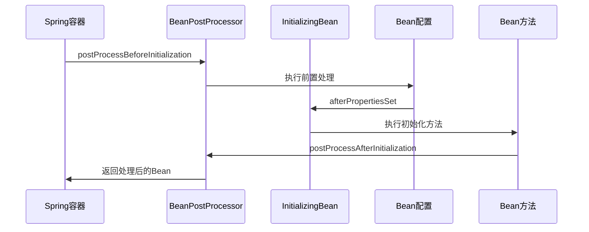

## 概述

Spring框架提供了丰富的Bean生命周期管理接口，允许开发者在Bean创建和销毁的不同阶段进行自定义处理。本文将深入解析Spring Bean的前置处理和后置处理接口，包括BeanPostProcessor、InitializingBean、DisposableBean等核心接口的实现原理和使用场景。

## Bean生命周期核心接口

### 1. BeanPostProcessor接口

BeanPostProcessor是Spring框架中最重要的扩展接口之一，它允许在Bean初始化前后进行自定义处理。

#### 接口定义
```java
public interface BeanPostProcessor {
    
    // Bean初始化前的回调方法
    @Nullable
    default Object postProcessBeforeInitialization(Object bean, String beanName) throws BeansException {
        return bean;
    }
    
    // Bean初始化后的回调方法
    @Nullable
    default Object postProcessAfterInitialization(Object bean, String beanName) throws BeansException {
        return bean;
    }
}
```

#### 实现示例
```java
@Component
public class CustomBeanPostProcessor implements BeanPostProcessor {
    
    private static final Logger logger = LoggerFactory.getLogger(CustomBeanPostProcessor.class);
    
    @Override
    public Object postProcessBeforeInitialization(Object bean, String beanName) throws BeansException {
        // 在Bean初始化前执行
        logger.info("Bean初始化前处理 - Bean名称: {}, 类型: {}", 
            beanName, bean.getClass().getName());
        
        // 可以对Bean进行属性设置或代理包装
        if (bean instanceof UserService) {
            logger.info("检测到UserService Bean，进行前置处理");
        }
        
        return bean;
    }
    
    @Override
    public Object postProcessAfterInitialization(Object bean, String beanName) throws BeansException {
        // 在Bean初始化后执行
        logger.info("Bean初始化后处理 - Bean名称: {}, 类型: {}", 
            beanName, bean.getClass().getName());
        
        // 可以对Bean进行代理包装或功能增强
        if (bean instanceof UserService) {
            // 创建代理对象
            return Proxy.newProxyInstance(
                bean.getClass().getClassLoader(),
                bean.getClass().getInterfaces(),
                new CustomInvocationHandler(bean)
            );
        }
        
        return bean;
    }
}

// 自定义调用处理器
class CustomInvocationHandler implements InvocationHandler {
    private final Object target;
    
    public CustomInvocationHandler(Object target) {
        this.target = target;
    }
    
    @Override
    public Object invoke(Object proxy, Method method, Object[] args) throws Throwable {
        System.out.println("方法调用前: " + method.getName());
        Object result = method.invoke(target, args);
        System.out.println("方法调用后: " + method.getName());
        return result;
    }
}
```

### 2. InitializingBean接口

InitializingBean接口允许Bean在属性设置完成后执行自定义初始化逻辑。

#### 接口定义
```java
public interface InitializingBean {
    
    // 属性设置完成后调用的初始化方法
    void afterPropertiesSet() throws Exception;
}
```

#### 实现示例
```java
@Service
public class UserService implements InitializingBean {
    
    @Autowired
    private UserRepository userRepository;
    
    private Map<String, User> userCache;
    
    @Override
    public void afterPropertiesSet() throws Exception {
        // 属性注入完成后执行初始化
        logger.info("UserService初始化开始...");
        
        // 初始化用户缓存
        this.userCache = new ConcurrentHashMap<>();
        List<User> users = userRepository.findAll();
        for (User user : users) {
            userCache.put(user.getUsername(), user);
        }
        
        logger.info("用户缓存初始化完成，缓存用户数: {}", userCache.size());
    }
    
    public User getUserByUsername(String username) {
        return userCache.get(username);
    }
}
```

### 3. DisposableBean接口

DisposableBean接口允许Bean在容器销毁时执行清理操作。

#### 接口定义
```java
public interface DisposableBean {
    
    // Bean销毁时调用的清理方法
    void destroy() throws Exception;
}
```

#### 实现示例
```java
@Service
public class DatabaseConnectionPool implements DisposableBean {
    
    private DataSource dataSource;
    private List<Connection> connections;
    
    @PostConstruct
    public void init() {
        // 初始化连接池
        connections = new ArrayList<>();
        for (int i = 0; i < 10; i++) {
            try {
                Connection conn = dataSource.getConnection();
                connections.add(conn);
            } catch (SQLException e) {
                throw new RuntimeException("连接池初始化失败", e);
            }
        }
        logger.info("数据库连接池初始化完成，连接数: {}", connections.size());
    }
    
    @Override
    public void destroy() throws Exception {
        // 容器销毁时关闭所有连接
        logger.info("开始关闭数据库连接池...");
        
        for (Connection conn : connections) {
            if (conn != null && !conn.isClosed()) {
                conn.close();
            }
        }
        
        logger.info("数据库连接池关闭完成");
    }
}
```

## 接口执行顺序与优先级

### 1. Bean初始化阶段执行顺序



### 2. 完整生命周期执行流程

```java
public abstract class AbstractAutowireCapableBeanFactory extends AbstractBeanFactory {
    
    protected Object initializeBean(String beanName, Object bean, @Nullable RootBeanDefinition mbd) {
        // 1. 执行Aware接口方法
        invokeAwareMethods(beanName, bean);
        
        Object wrappedBean = bean;
        if (mbd == null || !mbd.isSynthetic()) {
            // 2. 执行BeanPostProcessor的前置处理
            wrappedBean = applyBeanPostProcessorsBeforeInitialization(wrappedBean, beanName);
        }
        
        try {
            // 3. 执行初始化方法
            invokeInitMethods(beanName, wrappedBean, mbd);
        } catch (Throwable ex) {
            throw new BeanCreationException(mbd != null ? mbd.getResourceDescription() : null, 
                beanName, "Invocation of init method failed", ex);
        }
        
        if (mbd == null || !mbd.isSynthetic()) {
            // 4. 执行BeanPostProcessor的后置处理
            wrappedBean = applyBeanPostProcessorsAfterInitialization(wrappedBean, beanName);
        }
        
        return wrappedBean;
    }
}
```

### 3. 初始化方法执行顺序

```mermaid
flowchart TD
    A[Bean实例化] --> B[属性注入]
    B --> C[Aware接口调用]
    C --> D[BeanPostProcessor<br/>前置处理]
    D --> E[@PostConstruct注解方法]
    E --> F[InitializingBean.afterPropertiesSet]
    F --> G[自定义init方法]
    G --> H[BeanPostProcessor<br/>后置处理]
    H --> I[Bean初始化完成]
```

## 高级应用场景

### 1. 自定义BeanPostProcessor实现

#### 性能监控BeanPostProcessor
```java
@Component
public class PerformanceMonitorBeanPostProcessor implements BeanPostProcessor {
    
    private final Map<String, Long> initializationTimes = new ConcurrentHashMap<>();
    
    @Override
    public Object postProcessBeforeInitialization(Object bean, String beanName) throws BeansException {
        // 记录初始化开始时间
        initializationTimes.put(beanName, System.currentTimeMillis());
        return bean;
    }
    
    @Override
    public Object postProcessAfterInitialization(Object bean, String beanName) throws BeansException {
        // 计算初始化耗时
        Long startTime = initializationTimes.get(beanName);
        if (startTime != null) {
            long duration = System.currentTimeMillis() - startTime;
            
            if (duration > 100) { // 超过100ms记录警告
                logger.warn("Bean初始化耗时过长 - Bean: {}, 耗时: {}ms", beanName, duration);
            }
            
            initializationTimes.remove(beanName);
        }
        
        return bean;
    }
}
```

#### 属性验证BeanPostProcessor
```java
@Component
public class ValidationBeanPostProcessor implements BeanPostProcessor {
    
    private final Validator validator = Validation.buildDefaultValidatorFactory().getValidator();
    
    @Override
    public Object postProcessAfterInitialization(Object bean, String beanName) throws BeansException {
        // 对配置类Bean进行属性验证
        if (bean.getClass().isAnnotationPresent(Configuration.class)) {
            Set<ConstraintViolation<Object>> violations = validator.validate(bean);
            
            if (!violations.isEmpty()) {
                StringBuilder sb = new StringBuilder();
                sb.append("配置类验证失败 - ").append(beanName).append(":\n");
                
                for (ConstraintViolation<Object> violation : violations) {
                    sb.append("  - ").append(violation.getPropertyPath())
                      .append(": ").append(violation.getMessage()).append("\n");
                }
                
                throw new BeanCreationException(sb.toString());
            }
        }
        
        return bean;
    }
}
```

### 2. 组合使用多个接口

#### 完整的服务类实现
```java
@Service
public class CompleteService implements InitializingBean, DisposableBean {
    
    @Value("${service.max.connections:10}")
    private int maxConnections;
    
    private ExecutorService executorService;
    private AtomicInteger activeConnections = new AtomicInteger(0);
    
    @PostConstruct
    public void customInit() {
        // 使用@PostConstruct注解的初始化方法
        logger.info("自定义初始化方法执行");
    }
    
    @Override
    public void afterPropertiesSet() throws Exception {
        // 属性设置完成后初始化线程池
        logger.info("开始初始化线程池，最大连接数: {}", maxConnections);
        
        this.executorService = Executors.newFixedThreadPool(maxConnections);
        logger.info("线程池初始化完成");
    }
    
    public void executeTask(Runnable task) {
        if (activeConnections.get() >= maxConnections) {
            throw new IllegalStateException("达到最大连接数限制");
        }
        
        activeConnections.incrementAndGet();
        executorService.submit(() -> {
            try {
                task.run();
            } finally {
                activeConnections.decrementAndGet();
            }
        });
    }
    
    @PreDestroy
    public void customDestroy() {
        // 使用@PreDestroy注解的销毁方法
        logger.info("自定义销毁方法执行");
    }
    
    @Override
    public void destroy() throws Exception {
        // 容器销毁时关闭线程池
        logger.info("开始关闭线程池...");
        
        if (executorService != null) {
            executorService.shutdown();
            try {
                if (!executorService.awaitTermination(10, TimeUnit.SECONDS)) {
                    executorService.shutdownNow();
                }
            } catch (InterruptedException e) {
                executorService.shutdownNow();
                Thread.currentThread().interrupt();
            }
        }
        
        logger.info("线程池关闭完成");
    }
}
```

### 3. BeanPostProcessor的优先级控制

#### 实现Ordered接口控制执行顺序
```java
@Component
public class FirstBeanPostProcessor implements BeanPostProcessor, Ordered {
    
    @Override
    public int getOrder() {
        return Ordered.HIGHEST_PRECEDENCE; // 最高优先级
    }
    
    @Override
    public Object postProcessBeforeInitialization(Object bean, String beanName) throws BeansException {
        logger.info("第一个BeanPostProcessor - 前置处理: {}", beanName);
        return bean;
    }
    
    @Override
    public Object postProcessAfterInitialization(Object bean, String beanName) throws BeansException {
        logger.info("第一个BeanPostProcessor - 后置处理: {}", beanName);
        return bean;
    }
}

@Component
public class LastBeanPostProcessor implements BeanPostProcessor, Ordered {
    
    @Override
    public int getOrder() {
        return Ordered.LOWEST_PRECEDENCE; // 最低优先级
    }
    
    @Override
    public Object postProcessBeforeInitialization(Object bean, String beanName) throws BeansException {
        logger.info("最后一个BeanPostProcessor - 前置处理: {}", beanName);
        return bean;
    }
    
    @Override
    public Object postProcessAfterInitialization(Object bean, String beanName) throws BeansException {
        logger.info("最后一个BeanPostProcessor - 后置处理: {}", beanName);
        return bean;
    }
}
```

## 源码分析

### 1. BeanPostProcessor执行源码

```java
public abstract class AbstractAutowireCapableBeanFactory extends AbstractBeanFactory {
    
    // 应用BeanPostProcessor前置处理
    public Object applyBeanPostProcessorsBeforeInitialization(Object existingBean, String beanName)
            throws BeansException {
        
        Object result = existingBean;
        // 遍历所有BeanPostProcessor
        for (BeanPostProcessor processor : getBeanPostProcessors()) {
            Object current = processor.postProcessBeforeInitialization(result, beanName);
            if (current == null) {
                return result;
            }
            result = current;
        }
        return result;
    }
    
    // 应用BeanPostProcessor后置处理
    public Object applyBeanPostProcessorsAfterInitialization(Object existingBean, String beanName)
            throws BeansException {
        
        Object result = existingBean;
        // 遍历所有BeanPostProcessor
        for (BeanPostProcessor processor : getBeanPostProcessors()) {
            Object current = processor.postProcessAfterInitialization(result, beanName);
            if (current == null) {
                return result;
            }
            result = current;
        }
        return result;
    }
}
```

### 2. 初始化方法调用源码

```java
public abstract class AbstractAutowireCapableBeanFactory extends AbstractBeanFactory {
    
    protected void invokeInitMethods(String beanName, Object bean, @Nullable RootBeanDefinition mbd)
            throws Throwable {
        
        boolean isInitializingBean = (bean instanceof InitializingBean);
        
        if (isInitializingBean) {
            // 调用InitializingBean的afterPropertiesSet方法
            ((InitializingBean) bean).afterPropertiesSet();
        }
        
        if (mbd != null && bean.getClass() != NullBean.class) {
            String initMethodName = mbd.getInitMethodName();
            if (StringUtils.hasLength(initMethodName) && 
                !(isInitializingBean && "afterPropertiesSet".equals(initMethodName))) {
                // 调用自定义的init方法
                invokeCustomInitMethod(beanName, bean, mbd);
            }
        }
    }
}
```

## 最佳实践与注意事项

### 1. 性能优化建议

#### 避免在BeanPostProcessor中执行耗时操作
```java
@Component
public class EfficientBeanPostProcessor implements BeanPostProcessor {
    
    @Override
    public Object postProcessBeforeInitialization(Object bean, String beanName) throws BeansException {
        // 避免在BeanPostProcessor中执行数据库操作或网络请求
        if (bean instanceof CriticalService) {
            // 使用异步方式处理耗时操作
            CompletableFuture.runAsync(() -> {
                performHeavyOperation(bean);
            });
        }
        return bean;
    }
    
    private void performHeavyOperation(Object bean) {
        // 耗时操作...
    }
}
```

### 2. 错误处理策略

#### 安全的BeanPostProcessor实现
```java
@Component
public class SafeBeanPostProcessor implements BeanPostProcessor {
    
    @Override
    public Object postProcessBeforeInitialization(Object bean, String beanName) throws BeansException {
        try {
            // 安全的处理逻辑
            return doSafeProcessing(bean, beanName);
        } catch (Exception e) {
            // 记录错误但不中断Bean创建流程
            logger.error("BeanPostProcessor处理失败，但继续Bean创建流程", e);
            return bean;
        }
    }
    
    private Object doSafeProcessing(Object bean, String beanName) {
        // 安全的处理逻辑...
        return bean;
    }
}
```

### 3. 调试与监控

#### Bean生命周期监控配置
```properties
# 开启Bean生命周期调试日志
logging.level.org.springframework.beans.factory.support=DEBUG
logging.level.org.springframework.context.annotation=DEBUG

# 监控Bean初始化时间
management.endpoints.web.exposure.include=metrics,beans
management.metrics.enable.beans=true
```

## 总结

Spring Bean的前置处理和后置处理接口为开发者提供了强大的扩展能力：

1. **BeanPostProcessor**：允许在Bean初始化前后进行自定义处理，是实现AOP、属性验证、性能监控等功能的基础
2. **InitializingBean**：提供属性设置完成后的初始化钩子，适合资源初始化、缓存预热等场景
3. **DisposableBean**：提供Bean销毁时的清理钩子，确保资源正确释放

理解这些接口的执行顺序和优先级对于编写高质量的Spring应用至关重要。在实际开发中，应根据具体需求选择合适的接口组合，并注意性能优化和错误处理，以确保应用的稳定性和可维护性。