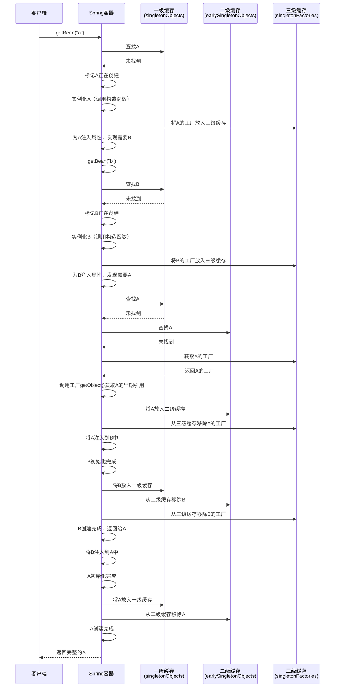

> 本文深入分析Spring框架如何通过三级缓存机制优雅地解决Bean之间的循环依赖问题，包括核心原理、源码分析和实际应用。

## 简介

### 什么是循环依赖

循环依赖是指两个或多个Bean之间相互引用，形成一个闭环的依赖关系。例如：

```java
@Component
public class A {
    @Autowired
    private B b;
}

@Component
public class B {
    @Autowired
    private A a;
}
```

在这个例子中，A依赖B，B又依赖A，这就是典型的循环依赖。

### 为什么需要解决循环依赖

在Spring容器启动时，需要创建并初始化所有的Bean。如果存在循环依赖，普通的创建方式会导致死锁或无限递归。Spring通过三级缓存机制优雅地解决了这个问题。

## 架构知识点

### Bean的生命周期

在深入了解三级缓存之前，我们需要了解Spring Bean的完整生命周期：

1. **实例化（Instantiation）**：调用构造函数创建Bean对象
2. **属性注入（Populate）**：设置Bean的属性值和依赖
3. **初始化（Initialization）**：执行初始化方法（如init-method）
4. **销毁（Destruction）**：执行销毁方法（如destroy-method）

### 三级缓存的组成

Spring的三级缓存位于`DefaultSingletonBeanRegistry`类中，由三个Map组成：

1. **一级缓存（singletonObjects）**：存放完全初始化好的Bean
2. **二级缓存（earlySingletonObjects）**：存放已实例化但未完全初始化的Bean
3. **三级缓存（singletonFactories）**：存放Bean工厂（ObjectFactory），用于创建早期Bean引用

## 源码分析

### 核心类和接口

让我们先看一下`DefaultSingletonBeanRegistry`的核心代码：

```java
public class DefaultSingletonBeanRegistry extends SimpleAliasRegistry implements SingletonBeanRegistry {
    
    // 一级缓存：存放完全初始化好的Bean
    private final Map<String, Object> singletonObjects = new ConcurrentHashMap<>(256);
    
    // 二级缓存：存放已实例化但未完全初始化的Bean
    private final Map<String, Object> earlySingletonObjects = new ConcurrentHashMap<>(16);
    
    // 三级缓存：存放Bean工厂
    private final Map<String, ObjectFactory<?>> singletonFactories = new HashMap<>(16);
    
    // 正在创建的Bean集合
    private final Set<String> singletonsCurrentlyInCreation =
            Collections.newSetFromMap(new ConcurrentHashMap<>(16));
}
```

### 获取Bean的流程

让我们通过`getBean()`方法追踪Bean的获取流程：

```java
protected Object getSingleton(String beanName, boolean allowEarlyReference) {
    // 首先从一级缓存获取
    Object singletonObject = this.singletonObjects.get(beanName);
    if (singletonObject == null && isSingletonCurrentlyInCreation(beanName)) {
        // 一级缓存没有，且Bean正在创建中，从二级缓存获取
        singletonObject = this.earlySingletonObjects.get(beanName);
        if (singletonObject == null && allowEarlyReference) {
            // 二级缓存也没有，且允许早期引用，从三级缓存获取
            synchronized (this.singletonObjects) {
                // 双重检查
                singletonObject = this.singletonObjects.get(beanName);
                if (singletonObject == null) {
                    singletonObject = this.earlySingletonObjects.get(beanName);
                    if (singletonObject == null) {
                        ObjectFactory<?> singletonFactory = this.singletonFactories.get(beanName);
                        if (singletonFactory != null) {
                            // 从三级缓存获取ObjectFactory，调用getObject()创建早期引用
                            singletonObject = singletonFactory.getObject();
                            // 放入二级缓存
                            this.earlySingletonObjects.put(beanName, singletonObject);
                            // 从三级缓存移除
                            this.singletonFactories.remove(beanName);
                        }
                    }
                }
            }
        }
    }
    return singletonObject;
}
```

### Bean创建流程

让我们看一下`doCreateBean()`方法，这是Bean创建的核心方法：

```java
protected Object doCreateBean(String beanName, RootBeanDefinition mbd, @Nullable Object[] args)
        throws BeanCreationException {
    
    BeanWrapper instanceWrapper = null;
    if (mbd.isSingleton()) {
        instanceWrapper = this.factoryBeanInstanceCache.remove(beanName);
    }
    if (instanceWrapper == null) {
        // 1. 实例化Bean
        instanceWrapper = createBeanInstance(beanName, mbd, args);
    }
    Object bean = instanceWrapper.getWrappedInstance();
    Class<?> beanType = instanceWrapper.getWrappedClass();
    
    boolean earlySingletonExposure = (mbd.isSingleton() && this.allowCircularReferences &&
            isSingletonCurrentlyInCreation(beanName));
    if (earlySingletonExposure) {
        // 2. 将Bean工厂放入三级缓存
        addSingletonFactory(beanName, () -> getEarlyBeanReference(beanName, mbd, bean));
    }
    
    Object exposedObject = bean;
    try {
        // 3. 属性注入
        populateBean(beanName, mbd, instanceWrapper);
        // 4. 初始化
        exposedObject = initializeBean(beanName, exposedObject, mbd);
    }
    catch (Throwable ex) {
        if (ex instanceof BeanCreationException && beanName.equals(((BeanCreationException) ex).getBeanName())) {
            throw (BeanCreationException) ex;
        }
        else {
            throw new BeanCreationException(
                    mbd.getResourceDescription(), beanName, "Initialization of bean failed", ex);
        }
    }
    
    if (earlySingletonExposure) {
        Object earlySingletonReference = getSingleton(beanName, false);
        if (earlySingletonReference != null) {
            if (exposedObject == bean) {
                exposedObject = earlySingletonReference;
            }
            else if (!this.allowRawInjectionDespiteWrapping && hasDependentBean(beanName)) {
                String[] dependentBeans = getDependentBeans(beanName);
                Set<String> actualDependentBeans = new LinkedHashSet<>(dependentBeans.length);
                for (String dependentBean : dependentBeans) {
                    if (!removeSingletonIfCreatedForTypeCheckOnly(dependentBean)) {
                        actualDependentBeans.add(dependentBean);
                    }
                }
                if (!actualDependentBeans.isEmpty()) {
                    throw new BeanCurrentlyInCreationException(beanName,
                            "Bean with name '" + beanName + "' has been injected into other beans [" +
                            StringUtils.collectionToCommaDelimitedString(actualDependentBeans) +
                            "] in its raw version as part of a circular reference, but has eventually been " +
                            "wrapped. This means that said other beans do not use the final version of the " +
                            "bean. This is often the result of over-eager type matching - consider using " +
                            "'getBeanNamesForType' with the 'allowEagerInit' flag turned off, for example.");
                }
            }
        }
    }
    
    return exposedObject;
}
```

### 添加Bean工厂到三级缓存

```java
protected void addSingletonFactory(String beanName, ObjectFactory<?> singletonFactory) {
    Assert.notNull(singletonFactory, "Singleton factory must not be null");
    synchronized (this.singletonObjects) {
        if (!this.singletonObjects.containsKey(beanName)) {
            this.singletonFactories.put(beanName, singletonFactory);
            this.earlySingletonObjects.remove(beanName);
            this.registeredSingletons.add(beanName);
        }
    }
}
```

### 将Bean放入一级缓存

```java
protected void addSingleton(String beanName, Object singletonObject) {
    synchronized (this.singletonObjects) {
        this.singletonObjects.put(beanName, singletonObject);
        this.singletonFactories.remove(beanName);
        this.earlySingletonObjects.remove(beanName);
        this.registeredSingletons.add(beanName);
    }
}
```

## 实际应用

### 循环依赖解决过程示例

让我们通过A和B的循环依赖示例，详细说明整个解决过程：



### 为什么需要三级缓存，而不是二级缓存？

很多人会问：为什么Spring需要三级缓存，二级缓存不够吗？

关键原因在于**AOP代理**。如果Bean被AOP代理，那么最终放入容器的应该是代理对象，而不是原始对象。

让我们看一下`getEarlyBeanReference()`方法：

```java
protected Object getEarlyBeanReference(String beanName, RootBeanDefinition mbd, Object bean) {
    Object exposedObject = bean;
    if (!mbd.isSynthetic() && hasInstantiationAwareBeanPostProcessors()) {
        for (SmartInstantiationAwareBeanPostProcessor bp : getBeanPostProcessorCache().smartInstantiationAware) {
            exposedObject = bp.getEarlyBeanReference(exposedObject, beanName);
        }
    }
    return exposedObject;
}
```

这个方法允许BeanPostProcessor在早期引用阶段对Bean进行处理，特别是AOP代理的创建。

**如果只有二级缓存：**
- 我们需要在实例化后立即创建代理对象
- 但这样会违反Bean的生命周期（应该在初始化后创建代理）
- 而且不是所有Bean都需要代理

**三级缓存的优势：**
- 只有在真正发生循环依赖时才会调用getEarlyBeanReference()
- 可以延迟代理对象的创建
- 保持了Bean生命周期的完整性

## 常见问题及解决方案

### 1. 构造器注入的循环依赖无法解决

Spring无法解决构造器注入的循环依赖：

```java
@Component
public class A {
    public A(B b) {
        // ...
    }
}

@Component
public class B {
    public B(A a) {
        // ...
    }
}
```

**解决方案：**
- 使用@Lazy注解
- 使用setter注入
- 重构代码消除循环依赖

```java
@Component
public class A {
    public A(@Lazy B b) {
        // ...
    }
}
```

### 2. 多例Bean的循环依赖

Spring不支持多例Bean的循环依赖，因为多例Bean不会被缓存，每次getBean()都会创建新的实例。

```java
@Scope("prototype")
@Component
public class A {
    @Autowired
    private B b;
}

@Scope("prototype")
@Component
public class B {
    @Autowired
    private A a;
}
```

**解决方案：**
- 将Bean改为单例
- 重构代码消除循环依赖

### 3. 循环依赖导致的BeanPostProcessor问题

如果循环依赖涉及到BeanPostProcessor，可能会出现问题。

**解决方案：**
- 确保BeanPostProcessor不依赖于业务Bean
- 使用@DependsOn注解控制Bean的加载顺序
- 将相关逻辑移到Bean初始化之后

## 注意事项

### 1. 最佳实践

虽然Spring能解决循环依赖，但最好还是避免循环依赖：

- **单一职责原则**：确保每个Bean只负责一个功能
- **依赖倒置原则**：依赖抽象而不是具体实现
- **事件驱动**：使用Spring事件机制解耦
- **分层设计**：严格控制各层之间的依赖关系

### 2. 性能考虑

- 三级缓存机制会有一定的性能开销
- 避免不必要的循环依赖可以提高容器启动速度
- 大规模循环依赖会使代码难以维护和测试

### 3. 版本差异

- Spring 3.x之前的版本处理方式有所不同
- Spring Boot 2.6+默认禁止循环依赖，需要手动开启

```yaml
spring:
  main:
    allow-circular-references: true
```

## 总结

Spring通过三级缓存机制优雅地解决了单例Bean的循环依赖问题：

1. **一级缓存**：存放完全初始化的Bean，直接对外提供服务
2. **二级缓存**：存放已实例化但未完全初始化的Bean，用于解决循环依赖
3. **三级缓存**：存放Bean工厂，用于创建早期Bean引用，支持AOP代理

核心思想是**提前暴露对象引用**，在Bean完全初始化之前就将其引用暴露出去，让其他依赖它的Bean能够获取到这个引用。

虽然Spring提供了循环依赖的解决方案，但我们在设计时仍应尽量避免循环依赖，保持代码的清晰和可维护性。
