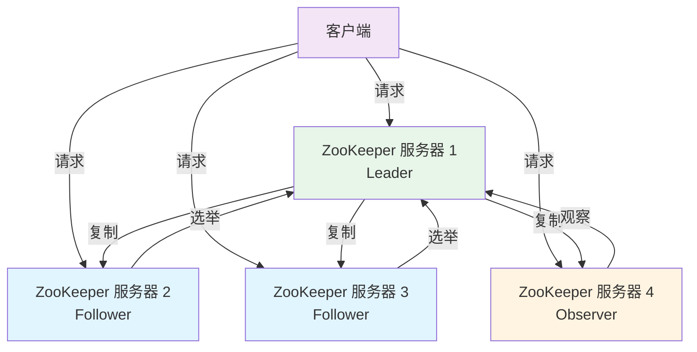
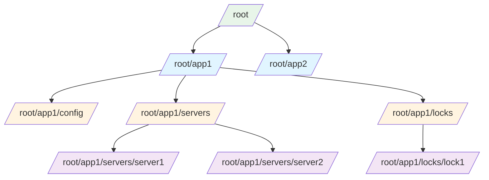
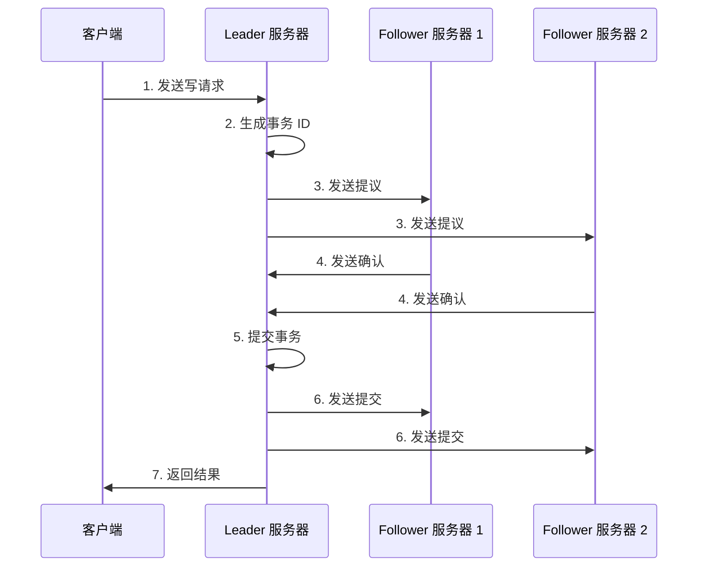
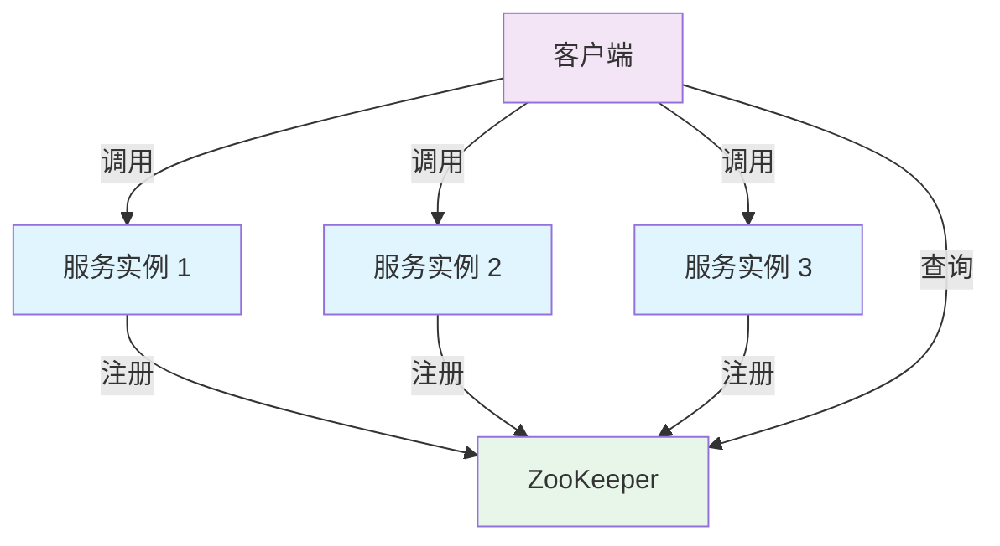
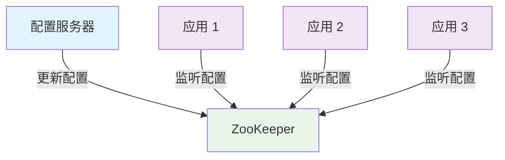
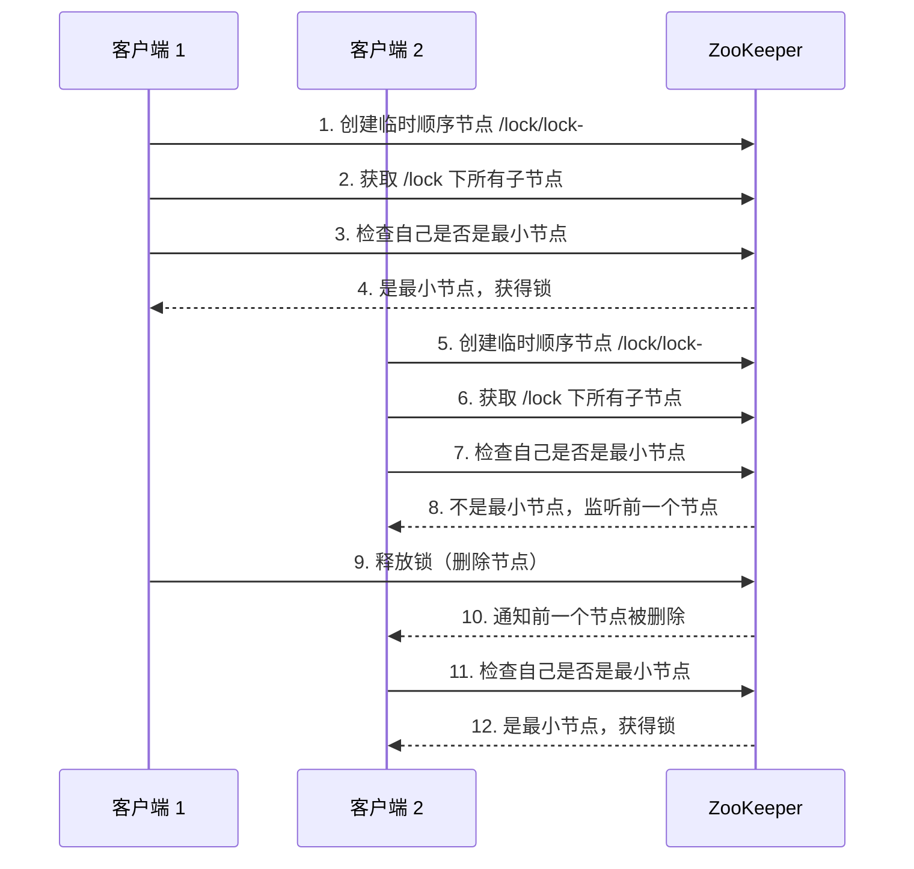
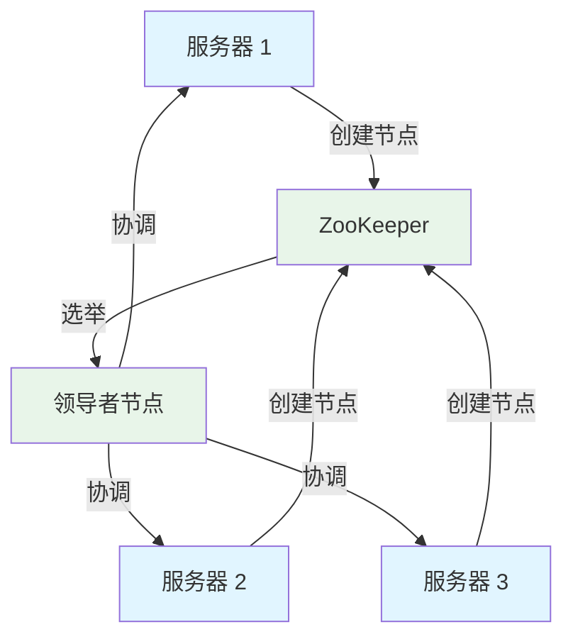
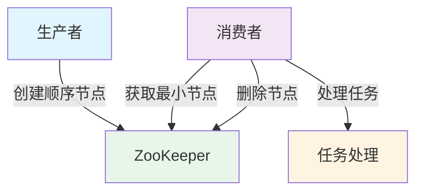

> 深入解析 ZooKeeper 的核心原理、架构设计、使用场景及实战应用

## 简介

ZooKeeper 是一个开源的分布式协调服务，由 Apache 基金会维护。它为分布式应用提供了一致性保证、命名服务、配置管理、分布式锁等核心功能。ZooKeeper 被广泛应用于大数据生态系统，如 Hadoop、Kafka、HBase 等，作为它们的协调服务。

### ZooKeeper 的主要特点

| 特点 | 说明 |
|------|------|
| 高可靠性 | 基于复制的高可用架构 |
| 一致性 | 保证数据的强一致性 |
| 实时性 | 提供实时的数据视图 |
| 简单易用 | 简洁的 API 设计 |
| 顺序一致性 | 保证操作的顺序执行 |
| 原子性 | 操作要么全部成功，要么全部失败 |

## 核心架构原理

### 1. 架构组成

ZooKeeper 采用主从架构，由以下组件组成：



### 2. 服务器角色

| 角色 | 说明 | 职责 |
|------|------|------|
| Leader | 领导者 | 处理写请求，维护一致性，协调 followers |
| Follower | 跟随者 | 处理读请求，参与选举，复制 Leader 的数据 |
| Observer | 观察者 | 处理读请求，不参与选举，复制 Leader 的数据 |

### 3. 数据模型

ZooKeeper 的数据模型类似于文件系统，由节点（znode）组成的层次结构：



### 4. 会话机制

ZooKeeper 客户端与服务器之间通过会话进行通信：

- 客户端连接到 ZooKeeper 集群中的任一服务器
- 服务器为客户端分配会话 ID
- 客户端定期发送心跳保持会话活跃
- 会话超时后，服务器会删除客户端的临时节点

### 5. 一致性协议

ZooKeeper 使用 ZAB（ZooKeeper Atomic Broadcast）协议保证数据一致性：

1. **崩溃恢复**：当 Leader 崩溃时，选举新的 Leader
2. **原子广播**：Leader 向所有 Follower 广播写操作



### 6. Watch 机制

ZooKeeper 提供 Watch 机制实现数据变更通知：

- 客户端可以为节点设置 Watch
- 当节点发生变化时，服务器会通知客户端
- Watch 是一次性的，触发后需要重新注册

## 安装与配置

### 1. 安装 ZooKeeper

**下载 ZooKeeper：**

```bash
# 下载 ZooKeeper 3.8.0
tar -xzf apache-zookeeper-3.8.0-bin.tar.gz
mv apache-zookeeper-3.8.0-bin /opt/zookeeper
```

**配置环境变量：**

```bash
export ZOOKEEPER_HOME=/opt/zookeeper
export PATH=$PATH:$ZOOKEEPER_HOME/bin
```

### 2. 配置文件

**基本配置（conf/zoo.cfg）：**

```properties
# 数据目录
dataDir=/opt/zookeeper/data

# 日志目录
dataLogDir=/opt/zookeeper/logs

# 客户端端口
clientPort=2181

# 会话超时时间（毫秒）
syncLimit=5

# 心跳间隔（毫秒）
tickTime=2000

# 初始化限制时间（毫秒）
initLimit=10

# 最大客户端连接数
maxClientCnxns=60

# 自动创建目录
autopurge.snapRetainCount=3
autopurge.purgeInterval=1
```

**集群配置：**

```properties
# 服务器列表（server.服务器ID=主机:选举端口:通信端口）
server.1=zoo1:2888:3888
server.2=zoo2:2888:3888
server.3=zoo3:2888:3888
```

**创建 myid 文件：**

```bash
# 在 data 目录下创建 myid 文件，内容为服务器 ID
echo "1" > /opt/zookeeper/data/myid
```

### 3. 启动与停止

**启动 ZooKeeper：**

```bash
# 启动服务
zkServer.sh start

# 查看状态
zkServer.sh status

# 停止服务
zkServer.sh stop

# 重启服务
zkServer.sh restart
```

**客户端连接：**

```bash
# 连接本地 ZooKeeper
zkCli.sh -server localhost:2181

# 连接远程 ZooKeeper
zkCli.sh -server zoo1:2181,zoo2:2181,zoo3:2181
```

## 核心概念

### 1. ZNode 类型

| 类型 | 说明 | 特点 |
|------|------|------|
| 持久节点（PERSISTENT） | 一旦创建，除非手动删除，否则一直存在 | 适合存储持久化配置 |
| 持久顺序节点（PERSISTENT_SEQUENTIAL） | 持久节点 + 自动添加顺序号 | 适合创建全局唯一ID |
| 临时节点（EPHEMERAL） | 会话结束后自动删除 | 适合服务发现 |
| 临时顺序节点（EPHEMERAL_SEQUENTIAL） | 临时节点 + 自动添加顺序号 | 适合分布式锁 |
| 容器节点（CONTAINER） | 当子节点为空时自动删除 | 适合存储临时集合 |
| TTL 节点（TTL） | 超过指定时间无修改则自动删除 | 适合缓存数据 |

### 2. 会话状态

| 状态 | 说明 |
|------|------|
| CONNECTING | 正在连接中 |
| CONNECTED | 已连接 |
| RECONNECTING | 重连中 |
| DISCONNECTED | 已断开 |
| EXPIRED | 会话已过期 |
| CLOSED | 会话已关闭 |

### 3. 版本号

| 版本类型 | 说明 |
|----------|------|
| cversion | 子节点版本号 |
| version | 数据版本号 |
| aversion | ACL 版本号 |

## 基础操作

### 1. 客户端命令

**连接 ZooKeeper：**

```bash
zkCli.sh -server localhost:2181
```

**创建节点：**

```bash
# 创建持久节点
create /app "app data"

# 创建持久顺序节点
create -s /app/seq "seq data"

# 创建临时节点
create -e /app/temp "temp data"

# 创建临时顺序节点
create -e -s /app/temp-seq "temp seq data"

# 创建带 ACL 的节点
create -e -s -c /app/container "container data"
```

**读取节点：**

```bash
# 读取节点数据
get /app

# 读取节点数据并设置 watch
get -w /app

# 列出子节点
ls /app

# 列出子节点并设置 watch
ls -w /app

# 查看节点状态
stat /app
```

**更新节点：**

```bash
# 更新节点数据
set /app "new data"

# 基于版本号更新
set /app "new data" 1
```

**删除节点：**

```bash
# 删除节点
delete /app

# 基于版本号删除
delete /app 1

# 递归删除节点
deleteall /app
```

### 2. Java API 使用

**添加依赖：**

```xml
<dependency>
    <groupId>org.apache.zookeeper</groupId>
    <artifactId>zookeeper</artifactId>
    <version>3.8.0</version>
</dependency>
```

**基本操作：**

```java
import org.apache.zookeeper.*;
import org.apache.zookeeper.data.Stat;
import java.io.IOException;
import java.util.List;

public class ZooKeeperExample {
    private static final String CONNECT_STRING = "localhost:2181";
    private static final int SESSION_TIMEOUT = 30000;
    private ZooKeeper zk;
    
    public void connect() throws IOException {
        zk = new ZooKeeper(CONNECT_STRING, SESSION_TIMEOUT, event -> {
            System.out.println("Event: " + event.getType());
        });
    }
    
    public void createNode(String path, String data) throws KeeperException, InterruptedException {
        zk.create(path, data.getBytes(), ZooDefs.Ids.OPEN_ACL_UNSAFE, CreateMode.PERSISTENT);
    }
    
    public String getData(String path) throws KeeperException, InterruptedException {
        byte[] data = zk.getData(path, false, null);
        return new String(data);
    }
    
    public void setData(String path, String data) throws KeeperException, InterruptedException {
        zk.setData(path, data.getBytes(), -1);
    }
    
    public void deleteNode(String path) throws KeeperException, InterruptedException {
        zk.delete(path, -1);
    }
    
    public List<String> getChildren(String path) throws KeeperException, InterruptedException {
        return zk.getChildren(path, false);
    }
    
    public void close() throws InterruptedException {
        if (zk != null) {
            zk.close();
        }
    }
    
    public static void main(String[] args) throws Exception {
        ZooKeeperExample example = new ZooKeeperExample();
        example.connect();
        
        // 创建节点
        example.createNode("/test", "Hello ZooKeeper");
        
        // 读取数据
        System.out.println("Data: " + example.getData("/test"));
        
        // 更新数据
        example.setData("/test", "Updated data");
        System.out.println("Updated data: " + example.getData("/test"));
        
        // 列出子节点
        System.out.println("Children: " + example.getChildren("/"));
        
        // 删除节点
        example.deleteNode("/test");
        
        example.close();
    }
}
```

## 使用场景

### 1. 服务发现

ZooKeeper 可以作为服务注册中心，实现服务的自动发现：



**实现方式：**
- 服务启动时，在 ZooKeeper 中创建临时节点
- 服务停止时，临时节点自动删除
- 客户端监听服务节点变化，获取可用服务列表

### 2. 配置管理

ZooKeeper 可以集中管理配置信息，实现配置的实时更新：



**实现方式：**
- 配置存储在 ZooKeeper 的持久节点中
- 应用监听配置节点的变化
- 配置更新时，所有应用自动获取最新配置

### 3. 分布式锁

ZooKeeper 可以实现分布式锁，保证分布式环境下的资源互斥访问：



**实现方式：**
- 客户端创建临时顺序节点
- 检查自己是否是最小节点
- 如果是，获得锁；否则，监听前一个节点
- 前一个节点删除时，重新检查

### 4. 领导者选举

ZooKeeper 可以实现分布式系统中的领导者选举：



**实现方式：**
- 所有服务器创建临时顺序节点
- 最小节点的服务器成为领导者
- 其他服务器监听领导者节点
- 领导者节点删除时，重新选举

### 5. 分布式队列

ZooKeeper 可以实现分布式队列，保证任务的顺序执行：



**实现方式：**
- 生产者创建顺序节点
- 消费者获取最小节点
- 处理任务后删除节点
- 重复上述过程

## 高级特性

### 1. ACL 权限控制

ZooKeeper 提供细粒度的权限控制：

| 权限 | 说明 | 代码 |
|------|------|------|
| CREATE | 创建子节点 | c |
| READ | 读取节点数据和子节点列表 | r |
| WRITE | 修改节点数据 | w |
| DELETE | 删除子节点 | d |
| ADMIN | 管理 ACL | a |

**设置 ACL：**

```bash
# 创建带 ACL 的节点
create /app "data" digest:user:password:crwda
```

**添加认证：**

```bash
# 添加认证
addauth digest user:password

# 访问节点
get /app
```

### 2. Watch 机制

ZooKeeper 的 Watch 机制用于监听数据变更：

**监听类型：**
- 数据变更 Watch：监听节点数据的变化
- 子节点变更 Watch：监听子节点的变化
- 节点创建/删除 Watch：监听节点的创建和删除

**实现示例：**

```java
// 监听数据变更
zk.getData("/app", event -> {
    if (event.getType() == Watcher.Event.EventType.NodeDataChanged) {
        System.out.println("Node data changed");
    }
}, null);

// 监听子节点变更
zk.getChildren("/app", event -> {
    if (event.getType() == Watcher.Event.EventType.NodeChildrenChanged) {
        System.out.println("Node children changed");
    }
}, null);
```

### 3. 事务日志和快照

ZooKeeper 使用事务日志和快照保证数据持久性：

- **事务日志**：记录所有写操作
- **快照**：定期保存数据状态

**配置示例：**

```properties
# 事务日志目录
dataLogDir=/opt/zookeeper/logs

# 快照保留数量
autopurge.snapRetainCount=3

# 自动清理间隔（小时）
autopurge.purgeInterval=1
```

## 最佳实践

### 1. 集群部署

**建议配置：**
- 奇数个服务器（3、5、7 等）
- 每个服务器配置相同的硬件资源
- 服务器分布在不同的物理机器上

**部署步骤：**
1. 安装 ZooKeeper
2. 配置 zoo.cfg 文件
3. 创建 myid 文件
4. 启动所有服务器
5. 验证集群状态

### 2. 性能优化

**配置优化：**

```properties
# 增加内存
JVMFLAGS="-Xms2G -Xmx2G"

# 增加客户端连接数
maxClientCnxns=60

# 调整事务日志刷盘策略
syncLimit=2

# 调整会话超时时间
tickTime=2000
```

**使用优化：**
- 减少 Watch 的数量
- 合理使用节点类型
- 避免频繁创建和删除节点
- 使用批量操作减少网络开销

### 3. 监控与维护

**监控指标：**
- 服务器状态（Leader/Follower）
- 客户端连接数
- 事务处理速率
- 内存使用情况
- 磁盘使用情况

**维护操作：**
- 定期备份数据
- 定期清理事务日志和快照
- 监控集群健康状态
- 及时处理服务器故障

## 常见问题与解决方案

### 1. 会话过期

**原因：**
- 网络问题导致心跳中断
- 服务器负载过高
- 客户端处理时间过长

**解决方案：**
- 增加会话超时时间
- 优化网络连接
- 减少客户端处理时间
- 实现会话重连机制

### 2. 集群脑裂

**原因：**
- 网络分区导致集群分裂
- 多个 Leader 同时存在

**解决方案：**
- 使用奇数个服务器
- 配置合理的选举超时时间
- 实现网络故障检测

### 3. 性能瓶颈

**原因：**
- 客户端连接数过多
- 写操作频繁
- 内存不足
- 磁盘 I/O 瓶颈

**解决方案：**
- 增加服务器数量
- 优化客户端代码
- 增加内存和磁盘资源
- 使用 Observer 节点分担读压力

### 4. 数据一致性问题

**原因：**
- 网络延迟
- 服务器故障
- 客户端缓存

**解决方案：**
- 使用同步 API
- 实现重试机制
- 验证数据版本号
- 避免使用过期数据

## 实战案例

### 1. 服务注册与发现

**配置示例：**

```java
public class ServiceRegistry {
    private ZooKeeper zk;
    private String servicePath;
    
    public void register(String serviceName, String serviceAddress) throws Exception {
        // 创建服务节点
        String path = "/services/" + serviceName;
        if (zk.exists(path, false) == null) {
            zk.create(path, new byte[0], ZooDefs.Ids.OPEN_ACL_UNSAFE, CreateMode.PERSISTENT);
        }
        
        // 创建临时节点
        String addressPath = path + "/address-";
        zk.create(addressPath, serviceAddress.getBytes(), ZooDefs.Ids.OPEN_ACL_UNSAFE, CreateMode.EPHEMERAL_SEQUENTIAL);
        System.out.println("Service registered: " + serviceAddress);
    }
    
    public List<String> discover(String serviceName) throws Exception {
        String path = "/services/" + serviceName;
        if (zk.exists(path, false) == null) {
            return Collections.emptyList();
        }
        
        List<String> addresses = new ArrayList<>();
        List<String> children = zk.getChildren(path, false);
        for (String child : children) {
            byte[] data = zk.getData(path + "/" + child, false, null);
            addresses.add(new String(data));
        }
        return addresses;
    }
}
```

### 2. 分布式锁实现

**配置示例：**

```java
public class DistributedLock {
    private ZooKeeper zk;
    private String lockPath;
    private String currentLock;
    private String waitLock;
    private CountDownLatch latch;
    
    public void lock() throws Exception {
        // 创建临时顺序节点
        currentLock = zk.create(lockPath + "/lock-", new byte[0], ZooDefs.Ids.OPEN_ACL_UNSAFE, CreateMode.EPHEMERAL_SEQUENTIAL);
        
        // 获取所有子节点
        List<String> children = zk.getChildren(lockPath, false);
        Collections.sort(children);
        
        // 检查是否是最小节点
        if (currentLock.equals(lockPath + "/" + children.get(0))) {
            System.out.println("Got lock: " + currentLock);
            return;
        }
        
        // 找到前一个节点
        for (int i = 0; i < children.size(); i++) {
            if (currentLock.equals(lockPath + "/" + children.get(i))) {
                waitLock = lockPath + "/" + children.get(i - 1);
                break;
            }
        }
        
        // 监听前一个节点
        System.out.println("Waiting for lock: " + waitLock);
        latch = new CountDownLatch(1);
        zk.exists(waitLock, event -> {
            if (event.getType() == Watcher.Event.EventType.NodeDeleted) {
                latch.countDown();
            }
        });
        latch.await();
        System.out.println("Got lock: " + currentLock);
    }
    
    public void unlock() throws Exception {
        zk.delete(currentLock, -1);
        System.out.println("Released lock: " + currentLock);
    }
}
```

### 3. 配置中心

**配置示例：**

```java
public class ConfigCenter {
    private ZooKeeper zk;
    private String configPath;
    private Map<String, String> configs = new ConcurrentHashMap<>();
    
    public void init() throws Exception {
        // 监听配置节点
        loadConfigs();
        zk.exists(configPath, event -> {
            if (event.getType() == Watcher.Event.EventType.NodeDataChanged) {
                try {
                    loadConfigs();
                } catch (Exception e) {
                    e.printStackTrace();
                }
            }
        });
    }
    
    private void loadConfigs() throws Exception {
        byte[] data = zk.getData(configPath, false, null);
        if (data != null) {
            String json = new String(data);
            Map<String, String> newConfigs = new Gson().fromJson(json, Map.class);
            configs.putAll(newConfigs);
            System.out.println("Configs loaded: " + newConfigs);
        }
    }
    
    public String getConfig(String key) {
        return configs.get(key);
    }
    
    public void updateConfig(String key, String value) throws Exception {
        configs.put(key, value);
        String json = new Gson().toJson(configs);
        zk.setData(configPath, json.getBytes(), -1);
        System.out.println("Config updated: " + key + " = " + value);
    }
}
```

## 总结

本文详细介绍了 ZooKeeper 的核心原理、架构设计、使用场景及实战应用，包括：

1. **核心架构**：主从架构、服务器角色、数据模型、会话机制、一致性协议
2. **安装配置**：单机部署、集群部署、配置文件详解
3. **基础操作**：客户端命令、Java API 使用
4. **使用场景**：服务发现、配置管理、分布式锁、领导者选举、分布式队列
5. **高级特性**：ACL 权限控制、Watch 机制、事务日志和快照
6. **最佳实践**：集群部署、性能优化、监控与维护
7. **常见问题**：会话过期、集群脑裂、性能瓶颈、数据一致性问题
8. **实战案例**：服务注册与发现、分布式锁实现、配置中心

通过本文的学习，你应该能够掌握 ZooKeeper 的核心原理和使用方法，并在实际项目中灵活应用 ZooKeeper 来解决分布式系统中的协调问题。

## 参考资料

- [ZooKeeper 官方文档](https://zookeeper.apache.org/doc/current/)
- [ZooKeeper 实战](https://book.douban.com/subject/26292006/)
- [ZooKeeper 原理与实践](https://www.imooc.com/learn/850)
- [ZooKeeper 源码分析](https://github.com/apache/zookeeper)
- [ZooKeeper 集群部署指南](https://zookeeper.apache.org/doc/current/zookeeperAdmin.html)
